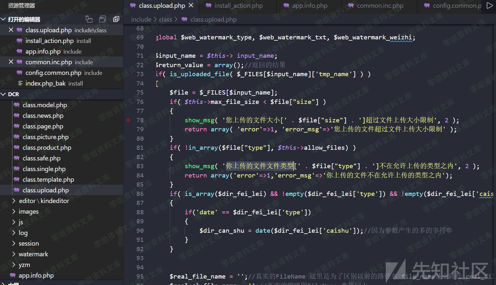
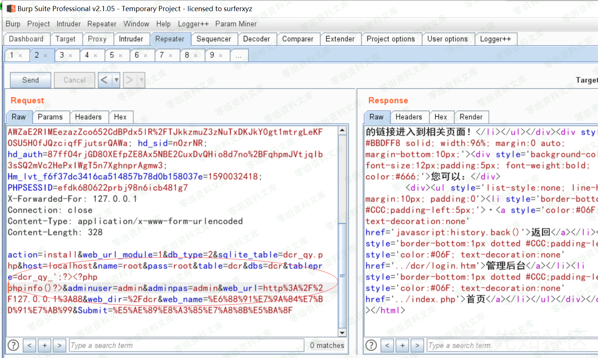
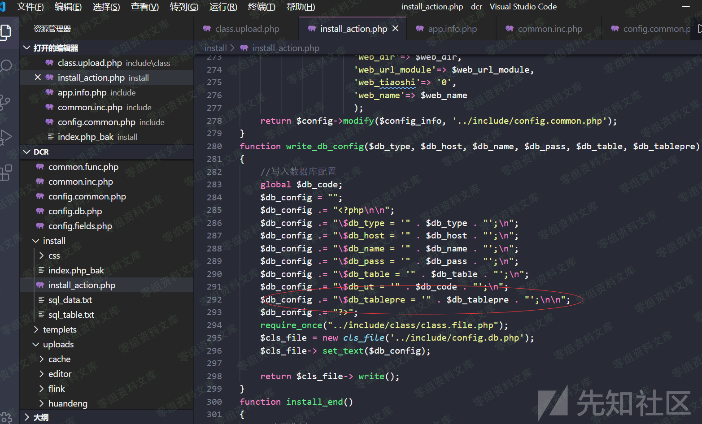
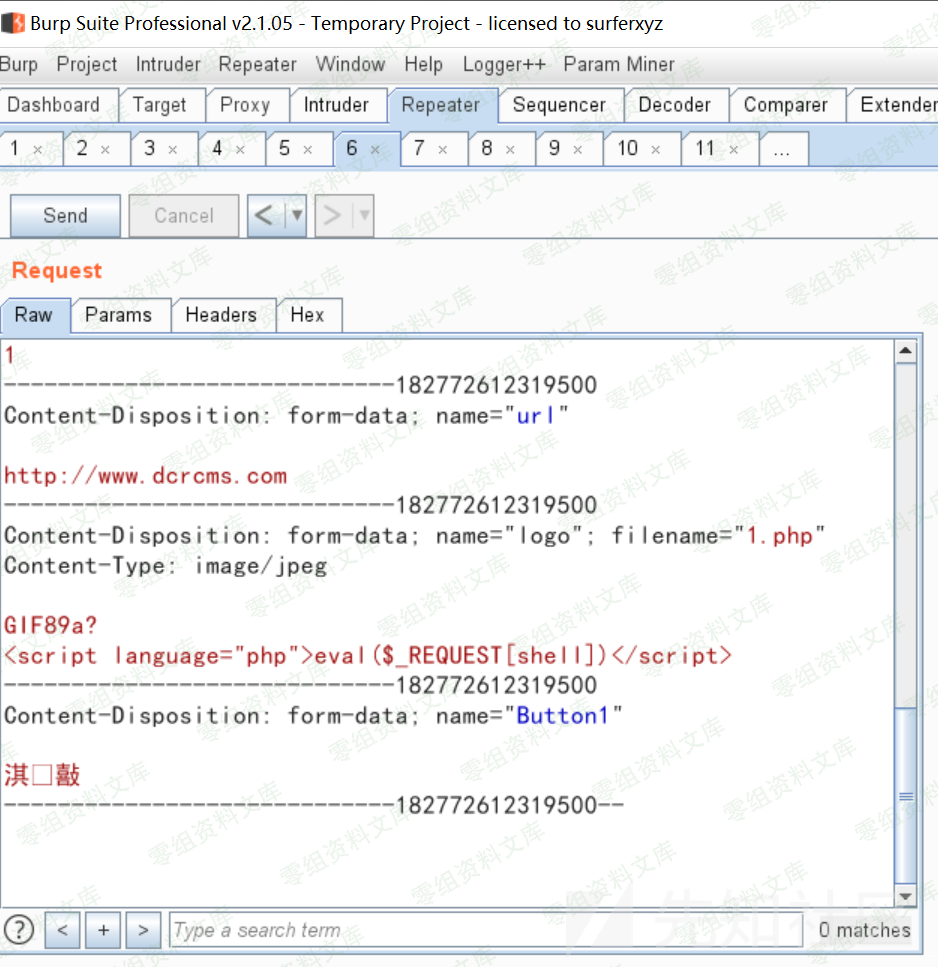
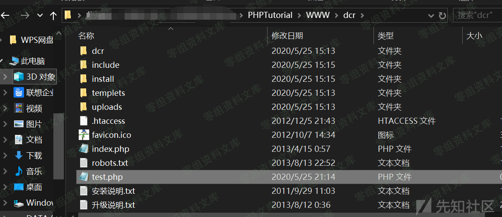

## 核对与使用边界

本文已按保存的全文审阅记录进行文字校订；本轮仅静态核对，未运行 PoC、请求目标或逐图验证。

适用条件与版本记录（来源主张，未列为明确更正的部分仍待权威资料核对）：backenduploadpermission;userMIMEcheckedallow_files;PHPextensionretained andexec

- **证据待核（1）**：所有图片上传点均可getshell超出展示一处，需完整调用点清单/共享验证路径。保留原引用、截图位置和实验叙述；本项所缺材料未被补造，截图存在或作者宣称成功都不等于已核验其内容。

- **证据待核（2）**：关键允许类型/实际multipart和落点都截图，缺可检索正文。保留原引用、截图位置和实验叙述；本项所缺材料未被补造，截图存在或作者宣称成功都不等于已核验其内容。

- **结论使用边界（3）**：代码说allow_files白名单应说明按客户端MIME非文件扩展，避免误说有白名单即安全。此项限制直接适用于下文对应结论；现有正文不足以作更宽泛推论，所列方法和原始证据均保留。

- **事实待核（4）**：有xz7904源，无修复/更广范围。该项尚不能从转载本身确定外部事实；下文相应编号、版本或修复说法只作为来源记录，不能据此判定部署受影响或已修复。明确更正另列于本节。

历史原文标识：下文原技术材料按来源保留；仅本节明确确认的更正替代相应旧说法，标为待核的观察仍不是事实确认。

# 稻草人cms 1.1.5 后台任意文件上传导致getshell

一、漏洞简介
------------

二、漏洞影响
------------

稻草人cms 1.1.5

三、复现过程
------------

首先进去后台，我们黑盒测试一下上传点，这里很多图片上传点我们随便找一个上传php文件这个好像是只对**Content-Type:** 做了判断，我们来验证一下

这里回显正常而且前端直接暴露了我们上传的地址，直接上蚁剑连接：成功getshell。事实上后台所有能上传图片的地方都是通过这种方式验证，导致我们可以在多处getshell。我们看一下代码include/class/class.upload.php这里仅仅对文件类型通过allow\_files
这个数组中的白名单检测，导致我们可以轻松绕过\--

参考链接
--------

> https://xz.aliyun.com/t/7904\#toc-1
