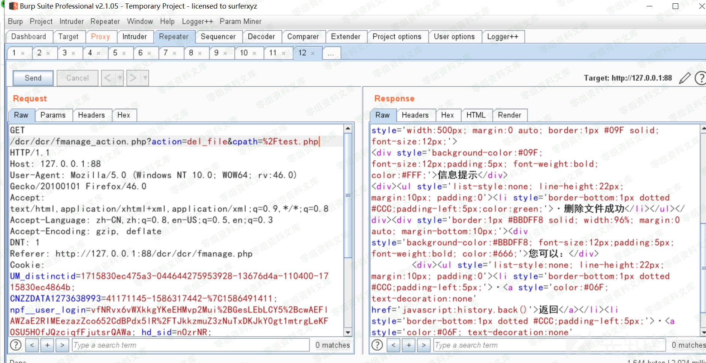
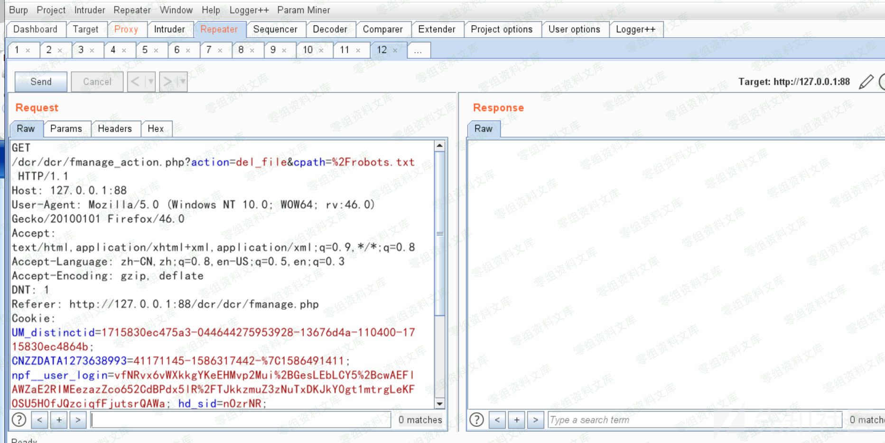
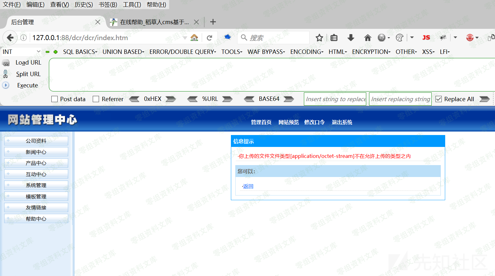
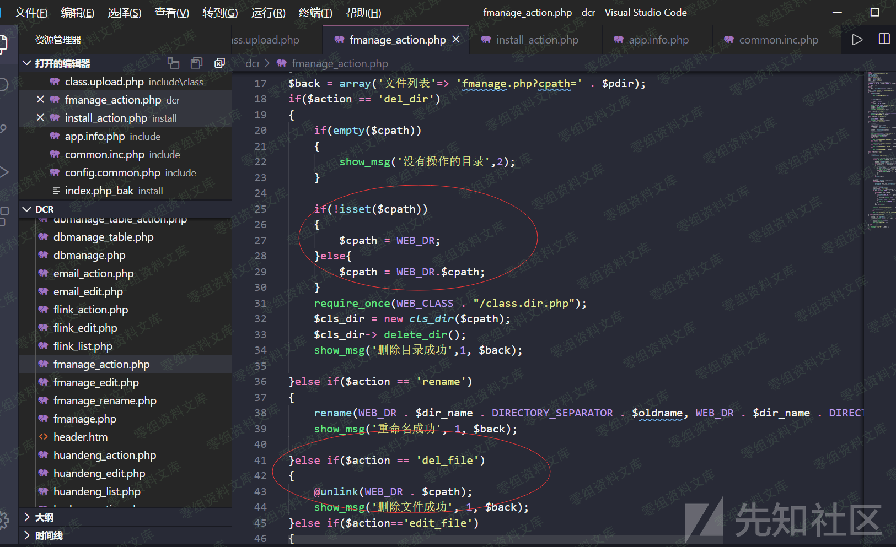

## 核对与使用边界

本文已按保存的全文审阅记录进行文字校订；本轮仅静态核对，未运行 PoC、请求目标或逐图验证。

适用条件与版本记录（来源主张，未列为明确更正的部分仍待权威资料核对）：adminfilemanager; cpathcontrolled;scopeofauthorizedfilesystemunknown

- **操作与副作用边界（1）**：作者自己质疑是否漏洞是重要边界说明，不能把合法高权限文件管理自动标任意删除漏洞。保留原步骤及请求方法。执行条件包括隔离且获授权的可恢复环境、预先记录相关文件/账号/配置/业务记录状态；响应完成不能等同无副作用，恢复时须核对该操作涉及的实际对象。

- **操作与副作用边界（2）**：测试仅同目录robots.php改test.php，没有展示逃出允许目录/跨权限删除。保留原步骤及请求方法。执行条件包括隔离且获授权的可恢复环境、预先记录相关文件/账号/配置/业务记录状态；响应完成不能等同无副作用，恢复时须核对该操作涉及的实际对象。

- **适用与权限边界（3）**：未给完整URL/请求/cpath源码，只图，缺角色模型/修复。按此限制解释本文结论，版本相同不足以证明所需角色、入口、配置、依赖或可控参数均已满足；原操作和失败记录一并保留。

- **证据待核（4）**：保留为待判设计能力而非已验证安全缺陷，有同源研究。保留原引用、截图位置和实验叙述；本项所缺材料未被补造，截图存在或作者宣称成功都不等于已核验其内容。

历史原文标识：下文原技术材料按来源保留；仅本节明确确认的更正替代相应旧说法，标为待核的观察仍不是事实确认。

# 稻草人cms 1.1.5 后台任意文件删除

一、漏洞简介
------------

二、漏洞影响
------------

稻草人cms 1.1.5

三、复现过程
------------

关于后台功能点任意文件删除这个严格来讲我认为不算漏洞，后台管理员赋予你的高权限使得你这里可以达到任意文件删除。。网上有的师傅认为后台文件任意文件删除是漏洞，这里拿出来写一下吧233

先创建一个文件测试

我们将当前目录下的robots.php修改成test.php试试

删除文件成功。

我们来看代码

这里cpath变量可控，当?action=del\_file时导致我们达成任意文件删除

参考链接
--------

> https://xz.aliyun.com/t/7904\#toc-1
