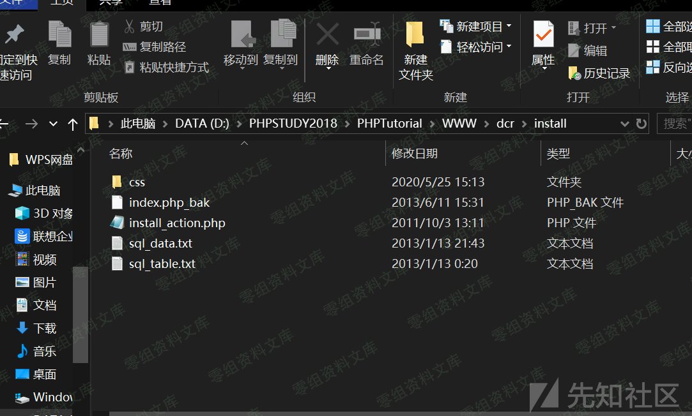
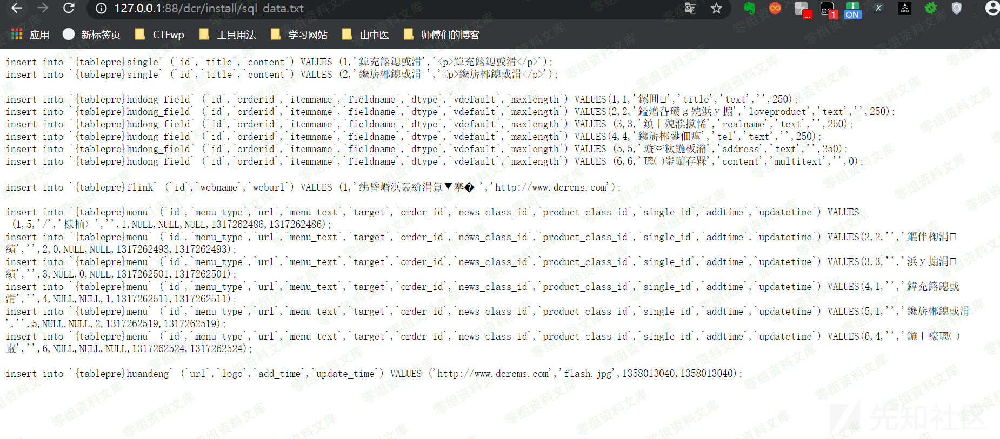
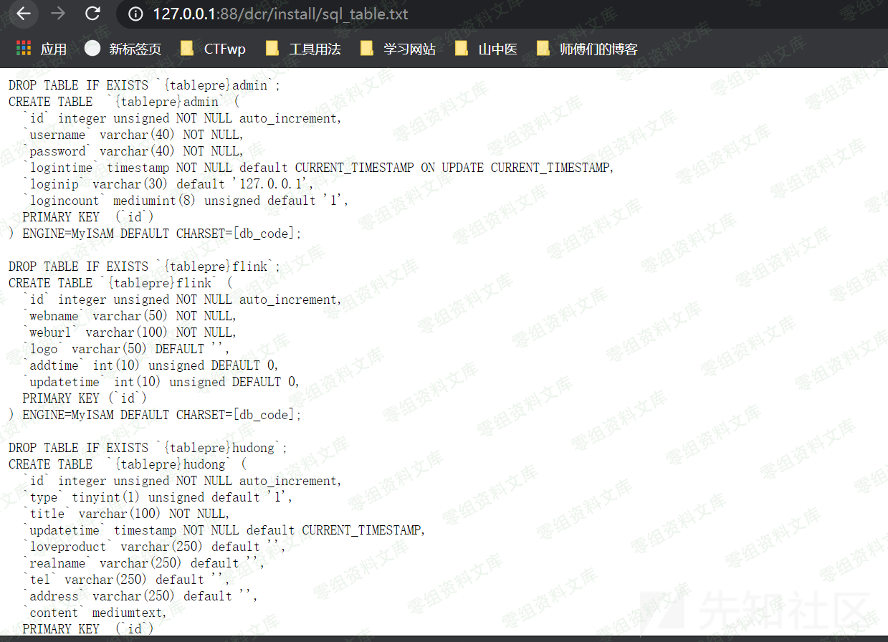
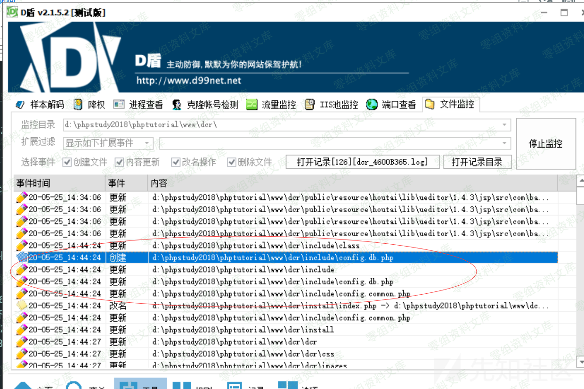
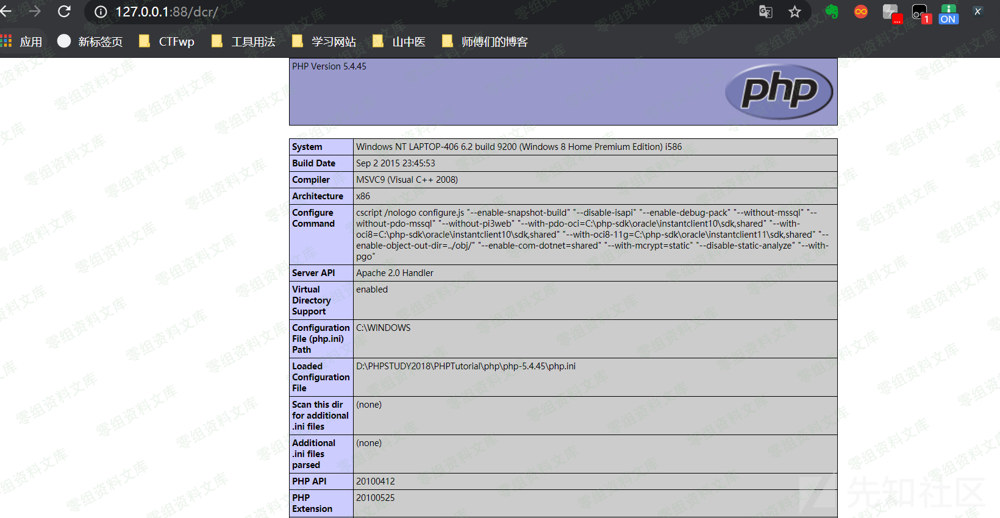
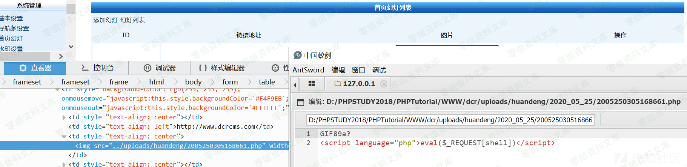
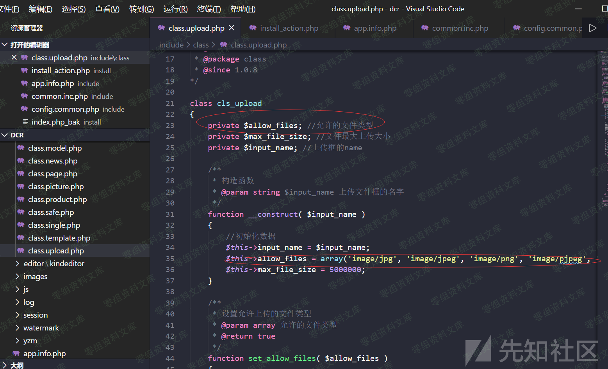

## 核对与使用边界

本文已按保存的全文审阅记录进行文字校订；本轮仅静态核对，未运行 PoC、请求目标或逐图验证。

适用条件与版本记录（来源主张，未列为明确更正的部分仍待权威资料核对）：installationworkflowreachable/unlocked;validDBsetup;tableprefixwrittenconfig;generatedtxtpublicaccess

- **操作与副作用边界（1）**：两个原语TXT敏感信息泄露与tablepre代码写须分开，TXT文件名/泄漏字段未文本给出。保留原步骤及请求方法。执行条件包括隔离且获授权的可恢复环境、预先记录相关文件/账号/配置/业务记录状态；响应完成不能等同无副作用，恢复时须核对该操作涉及的实际对象。

- **结论使用边界（2）**：未解释已安装后能否重进/安装锁，不能泛化正常线上匿名可用。此项限制直接适用于下文对应结论；现有正文不足以作更宽泛推论，所列方法和原始证据均保留。

- **适用与权限边界（3）**：include配置文件不等于自动过滤，文章该措辞错误，需具体输入过滤函数。按此限制解释本文结论，版本相同不足以证明所需角色、入口、配置、依赖或可控参数均已满足；原操作和失败记录一并保留。

- **适用与权限边界（4）**：PHP表前缀payload需核DB建表是否失败后仍写配置，只有图片结果。按此限制解释本文结论，版本相同不足以证明所需角色、入口、配置、依赖或可控参数均已满足；原操作和失败记录一并保留。

- **适用与权限边界（5）**：有xz原研究/缺修复与角色。按此限制解释本文结论，版本相同不足以证明所需角色、入口、配置、依赖或可控参数均已满足；原操作和失败记录一并保留。

历史原文标识：下文原技术材料按来源保留；仅本节明确确认的更正替代相应旧说法，标为待核的观察仍不是事实确认。

# 稻草人cms 1.1.5 安装过程信息泄露和getshell

一、漏洞简介
------------

二、漏洞影响
------------

稻草人cms 1.1.5

三、复现过程
------------

安装时使用D盾来做文件监控，bp重新发包抓包。我们先看安装之后的：

这里看到txt文件，访问一下可以看到有敏感信息泄露而且通过D盾文件监控我们发现有配置文件的写入根据经验，我们测试一下内容可不可控，如果可控我们可以想办法写木马进去。经过测试，（这里正常回显不报错），

    tablepre=dcr_qy_';?><?php phpinfo()?>

成功写入\--我们去看一下源码：可以看到这里就是我们的写入点这里虽然引入了配置文件起到了过滤作用，但是并没有对我们写入做任何限制\--

    include "../include/common.func.php";
    include "../include/app.info.php";

参考链接
--------

> https://xz.aliyun.com/t/7904\#toc-1
