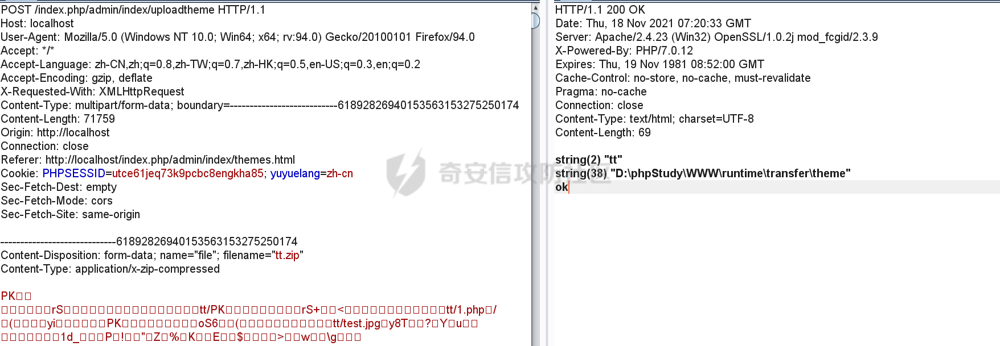
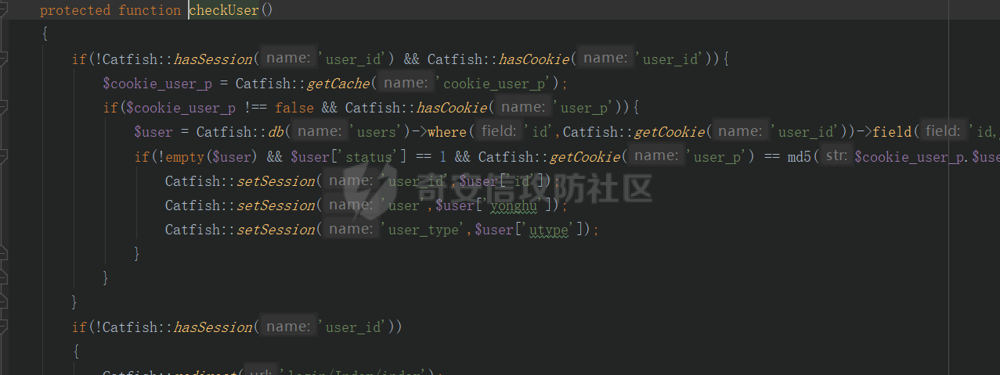
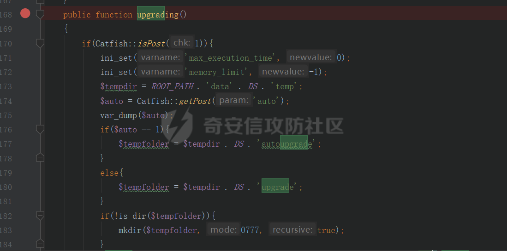
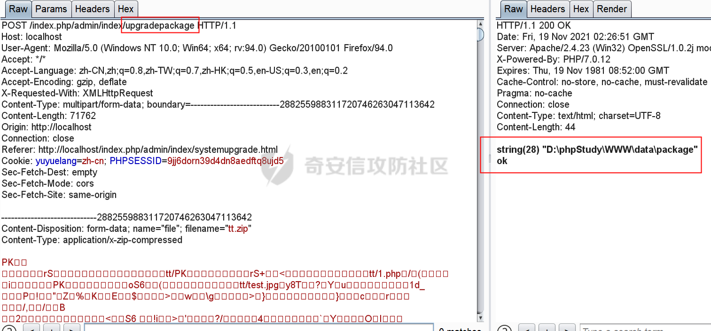

## 核对与使用边界


- 明确边界：三个成功点均为管理员安装主题、插件、系统升级的代码部署能力；还未证明越权、违反预期的路径逃逸或包来源信任问题，不能只因 ZIP 有 PHP 就确认漏洞。
- 原“禁止解压 .php/禁整个主题插件目录 PHP 解析”的通用建议会破坏正常部署，应以管理权限、来源信任、官方包签名/目录约束为评估对象；保留原建议但不作为已验证修复。
- 头像白名单失败与三个不同落点保留。ZIP 含 tt/1.php 而访问根 /1.php 的层级不一致、缺结束 boundary、ZipArchive 术语和原文链接声明矛盾均需回源，未修造成可用链。

本文已按保存的全文审阅记录进行文字校订；本轮仅静态核对，未运行 PoC、请求目标或逐图验证。

适用条件与版本记录（来源主张，未列为明确更正的部分仍待权威资料核对）：administratorcheckUser; theme/plugin/systemupdateZIPinstall; writablewebcode andPHPexec

- **适用与权限边界（1）**：三成功点都是管理员安装主题/插件/系统升级的正常代码部署通道，未证明越权/预期禁止代码/路径逃逸，不能仅因ZIP含PHP定性漏洞。按此限制解释本文结论，版本相同不足以证明所需角色、入口、配置、依赖或可控参数均已满足；原操作和失败记录一并保留。

- **适用与权限边界（2）**：修复建议禁止解压.php或禁止主题/插件/根目录PHP解析会破坏正常运行，应先定义信任边界并验证官方包签名/权限。按此限制解释本文结论，版本相同不足以证明所需角色、入口、配置、依赖或可控参数均已满足；原操作和失败记录一并保留。

- **结论使用边界（3）**：保留头像白名单失败与三实际落点差异的价值，不应全部简化任意上传。此项限制直接适用于下文对应结论；现有正文不足以作更宽泛推论，所列方法和原始证据均保留。

- **适用与权限边界（4）**：PoC ZIP含tt/1.php却系统升级访问根/1.php，文件层级不一致需核；请求占位未含结束边界。按此限制解释本文结论，版本相同不足以证明所需角色、入口、配置、依赖或可控参数均已满足；原操作和失败记录一并保留。

- **事实待核（5）**：ZipArchive create/open的overwrit/e术语不准确需原代码；CNVD编号/版本/补丁未知已诚实标明。该项尚不能从转载本身确定外部事实；下文相应编号、版本或修复说法只作为来源记录，不能据此判定部署受影响或已修复。明确更正另列于本节。

- **证据待核（6）**：附录说原文链接未保留但又给share907，自相矛盾；PDF镜像可补准确证据。保留原引用、截图位置和实验叙述；本项所缺材料未被补造，截图存在或作者宣称成功都不等于已核验其内容。

历史原文标识：下文原技术材料按来源保留；仅本节明确确认的更正替代相应旧说法，标为待核的观察仍不是事实确认。

# （鱼跃CMS）后台多处文件上传导致GETSHELL

一、漏洞简介
------------

鱼跃 CMS 后台多处文件上传导致 GETSHELL（奇安信攻防社区审计文章）。作者根据 CNVD 披露的“该 CMS 后台存在文件上传漏洞”的信息，把后台能够进行文件上传的功能点对应的代码逐一审计，最终找到三处可成功 getshell 的点，原理都是：上传 zip 压缩包不受后缀白名单限制，服务端用 PHP 原生 `ZipArchive` 类解压缩，压缩包内的 PHP 木马被释放到 Web 可访问目录。

三处成功点：

1.  系统设置 → 主题（`uploadtheme`）：解压到 `/public/theme/tt`；
2.  网站相关 → 插件列表（`pluginlist`，`admin/controller/index.php#2649`）：解压到 `/plugins/tt`；
3.  系统设置 → 系统升级（`upgradepackage` + `upgrading`，`admin/controller/index.php#4140` / `#4168`）：解压到网站根目录。

用户管理 → 个人信息的头像上传点因白名单校验无法绕过，利用失败。

二、漏洞影响
------------

-   产品：鱼跃 CMS（基于 Catfish 框架开发）
-   版本：原文未给出具体受影响版本号，未确认
-   组件：`admin/controller/Index.php`（`uploadtheme` / `pluginlist` / `upgradepackage` / `upgrading`）
-   前提条件：需后台管理员权限（`checkUser` 校验）
-   漏洞编号 / CVSS / 补丁状态：未确认（原文称依据 CNVD 披露信息审计，但未给出编号）

三、复现过程
------------

### 漏洞分析

**用户管理 → 个人信息（fail）**

在个人信息处能够上传个人头像，上传一张图片，同时抓包。根据上传的路径定位到代码位置 `admin/controller/Index.php#4032`：首先会对请求方式做一个校验，之后调用 `request` 方法来获取 `file` 类的实例对象，可以看到这里写着上传的白名单；接着调用了 `file` 类的 `validate` 方法，跟进，代码就只有几行，发现只是设置了上传文件的规则；接着重点是调用的 `move` 方法：

```php
public function move($path, $savename = true, $replace = true)
```

从代码可以看到如若上传出错，会直接返回 `false`；接着会调用类中的 `isValid` 方法对文件合法性进行检查，最主要的是调用的 `check` 方法，这里对文件后缀的校验白名单就来自前面的 `$validate` 数组，这里没有办法进行绕过。全局搜索了 `upload` 相关的函数名，发现都做了白名单校验，直接上传行不通，那么就需要通过上传压缩包来达到 getshell 的目的了。

**关键搜索**

在上传之前直接全局搜索和 `zip` 相关的代码，看看存不存在对压缩包内容进行解压缩的方法，找到了三个函数：一处为 `uploadtheme` 函数，刚好对应主题上传的功能点；另一处为 `upgrading` 函数，最后一处为 `pluginlist` 方法。先看主题上传。

**系统设置 → 主题（success）**

几个方法都是前面分析过的，所以上传压缩包肯定是没有问题的；之后会实例化 `ZipArchive` 类，该类为 PHP 的原生类，针对 ZIP 压缩文件进行相关的操作；这里调用了 `ZipArchive` 类中的 `create`、`open` 方法，并且传递的参数为 `overwrit` 或者 `e`；之后会调用 `extractTo` 方法，该方法将压缩文件解压缩到指定的目录，解压缩之后的路径为 `/runtime/transfer/theme/zip{文件名}`。

上传请求包（原文 Burp 截图，tt.zip 内含 `1.php` 木马）：

```http
POST /index.php/admin/index/uploadtheme HTTP/1.1
Host: localhost
User-Agent: Mozilla/5.0 (Windows NT 10.0; Win64; x64; rv:94.0) Gecko/20100101 Firefox/94.0
Accept: */*
Accept-Language: zh-CN,zh;q=0.8,zh-TW;q=0.7,zh-HK;q=0.5,en-US;q=0.3,en;q=0.2
Accept-Encoding: gzip, deflate
X-Requested-With: XMLHttpRequest
Content-Type: multipart/form-data; boundary=---------------------------61892826940153563153275250174
Content-Length: 71759
Origin: http://localhost
Connection: close
Referer: http://localhost/index.php/admin/index/themes.html
Cookie: PHPSESSID=utce61jeq73k9pcbc8engkha85; yuyuelang=zh-cn

-----------------------------61892826940153563153275250174
Content-Disposition: form-data; name="file"; filename="tt.zip"
Content-Type: application/x-zip-compressed

[zip 二进制内容，内含 tt/1.php 木马]
```



服务端返回 `string(2) "tt"` 与 `string(38) "D:\phpStudy\WWW\runtime/transfer/theme"`，然后上传之后到指定的路径下去查看却没有发现解压缩之后的文件；结合前端代码，通过查看源代码定位原先默认的 `theme` 路径，在同路径下找到了上传解压缩之后的文件夹 `/public/theme/tt`，成功 getshell。

**网站相关 → 插件列表（success）**

`admin/controller/index.php#2649`。首先调用 `checkUser` 方法对用户的身份信息进行了验证，只有管理员才能够进行相关操作：



之后的代码逻辑跟上面 getshell 的差不多，就不多分析了。由于缺少插件存放的文件夹，所以会在根目录下自动创建存储的文件夹；上传之后的文件路径为 `/plugins/tt`，也是能够 getshell 的。

**系统设置 → 系统升级（success）**

`admin/controller/index.php#4140`。这几个上传的函数方法主体部分都差不多，存储路径不太一样，都是遍历了上传的压缩包内容，之后调用 `file` 类中的方法对文件后缀、大小等进行校验，校验符合白名单的就能够上传成功；这里上传成功之后并没有解压缩操作，还是差了一步。

经过全局搜索，定位到 `admin/controller/index.php#4168` 的 `upgrading` 方法，猜测应该就是对上传的系统升级压缩包进行处理：



首先会调用 `Catfish` 类中的 `getPost` 方法，跟进，由于传入的 `$param=auto` 不为空，直接看 `else` 代码部分；由于 `Request` 类中的 `has` 方法对 POST 请求中是否有 `auto` 参数进行判断，`auto` 参数可控，不传参直接返回 false；这只会影响存储路径。接着调用 `Catfish` 类的 `post` 方法获取更新文件的路径，跟进之后发现通过缓存来进行获取——先通过上传压缩包，传递的数据包不变，直接调用 `upgrading` 方法，就能够从上传缓存中获取到存储路径。下面就是调用 `ZipArchive` 原生类对更新包进行解压缩操作了，那么这里也是能够利用成功的。

先调用 `upgradepackage` 方法上传：

```http
POST /index.php/admin/index/upgradepackage HTTP/1.1
Host: localhost
User-Agent: Mozilla/5.0 (Windows NT 10.0; Win64; x64; rv:94.0) Gecko/20100101 Firefox/94.0
Accept: */*
Accept-Language: zh-CN,zh;q=0.8,zh-TW;q=0.7,zh-HK;q=0.5,en-US;q=0.3,en;q=0.2
Accept-Encoding: gzip, deflate
X-Requested-With: XMLHttpRequest
Content-Type: multipart/form-data; boundary=---------------------------28825598831172074626047113642
Content-Length: 71762
Origin: http://localhost
Connection: close
Referer: http://localhost/index.php/admin/index/systemupgrade.html
Cookie: yuyuelang=zh-cn; PHPSESSID=9jj6dorn39d4dn8aedtfq8ujd5

-----------------------------28825598831172074626047113642
Content-Disposition: form-data; name="file"; filename="tt.zip"
Content-Type: application/x-zip-compressed

[zip 二进制内容，内含 tt/1.php 木马]
```



服务端返回 `string(28) "D:\phpStudy\WWW\data\package"`。再调用 `upgrading` 方法从缓存获取存储路径并解压缩，解压出的文件存储在网站根目录下面。

原文写在后面：对了，最后一处为什么 shell 会在根目录下，可以去下载官方的更新包，会发现更新包里的文件都是根目录下的关键代码文件夹，应该是替换掉进行升级操作，也就能解释我们上传的 shell 为什么会在根目录下存储了。

### PoC

制作包含 PHP 木马的 zip 压缩包（如 `tt.zip`，内含 `tt/1.php`，内容 `<?php phpinfo();?>` 或一句话木马），登录后台后：

1.  主题上传：POST `/index.php/admin/index/uploadtheme`，访问 `/public/theme/tt/1.php`；
2.  插件上传：POST `/index.php/admin/index/pluginlist` 相关接口，访问 `/plugins/tt/1.php`；
3.  系统升级：先 POST `/index.php/admin/index/upgradepackage` 上传，再请求 `upgrading` 方法触发解压，访问网站根目录下的 `1.php`。

以上请求包见上文 Burp 截图（Cookie / PHPSESSID 为原文复现环境值，目标环境需替换）。

四、修复建议
------------

1.  对上传的压缩包内容做白名单校验：解压后逐文件检查后缀，禁止释放 `.php` 等可执行脚本；
2.  解压目标目录禁止 PHP 解析（如目录级 `php_flag engine off` 或迁移到非 Web 目录）；
3.  `upgrading` 这类高危解压逻辑增加二次确认与完整性校验（签名校验官方更新包）；
4.  关注厂商是否发布官方补丁（截至成稿未确认补丁状态），及时升级。

### 附录

参考链接：

-   奇安信攻防社区原文：《鱼跃 CMS 审计—后台多处文件上传》（2021 年 11 月 24 日发布；原帖 https://forum.butian.net/share/907，原文链接未保留，以 PDF 镜像为准）
-   PDF 镜像：https://github.com/Mr-xn/Penetration_Testing_POC/raw/refs/heads/master/books/%E9%B1%BC%E8%B7%83CMS%E5%AE%A1%E8%AE%A1-%E5%90%8E%E5%8F%B0%E5%A4%9A%E5%A4%84%E6%96%87%E4%BB%B6%E4%B8%8A%E4%BC%A0.pdf
