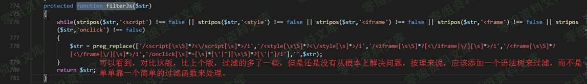
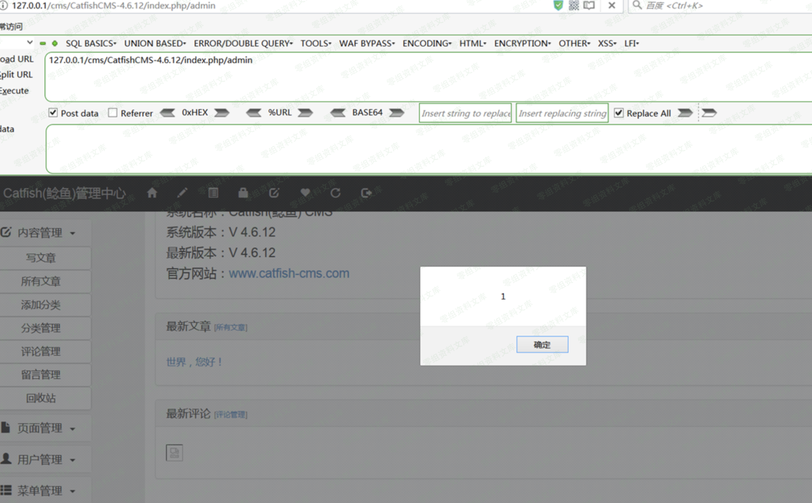

CatfishCMS 4.6.15 前台xss
=========================

一、漏洞简介
------------

二、漏洞影响
------------

CatfishCMS 4.6

三、复现过程
------------

### 代码分析

url：

    http://0-sec.org/cms/CatfishCMS-4.6.12/index.php/index/Index/pinglun

文件：application/index/controller/Index.php

方法：pinglun(

文件：application\\index\\controller\\Common.php

过滤函数：filterJs()

### 漏洞复现

首先注册一个用户

