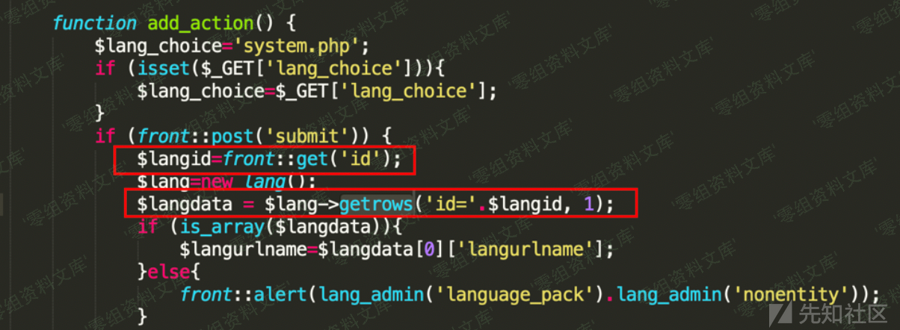

CmsEasy 7.3.8 sql注入漏洞
=========================

一、漏洞简介
------------

二、漏洞影响
------------

CmsEasy 7.3.8

三、复现过程
------------

漏洞代码位于lib/admin/language\_admin.php的add\_action函数

在测试后发现CmsEasy
V7.3.8框架已经对SQLi进行了转义和过滤，包括（select、\*
、sleep等等），为了确定具体的过滤名单，从源码中查找检测函数

##### 但是经过一番搜索后，源码中发现实际调用的注入检测函数并没有被定义，仔细研究后确定是在几个加密混淆的核心代码中实现了。。（闭源一定意味着安全吗？）------通过一番周折后得到函数

显而易见，这样简单的过滤很容易被部分SQLi关键组成字符绕过，导致SQL注入，例如，可以使用benchmark函数来代替sleep以达到基于时间的注入。除了通过得到源码来明确黑名单的，用fuzz同样可以得到过滤的黑名单，之后再想办法绕过

而类似的漏洞成因在同一个文件的edit\_action函数中也存在

这两处接口都存在SQL注入漏洞，提交的payload绕过过滤黑名单后可以进行利用

参考链接
--------

> https://xz.aliyun.com/t/7273
